# **Flink源码 - 从Kafka Connector看Source接口重构**

> 这篇文章转载自 Liebing 的博客 https://liebing.org.cn/flink-code-kafka-source.html ，它以Kafka Connector为例详细介绍了Flink新的Source接口。文章内容翔实，值得学习。
    

Flink原始的Source接口(`SourceFunction`)随着Flink在数据集成和流批一体上的不断发展, 暴露出了越来越多的问题. 为了实现更优雅的数据接入, 社区提出了[FLIP-27](https://cwiki.apache.org/confluence/display/FLINK/FLIP-27%3A+Refactor+Source+Interface#FLIP27:RefactorSourceInterface-Motivation)来重构Source接口. 新的Source接口已经在Flink 1.12中得到实现, 该接口将成为Flink数据接入的新标准. 虽然FLIP-27为流式数据的读取抽象了优雅的接口, 但是这些接口的实现和交互逻辑较为复杂, 如果不能准确理解其实现原理, 就很难写出正确的Connector. 本文以Kafka Connector为例, 详细介绍FLIP-27 Source接口的实现原理.

## **Source接口重构动机**

随着Flink的快速发展, 旧的Source接口(`SourceFunction`)出现了诸多问题(关于重构动机的更详细介绍可参考[漫谈Flink Source接口重构](http://www.whitewood.me/2020/02/11/%E6%BC%AB%E8%B0%88-Flink-Source-%E6%8E%A5%E5%8F%A3%E9%87%8D%E6%9E%84/)):

- **无法实现流处理和批处理的统一:** 原来的`SourceFunction`针对流处理设计, 难以适配到批处理. 从社区的发展来看, Flink对流批一体是有很大”野心”的, 流批一体的Source接口是重要的推进步骤.
- **数据源的发现和数据读取耦合在一起:** 这一问题使得对一些需要进行动态分区发现的数据源的Connector实现异常复杂, 如Kafka Connector.
- **分区(Partition/Shard/Split)并没有抽象的接口:** 这一问题使得难以实现一些数据源无关的通用特性, 例如Event Time对齐, Watermark对齐等.
- **需要显式使用Checkpoint Lock:** 由于Checkpoint Lock是非公平锁, `SourceFunction`可能长期持有而导致Checkpoint阻塞. 另外显示加锁的方式也不符合Flink算子Actor/Mailbox风格的线程模型设计.
- **没有统一的线程模型:** 为了避免阻塞主线程, Source通常需要实现IO线程来进行数据读取. 目前由于缺乏统一的线程管理, 提高了实现新的Source的门槛.

从结果来看, FLIP-27以及之后的[FLIP-182](https://cwiki.apache.org/confluence/display/FLINK/FLIP-182%3A+Support+watermark+alignment+of+FLIP-27+Sources)和[FLIP-217](https://cwiki.apache.org/confluence/display/FLINK/FLIP-217%3A+Support+watermark+alignment+of+source+splits)已经基本解决了上述问题. File, Kafka, Pulsar等常见数据源的Connector也已经基于新的接口进行了重构.

## **整体执行原理**

在介绍具体的接口实现之前, 我们先来看下新的Source实现在Runtime层面的整体运行逻辑.

- 在JobMaster中, 引入了一个新的组件`SourceCoordinator`, 其包含的`SourceCoordinatorContext` 负责通过RPC与Task中的`SourceOperator`通信. `SplitEnumerator`是一个抽象接口, 用户可针对不同的数据源做具体的实现, 主要用于发现Split并分配给指定的Reader. `SplitEnumerator`与`SourceCoordinator`共享一个`SourceCoordinatorContext`, 并通过它进行交互.
- 在TaskManager中, 引入了一个新的`SourceOperator`, 负责与`SourceCoordinator`交互, 并在内部调用`SourceReader`获取数据. `SourceReader`同样是一个抽象接口, 用户需要根据数据源做具体实现.

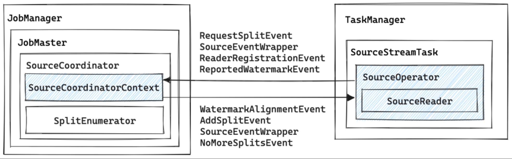

`SourceCoordinatorContext`与`SourceOperator`之间通过OperatorEvent进行交互, 具体来说:

- `SourceOperator`主要会向`SourceCoordinatorContext`发送:
    - `RequestSplitEvent`来向`SourceCoordinator`请求需要读取的Split, 在Kafka Connector中, `SourceCoordinator`总是主动向`SourceOperator`分配Split.
    - `ReaderRegistrationEvent`来向`SourceCoordinator`注册当前Reader.
    - `ReportedWatermarkEvent`来向`SourceCoordinator`报告当前Reader的Watermark, 以便`SourceCoordinator`决定是否需要进行Watermark对齐.
- `SourceCoordinatorContext`主要会向`SourceOperator`发送:
    - `AddSplitEvent`来向`SourceOperator`分配Split.
    - `WatermarkAlignmentEvent`来通知`SourceOperator`要进行Watermark对齐.
    - `NoMoreSplitsEvent`来通知`SourceOperator`没有更多的Split了.

从宏观角度来看, FLIP-27最重要的变动就是将数据源的发现和数据的读取拆分开来, 作为两个独立的组件分别运行在JobMaster和Task中, 彼此之间通过RPC进行通信. 在这个整体框架下, 很多细节问题就变得很好解决了, 比如Watermark的对齐可以通过全局的`SourceCoordinator`方便地实现.

## 核心接口

在FLIP-27中, 最核心的两个接口是`SplitEnumerator`和`SourceReader`. 其中:

- `SplitEnumerator`用于发现Splits并将其分配给`SourceReader`.
- `SourceReader`用于从给定的Splits中读取数据.

除上述两个接口是公共接口外, 其他几个公共接口如下, 在实现Connector时需要频繁使用这些接口:

- `Source`: 实际上是一个工厂类, 用于创建`SplitEnumerator`和`SourceReader`.
- `SourceSplit`: 分区的抽象接口, 用于表示一个Partition/Shard/Split.
- `SplitEnumeratorContext`: 用于为`SplitEnumerator`提供上下文信息, 保存已分配的分区, 并向`SourceReader`发送事件消息(如分配一个新的分区).
- `SplitAssignment`: 用于保存分配给各个子任务的分区.
- `SourceReaderContext`: 用于`SourceReader`和`SplitEnumerator`之间的通信.
- `SplitReader`: 从一个或多个分区中读取数据.
- `SplitFetcherManager`: 用于管理`SplitFetcher`, `SplitFetcher`调用`SplitReader`进行数据读取, 运行在`SplitFetcherManager`的线程池中.
- `SourceOutput`: Collector样式的接口, 用于获取`SourceReader`发出的记录和时间戳.
- `WatermarkOutput`: 用于发送Watermark, 并指示Source是否空闲.
- `Watermark`: 这是在`org.apache.flink.api.common.eventtime`包中新建的Watermark类. 这个类最终将替换`org.apache.flink.stream.api.Watermark`. 这个更改允许`flink-core`独立于其他模块. 因为最终Watermark的生成将会被放到Source中. (关于为什么要将Watermark的生成放到Source中可参考笔者之前的博文[Flink最佳实践 - Watermark原理及实践问题解析](https://liebing.org.cn/flink-watermark.html#%E9%9D%9ESource%E7%AE%97%E5%AD%90%E7%94%9F%E6%88%90Watermark%E7%9A%84%E9%97%AE%E9%A2%98))

## KafkaSource的执行流程

上文介绍了FLIP-27中引入的几个新接口, 接下来本文将以`KafkaSource`为例, 介绍这些接口的执行和交互流程. 如果不做特殊说明, 本文在描述时将以Kafka Connector的具体实现类为准, 其中某些方法可能实现在父类中, 在阅读源码时需要稍加注意.

### **Split分配流程**

Split分配流程由`KafkaSourceEnumerator`实现, 它是`SplitEnumerator`的实现类, 运行在JobMaster中. 整个Split的分配流程如下图所示:

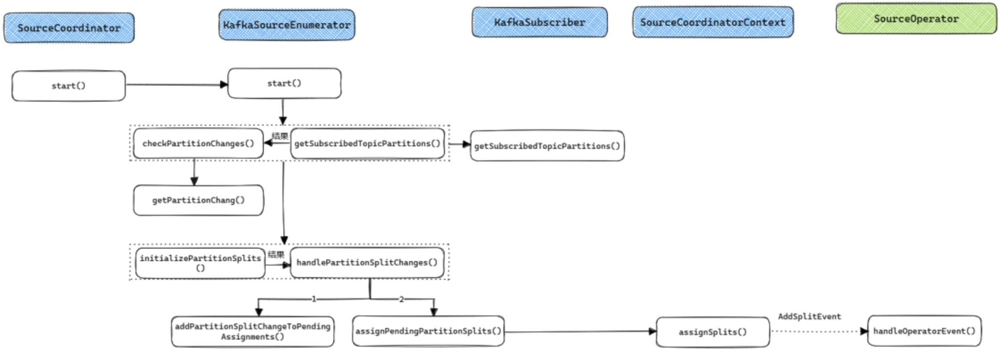

- 在JobMaster中会启动一个`SourceCoordinator`, 在它的`start()`方法中会调用`KafkaSourceEnumerator`的`start()`方法来启动Split分配.
- `KafkaSourceEnumerator`的`start()`方法会根据用户配置, 选择定时或一次调用`getSubscribedTopicPartitions()`和`checkPartitionChanges()`. 其中:
    - `getSubscribedTopicPartitions()`通过Kafka客户端获取指定Topic的所有Partition, 并将结果传递给`checkPartitionChanges()`;
    - `checkPartitionChanges()`会调用`getPartitionChange()`来根据已经分配的Partition判断哪些Partition是新增的, 哪些是删除的(实际上删除的Partition在目前的实现中没有做任何处理).
- 当获取到新增和删除的Partition之后, `checkPartitionChanges()`会调用`initializePartitionSplits()`和`handlePartitionSplitChanges()`, 其中:
    - `initializePartitionSplits()`用于初始化各个Partition的起始和结束Offset. 结果会传递给`handlePartitionSplitChanges()`;
    - `handlePartitionSplitChanges()`会先调用`addPartitionSplitChangeToPendingAssignments()`来计算各个Partition所属的`SourceReader`, 之后调用`assignPendingPartitionSplits()`来向`SourceOperator`发送消息分配Partition.
- 真正分配Partition的消息由`SourceCoordinatorContext`的`assignSplits()`方法通过发送`AddSplitEvent`来实现. TaskManager接收到消息后会交由`SourceOperator`进行处理, 详细的处理过程会在下文分析.

可以看到`KafkaSourceEnumerator`的Partition分配流程还是比较复杂的, 不过在把握整体流程之后再阅读各个函数的代码, 其实也不难理解.

## 数据读取流程

当`KafkaSourceReader`接收到来自`KafkaSourceEnumerator`分配的Partition之后, 就会开始真正进行数据读取了. 数据读取的整体流程还是比较简单的, `KafkaSourceReader`运行在Task主线程中, 非阻塞地从`FutureCompletingBlockingQueue`中获取数据, 如果有数据就使用`KafkaRecordEmitter`向下游发送数据. `SplitFetcher`是真正的IO线程, 通过`KafkaPartitionSplitReader`从Kafka读取数据后放入`FutureCompletingBlockingQueue`.

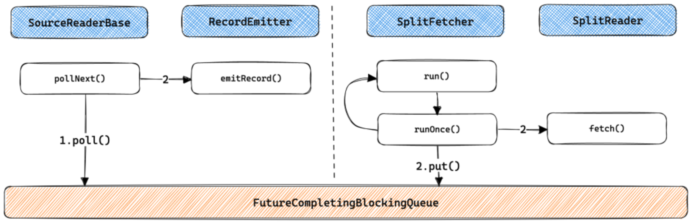

数据读取流程的核心在于IO线程模型的实现, 可通过`SplitFetcherManager`进行控制. 多数实现都是以下线程模型中的一种:

- Sequential Single Split, 即单个IO线程依次顺序读取各个Split, 这种模型一般用在文件, 数据库查询等有界数据场景.
    
    
    
- Multi-split Multiplexed, 即单个IO线程复用以读取多个Split, 一般用在支持多路复用客户端的组件上, 如Kafka.
    
    
    
- Multi-split Multi-threaded, 即一个IO线程读取一个Split, 一般用在Amazon Kinesis, 阿里云SLS等产品上.
    
    
    

## **SplitFetcher生命周期**

通过上文的分析我们已经知道, `SplitFetcher`是真正从数据源读取数据的任务, 它继承自`Runnable`并运行在`SplitFetcherManager`的线程池中. `SplitFetcher`任务的状态在运行过程中会不断发生变化, 笔者将`SplitFetcher`的生命周期总结为以下四个状态(**需要注意的是这几个状态是笔者总结的逻辑上的状态, 并不与Java线程的状态完全对应**):

- Running: 当`SplitFetcherManager`创建并向线程池提交`SplitFetcher`任务之后就进入了Runnning状态. Running状态的`SplitFetcher`可能是在真正地读取数据(对应的JVM线程状态为RUNNABLE, WAITING或TIME_WAITING), 也可能在等待Split的分配(如刚启动时的场景, 对应的JVM线程状态为WAITING).
- Pause: 为了在多个Split之间进行Watermark对齐, `SplitFetcher`提供了三个接口:
    - `pauseOrResumeSplits()`: 会调用`SplitReader.pauseOrResumeSplits()`, 适用于`KafkaConsumer`这类提供了暂停或继续读取指定Split的客户端接口.
    - `pause()`: 通过设置`SplitFetcher`的`paused`标志位为`true`来暂停`SplitFetcher`任务.
    - `resume()`: 通过设置`SplitFetcher`的`paused`标志位为`false`, 并调用`resumed.signal()`来继续执行`SplitFetcher`任务.
- Idle: 如果`SplitFetcher`完成了所有Split的数据读取, 就会进入Idle状态. 对应的JVM线程状态为WAITING.
- Closed: 进入Idle状态的`SplitFetcher`将会被关闭而进入Closed状态.

> 从JVM线程的角度来看, `SplitFetcher`线程进入WAITING/TIME_WAITING状态的可能原因有两个:
1.  在读取数据时, 即在`SplitReader.fetch()`中等待, 如`KafkaConsumer.poll()`会因为暂时获取不到数据而等待.
2. `assignedSplits`和`taskQueue`均为空, 等待需要等待任务.
> 

`SplitFetcher`的生命周期受`SourceReader`的控制, 其控制逻辑如下图所示. 其中紫色阴影块会调用`SplitFetcher`对其生命周期进行控制.

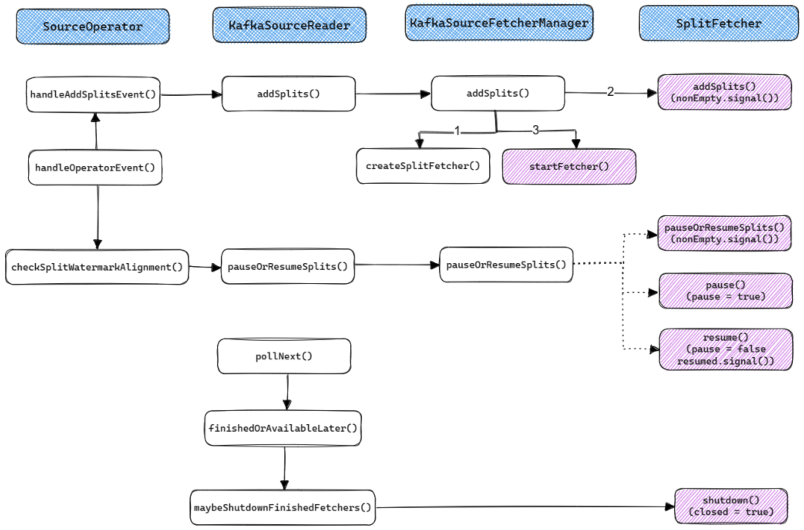

上图展示了`SourceReader`是如何通过`SplitFetcherManager`来控制`SplitFetcher`任务的. 接下来我们再来分析下`SplitFetcher`内部的执行逻辑. 其整体执行流程如下图所示:

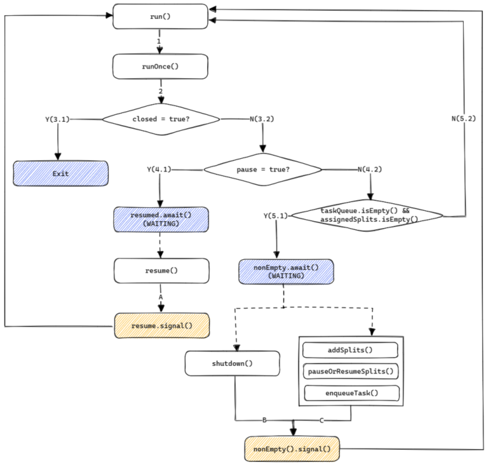

- 在`SplitFetcher`的`run()`方法中会通过一个`while`循环不断运行`runOnce()`方法.
- `SourceReader`在`pollNext()`方法中会调用`maybeShutdownFinishedFetchers()`来判断对应的`SplitFetcher`是否处于Idle状态, 如果是则调用`SplitFetcher.shutdown()`来关闭该`SplitFetcher`(设置`closed`为`true`), 之后`runOnce()`将进入步骤3.1.
- 如果各个Split之间的Watermark差距过大, `SourceReader`会调用`SplitReader`的`pauseOrResumeSplits()`或`pause()`来暂停当前任务, 之后`runOnce()`将进入步骤4.1. 后续会调用`pauseOrResumeSplits()`或`resume()`来继续任务.
- 如果当前没有被分配的Split, 也没有需要执行的任务(如添加Split), 那么`SplitFetcher`将进入WAITING状态, 直到`addSplits()`, `pauseOrResumeSplits()`或`enqueueTask()`(在`KafkaSource`中提交Offset时将调用次方法)被调用.

`SpliteFetcher`是真正实现数据读取的任务, 理解它的生命周期和执行流程是理解新版Source接口的核心之一.

## **Watermark对齐流程**

新Source接口中一个十分重要的特性就是Watermark对齐, 用于解决[Event Time倾斜问题](https://liebing.org.cn/flink-watermark.html#Event-Time%E5%80%BE%E6%96%9C%E7%9A%84%E9%97%AE%E9%A2%98). 在Flink 1.15及之后的版本中可以通过如下方式指定对齐参数.

```java
WatermarkStrategy
        .<Tuple2<Long, String>>forBoundedOutOfOrderness(Duration.ofSeconds(20))
        .withWatermarkAlignment(
            "alignment-group-1",    // watermarkGroup: Watermark对齐的group名称
            Duration.ofSeconds(20), // maxAllowedWatermarkDrift: 最大Watermark偏移
            Duration.ofSeconds(1)); // updateInterval: SourceOperator上报Watermark及SourceCoordinator下发Watermark对齐的时间间隔
```

[FLIP-296](https://cwiki.apache.org/confluence/display/FLINK/FLIP-296%3A+Extend+watermark-related+features+for+SQL)对SQL层Watermark相关的支持进行了完善, 支持在WITH参数中指定上述参数, 示例代码如下, 这一特性在[Flink 1.18](https://nightlies.apache.org/flink/flink-docs-master/docs/dev/table/concepts/time_attributes/#advanced-watermark-features)中发布.

```sql
CREATE TABLE user_actions (
  ...
  user_action_time TIMESTAMP(3),
  WATERMARK FOR user_action_time AS user_action_time - INTERVAL '5' SECOND
) WITH (
  'scan.watermark.alignment.group'='alignment-group-1',
  'scan.watermark.alignment.max-drift'='1min',
  'scan.watermark.alignment.update-interval'='1s',
  ...
);
```

Watermark的对齐需要`SourceCoordinator`和`SourceOperator`配合进行. 整体的交互流程如下图所示:

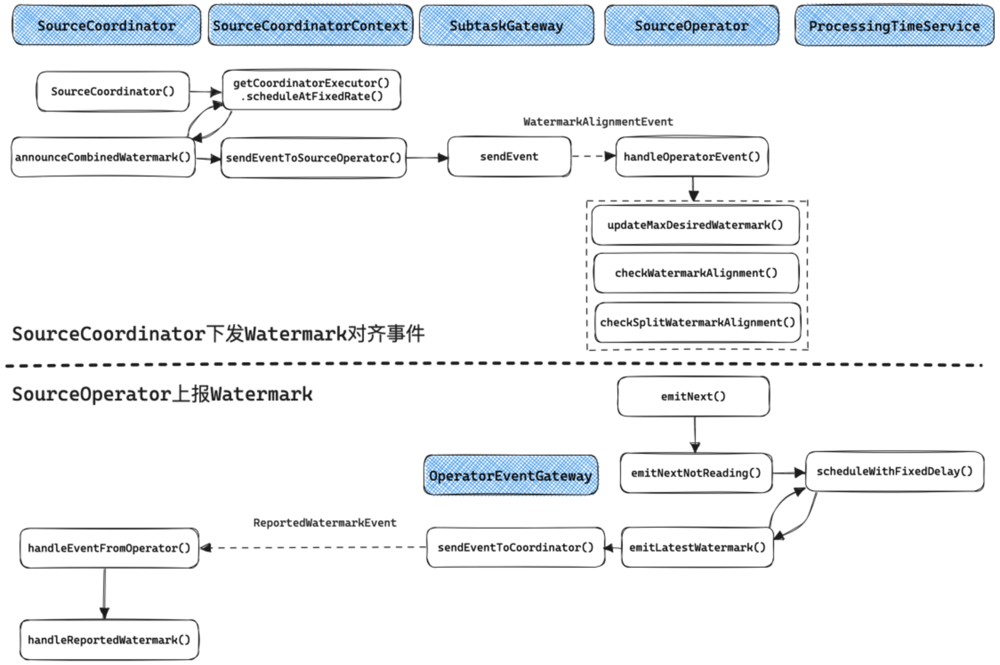

- `SourceOperator`会定期上报Watermark(时间间隔由`updateInterval`参数指定), 在实现上Mailbox线程最终会调用`emitNext()`, 如果`SourceOperator`不处于READING状态, 就会调用`emitNextNotReading()`, 它会在初始化时通过`ProcessingTimeService`启动一个定时任务, 定期调用`emitLatestWatermark()`向`SourceCoordinator`发送`ReportWatermarkEvent`事件, 最终`SourceCoordinator.handleEventFromOperator()`会处理该事件.
- `SourceCoordinator`会定期下发Watermark对齐事件(时间间隔由`updateInterval`参数指定), 在实现上其构造函数中会利用`SourceCoordinator`启动一个定时任务, 定期调用`announceCombinedWatermark()`向`SourceOperator`发送`WatermarkAlignmentEvent`, 最终`SourceOperator.handleOperatorEvent()`会处理该事件.

上文介绍了Watermark对齐的整体交互流程. 在具体实现上, `SourceCoordinator`端的实现比较简单, 就是将各个`SourceOperator`上报的Watermark聚合, 选出最小的Watermark值, 将其加上`maxAllowedWatermarkDrift`之后定期下发给`SourceOperator`, 作为允许读取的最大Watermark.

`SourceOperator`端的Watermark对齐流程相对复杂一些. [FLIP-182]([FLIP-182: Support watermark alignment of FLIP-27 Sources - Apache Flink - Apache Software Foundation](https://cwiki.apache.org/confluence/display/FLINK/FLIP-182%3A+Support+watermark+alignment+of+FLIP-27+Sources))提出了`SourceOperator`级别的Watermark对齐, 可以支持一个`SourceOperator`仅读取一个Split的场景, 在Flink 1.15及之后的版本中可用. [FLIP-217](https://cwiki.apache.org/confluence/display/FLINK/FLIP-217%3A+Support+watermark+alignment+of+source+splits)提出了Split级别的Watermark对齐, 支持一个`SourceOperator`读取多个Split的场景, 在Flink 1.17及之后的版本中可用. 整体的对齐流程如下图所示.

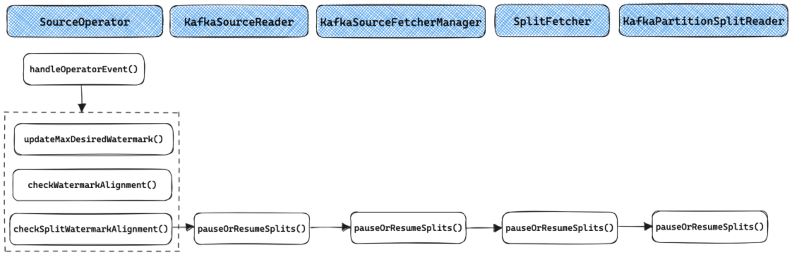

`SourceOperator`级别的对齐在`checkWatermarkAlignment()`中实现, 其核心代码如下. 如果当前`SourceOperator`处于READING状态, 且需要对齐则重置`waitingForAlignmentFuture`变量, Mailbox主线程会调用`getAvailableFuture()`来获取`SourceOperator`的可用性, 如果此时`waitingForAlignmentFuture`不处于结束状态则代表当前`SourceOperator`需要阻塞等待Watermark对齐; 如果当前`SourceOperator`处于WAITING_FOR_ALIGNMENT状态, 且不需要对齐则结束`waitingForAlignmentFuture`, `SourceOperator`重新回到运行状态.

```java
@Internal
public class SourceOperator<OUT, SplitT extends SourceSplit> extends AbstractStreamOperator<OUT>
        implements OperatorEventHandler,
                PushingAsyncDataInput<OUT>,
                TimestampsAndWatermarks.WatermarkUpdateListener {
    private CompletableFuture<Void> waitingForAlignmentFuture =
            CompletableFuture.completedFuture(null);

    private void checkWatermarkAlignment() {
        if (operatingMode == OperatingMode.READING) {
            checkState(waitingForAlignmentFuture.isDone());
            if (shouldWaitForAlignment()) {
                operatingMode = OperatingMode.WAITING_FOR_ALIGNMENT;
                waitingForAlignmentFuture = new CompletableFuture<>();
            }
        } else if (operatingMode == OperatingMode.WAITING_FOR_ALIGNMENT) {
            checkState(!waitingForAlignmentFuture.isDone());
            if (!shouldWaitForAlignment()) {
                operatingMode = OperatingMode.READING;
                waitingForAlignmentFuture.complete(null);
            }
        }
    }
            
    // 如果lastEmittedWatermark大于currentMaxDesiredWatermark, 则需要等待
    private boolean shouldWaitForAlignment() {
        return currentMaxDesiredWatermark < lastEmittedWatermark;
    }
            
    // 由StreamTask触发调用, 当返回的CompletableFuture阻塞时, Mailbox线程将阻塞
    @Override
    public CompletableFuture<?> getAvailableFuture() {
        switch (operatingMode) {
            case WAITING_FOR_ALIGNMENT:
                return availabilityHelper.update(waitingForAlignmentFuture);
            case OUTPUT_NOT_INITIALIZED:
            case READING:
                return availabilityHelper.update(sourceReader.isAvailable());
            case SOURCE_STOPPED:
            case SOURCE_DRAINED:
            case DATA_FINISHED:
                return AvailabilityProvider.AVAILABLE;
            default:
                throw new IllegalStateException("Unknown operating mode: " + operatingMode);
        }
    }
}
```

Split级别的Watermark对齐在`checkSplitWatermarkAlignment()`中实现, 其调用链较长, 如上图所示. 最终的实现在`KafkaPartitionSplitReader.pauseOrResumeSplits()`中, 通过`KafkaConsumer`提供的`pause()`和`resume()`两个方法分别用于停止和继续读取相应的Partition. 此外, 对于Multi-split Multi-threaded模式的实现, 由于一个`SplitFetcher`仅读取一个Split, 在需要对齐时可直接在`SplitFetcherManager.pauseOrResumeSplits()`通过`SplitFetcher.pause()`和`SplitFetcher.resume()`将指定的`SplitFetcher`暂停或唤醒.

## Checkpoint和Failover流程

除了Split分配和数据读取流程, 在生产环境中还需要关注的是Checkpoint流程和Failover流程.

`KafkaSourceEnumerator`的Checkpoint流程比较简单, 当Checkpoint触发时`SourceCoordinator`的`checkpointCoordinatot()`会调用`KafkaSourceEnumerator`的`snapshotState()`, 需要在状态中保存的仅有`KafkaSourceEnumerator`的`Set<TopicPartition> assignedPartitions`, 即已经分配的Partititions. 当Checpoint成功或失败时会分别回调`notifyCheckpointComplete()`和`notifyCheckpointAborted()`, 这两个函数其实都没有做任何实现.

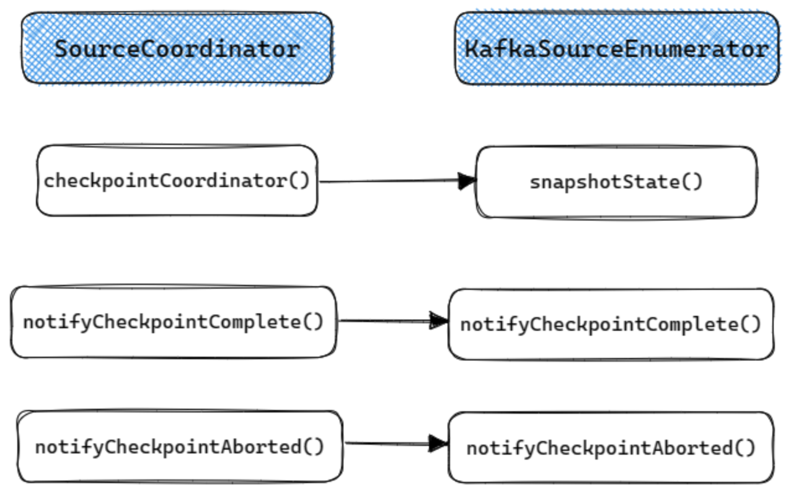

`KafkaSourceReader`的Checkpoint流程如下. 当Checkpoint触发时, `KafkaSourceReader`的`snapshotState()`将被调用用于保存当前Reader已经被分配的Split(`SourceReaderBase`中的`splitStates`变量保存了当前Reader已经被分配的所有Split). 当Checkpoint完成时`notifyCheckpointComplete()`会被调用, 用于向Kafka提交Offset.

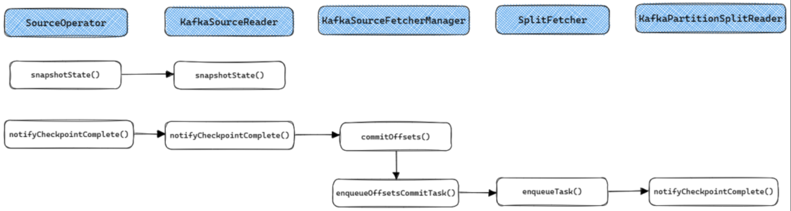

`KafkaSourceEnumerator`的Failover流程如下, 主要分为两部分:

1. 如果出现Global Failover那么`SourceCoordinator`将会调用`resetToCheckpoint()`来重置整个`KafkaSourceEnumerator`, 其中的`assignedPartitions`会被初始化为Checkpoint中的状态, 之后按启动流程重新启动即可.
2. 如果出现Partial Failover那么`SourceCoordinator`的`subtaskReset()`将会调用`KafkaSourceEnumerator`的`addSplitsBack()`来将上次Checkpoint之后还没有分配给Reader的Split分配给对应的Reader.

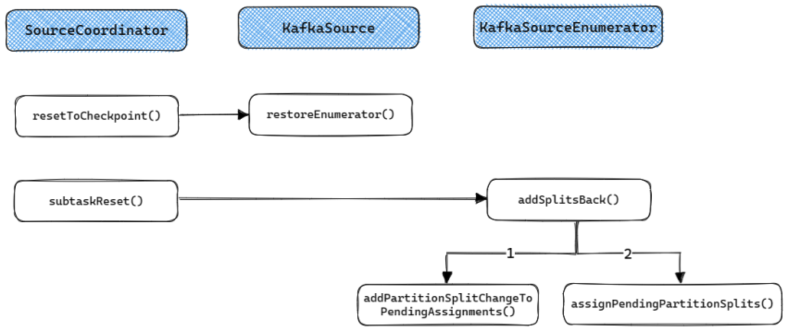

`KafkaReader`的Failover流程比较简单, 重启时在`SourceOperator`的`open()`函数中会重新加载当前Reader中已经被分配的所有Split(即原来`SourceReaderBase`中的`splitStates`变量保存的内容), 并重新调用`addSplits()`分配给`SplitFetcher`.

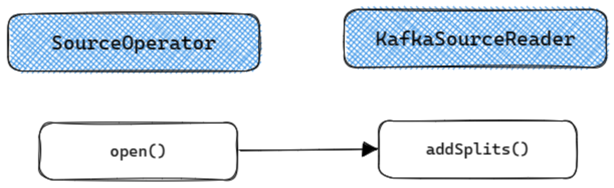

## 总结

本文以Kafka Connetcor为例, 详细介绍了FLIP-27中提出的新版Source接口的实现原理. 可以看到, 新版的Source接口在设计上还是比较巧妙的, 主要的亮点是解耦了分区发现和数据读取的流程, 简化了动态分区发现的实现. 另外通过对分区的抽象在流批处理上进行了统一. 不过Source的实现本身比较复杂, 实现一个生产可用的Source并不简单, 需要理解各个接口的执行和交互细节, 本文对其中的细节进行了详细介绍, 相信有助于实现新的Source Connector.

## 参考

[1] [FLIP-27: Refactor Source Interface](https://cwiki.apache.org/confluence/display/FLINK/FLIP-27%3A+Refactor+Source+Interface)

[2] [FLIP-27: Refactor Source Interface-Apache Mail Archives](https://lists.apache.org/thread/334co89dbhc8qpr9nvmz8t1gp4sz2c8y)

[3] [FLIP-182: Support watermark alignment of FLIP-27 Sources](https://cwiki.apache.org/confluence/display/FLINK/FLIP-182%3A+Support+watermark+alignment+of+FLIP-27+Sources)

[4] [FLIP-217: Support watermark alignment of source splits](https://cwiki.apache.org/confluence/display/FLINK/FLIP-217%3A+Support+watermark+alignment+of+source+splits)

[5] [漫谈Flink Source接口重构](http://www.whitewood.me/2020/02/11/%E6%BC%AB%E8%B0%88-Flink-Source-%E6%8E%A5%E5%8F%A3%E9%87%8D%E6%9E%84/)