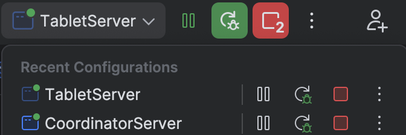

# **搭建Fluss本地开发环境**

在Fluss的官网中介绍了如何在本地部署Fluss集群，并且提供了相关的下载包([下载地址](https://alibaba.github.io/fluss-docs/downloads/))。 用户可以根据[部署文档](https://alibaba.github.io/fluss-docs/docs/install-deploy/deploying-local-cluster/)的指示轻松的在本地运行一个Fluss集群并完成简单测试。但是本地开发的话，我们需要搭建本地的开发环境，也就是在IDE中直接运行代码启动集群，从而方便本地的开发和断点调试。这篇文章总结了自己搭建Fluss本地开发环境的步骤，以及一些发现。

## 运行Fluss组件

Fluss集群需要运行三个组件, `Zookeeper`, `CoordinatorServer` 以及 `TabletServer` 。我们需要分别启动它们。

### 0. 下载fluss包

以当前的fluss 0.5.0版本为例，在官网中下载并解压后，会得到一个名为fluss-0.5.0的文件夹。在其中提供的local-cluster.sh脚本中可以看到，启动一个Fluss集群，需要按顺序分别启动  `Zookeeper`, `CoordinatorServer` 以及 `TabletServer`。我们也跟着这个步骤分别启动这三个组件。

```bash
# start zookeeper
"$FLUSS_BIN_DIR"/fluss-daemon.sh start zookeeper "${FLUSS_CONF_DIR}"/zookeeper.properties

# Start single Coordinator Server on this machine
"$FLUSS_BIN_DIR"/coordinator-server.sh start

# Start single Tablet Server on this machine
"${FLUSS_BIN_DIR}"/tablet-server.sh start

```

### 1. 启动Zookeeper

zookeeper不是本地开发的重点，只需要提供一个zookeeper进程供fluss集群使用。这次我们只需要启动zookeeper，因此在local-cluster.sh中可以注释掉后面CoordinatorServer和TabletServer的启动命令，并重新执行

```bash
bin/local-cluster.sh start
```

这样就会只启动zookeeper组件了。

### 2. 启动CoordinatorServer

在Fluss官方Github下载源码，导入IDE，并编译成功后，找到 `CoordinatorServer` 这个类，里面有一个main方法，意味着这个类是可以直接执行的。

但是有一点需要注意，main方法需要传入一个configDir的启动参数，这里使用下载的fluss包里的配置文件。

```bash
--configDir <path to fluss>/fluss-0.5.0/confeter
```

### 3. 启动TabletServer

在Fluss项目中找到 `TabletServer` 这个类，同样的设置configDir参数并启动。

```jsx
--configDir <path to fluss>/fluss-0.5.0/conf
```

成功启动后，在IDE里面可以看到两个正在运行的程序。现在就可以随意的打断点调试了。



## Fluss集群启动之后

我们现在成功启动了一个fluss集群，但是还没有创建任何表，没有写入任何数据。但实际上集群已经完成了一下准备工作。

### zookeeper信息注册

集群启动的时候已经在zookeeper注册了相关信息，我们可以登陆zookeeper去查看。
要想查看zookeeper里的数据，我们可以去zookeeper官网下载一个包，其中提供一个叫zkCli.sh的脚本，执行

```bash
bin/zkCli.sh
```

便可进入查看。

在zookeeper中，我们可以看到在根目录下注册了一个叫 `fluss` 的节点，在这个节点下面有三个子节点

 `coordinators` , `metadata` 以及 `tabletservers` 。

```jsx
[zk: localhost:2181(CONNECTED) 33] ls /
[fluss, zookeeper]
[zk: localhost:2181(CONNECTED) 34] ls /fluss
[coordinators, metadata, tabletservers]
```

分别查看里面的具体信息

**coordinator**

coordinator其中显示了一个active的server信息，包含version，id，host以及port。

```jsx
[zk: localhost:2181(CONNECTED) 38] get /fluss/coordinators/active
{"version":1,"id":"6ced8032-9800-4f5b-abd5-444c9623625c","host":"127.0.0.1","port":9123}
```

**metadata**

metadata默认注册了一个名为fluss的空database。

```jsx
[zk: localhost:2181(CONNECTED) 39] ls /fluss/metadata
[databases]
[zk: localhost:2181(CONNECTED) 40] ls /fluss/metadata/databases
[fluss]
[zk: localhost:2181(CONNECTED) 41] ls /fluss/metadata/databases/fluss
[]
```

**tabletservers**

tabletservers里注册了一个id为0的server信息，包含version，host，port以及register_timestamp。

```jsx
[zk: localhost:2181(CONNECTED) 46] get /fluss/tabletservers/ids/0
{"version":1,"host":"127.0.0.1","port":50258,"register_timestamp":1740039756113}
```

### 创建data文件路径

在配置文件server.yaml里，指定了数据存储的文件路径

```bash
# The local data directory to be used for Fluss to storing kv and log data.
data.dir: /tmp/fluss-data
```

因此在 `/tmp` 目录下，集群创建了名为 `fluss-data` 的文件夹，用来存放数据。打开文件夹可以看到有两个文件(high-watermark-checkpoint, recovery-point-offset-checkpoint
)和一个文件夹(remote-log-index-cache)。现在都是空的，没有任何内容在里面。

## 小结
本文介绍了如何搭建Fluss本地开发环境，如何在IDE中启动Fluss集群，并总结了一些集群启动之后的观察。为之后的Fluss学习做好准备。