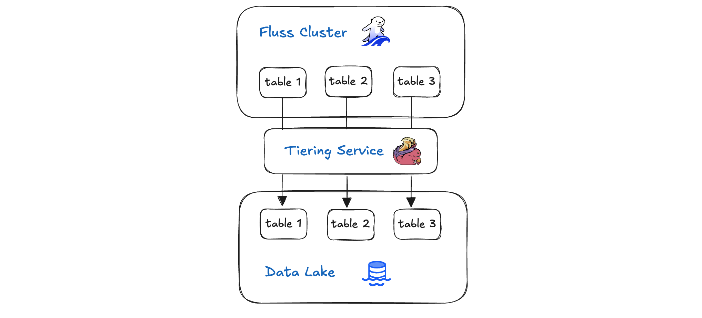
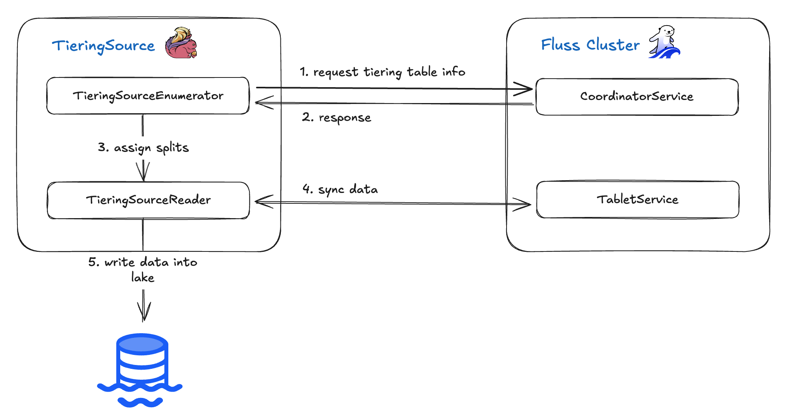
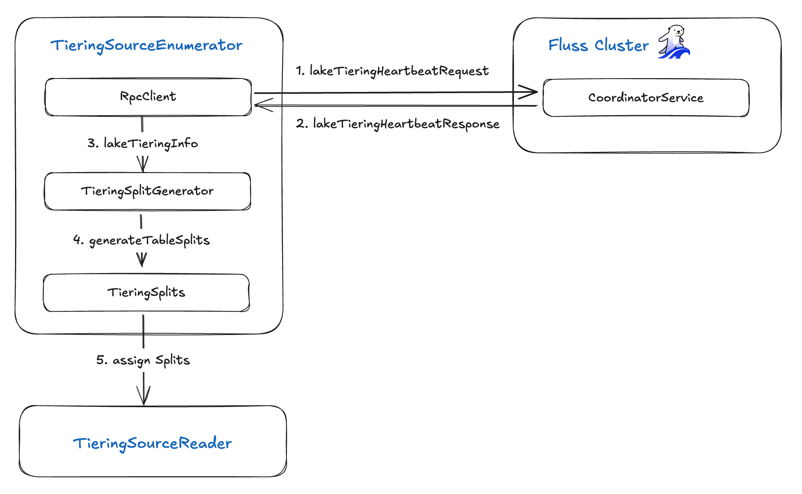
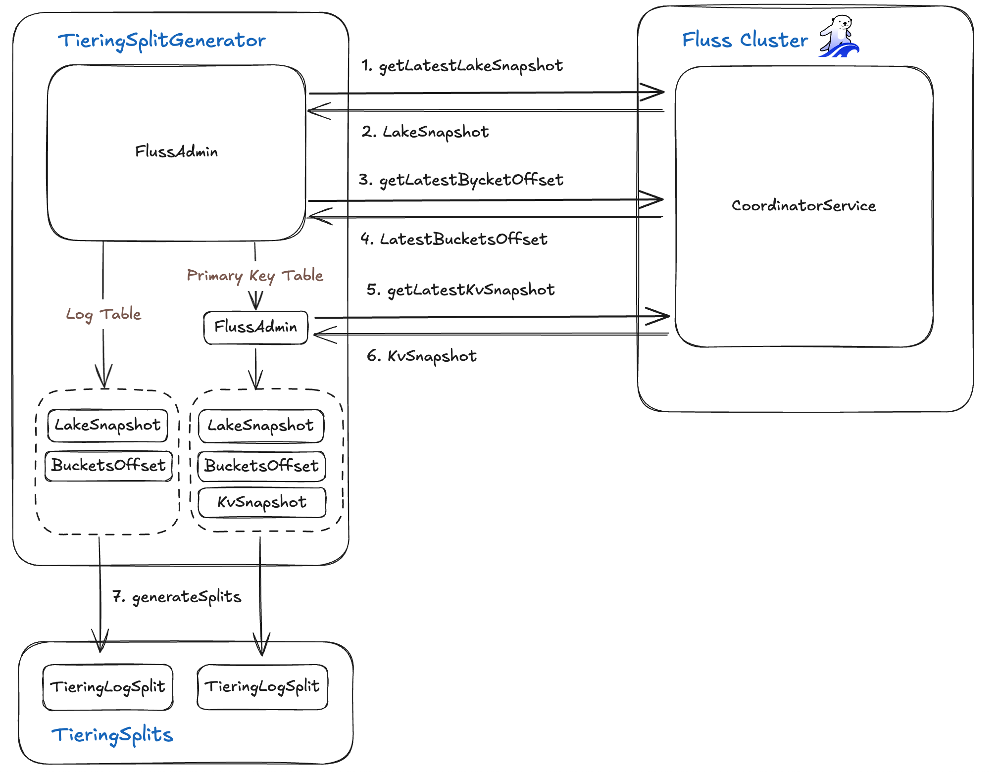
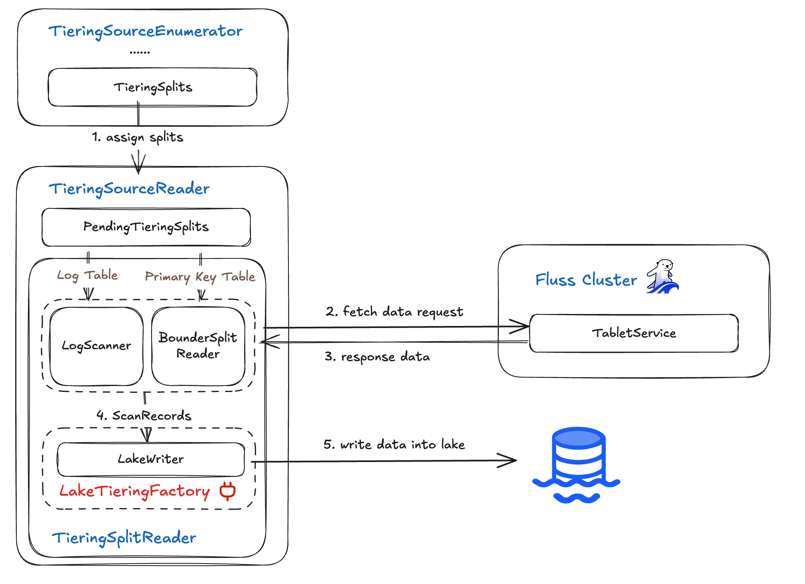
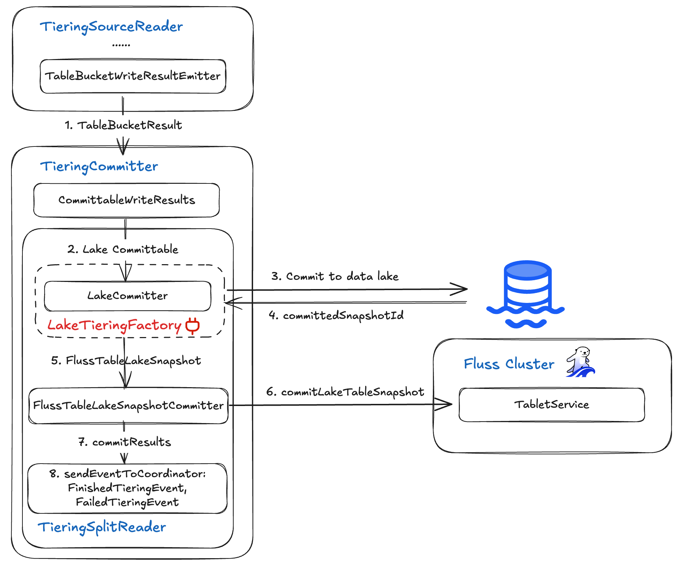

# Tiering Service Deep Dive

## 背景



Fluss 湖仓架构的核心是**分层服务 (Tiering Service)** —— 这是一个智能的、策略驱动的数据管道，它无缝地连接着您的实时 Fluss 集群和高性价比的湖仓存储。该服务持续从 Fluss 集群摄取新事件，并自动将较旧或访问频率较低的数据迁移到更冷的存储层中，且整个过程不会中断正在进行的查询。通过根据可配置的规则平衡热、温、冷存储，分层服务确保了最新数据立即可查，同时又能经济高效地归档历史记录。在本篇深度剖析中，我们将探讨 Fluss 的分层服务如何编排数据、保障数据一致性，并在兼顾性能与成本的前提下完成数据分析工作。

## Flink 分层服务 (Flink Tiering Service)

Fluss 分层服务是作为一个 Flink job 实现的，它持续地将数据从 Fluss 集群流式传输到您的数据湖中。其执行图非常简单，由三个算子（operators）组成：

```
 Source: TieringSource -> TieringCommitter -> Sink: Writer
```

- **TieringSource**: 从 Fluss 表读取记录并将其写入数据湖。
- **TieringCommitter**: 通过推进数据湖仓和 Fluss 集群中的偏移量（offsets）来提交每个同步批次（sync batch）。
- **No-Op Sink**: 一个虚拟接收器（dummy sink），不执行任何实际操作。

在接下来的章节中，我们将深入探讨 TieringSource 和 TieringCommitter，看看它们究竟是如何编排实时存储与历史存储之间的无缝数据传输的。

## TieringSource



**TieringSource 算子** 从 Fluss 分层表（tiering table）读取记录并将其写入您的数据湖。它构建在 Flink 的 Source V2 API ([FLIP-27](https://cwiki.apache.org/confluence/display/FLINK/FLIP-27%3A+Refactor+Source+Interface)) 之上，分解为两个核心组件：**TieringSourceEnumerator** 和 **TieringSourceReader**。其高层工作流程如下：

1. **Enumerator** 向 CoordinatorService 查询当前分层表的元数据。
2. 一旦收到表信息，Enumerator 生成“分片”（splits，即数据分区）并将它们分配给 Reader。
3. **Reader** 获取每个分片的实际数据。
4. 随后，Reader 将这些记录写入数据湖。

在接下来的章节中，我们将深入探讨 TieringSourceEnumerator 和 TieringSourceReader 的内部工作机制，了解它们如何实现从 Fluss 到湖仓的可靠、可扩展的数据摄取。

### TieringSourceEnumerator



**TieringSourceEnumerator** 通过五个关键步骤编排分片的创建和分配：

1. **心跳请求 (Heartbeat Request)**：使用 RPC 客户端向 Fluss 服务器发送 **`lakeTieringHeartbeatRequest`**。
2. **心跳响应 (Heartbeat Response)**：接收包含分层表元数据以及已完成、失败和进行中表的同步状态的 **`lakeTieringHeartbeatResponse`**。
3. **湖分层信息 (Lake Tiering Info)**：将返回的 **`lakeTieringInfo`** 转发给 **`TieringSplitGenerator`**。
4. **分片生成 (Split Generation)**：**`TieringSplitGenerator`** 生成一组 **`TieringSplits`**——每个分片代表一个待处理的数据分区。
5. **分片分配 (Split Assignment)**：将这些 **`TieringSplits`** 分配给 **`TieringSourceReader`** 实例，以便后续摄取到数据湖中。

#### RpcClient

- **发送心跳 (Sending Heartbeats)**：它构造并发送 **`LakeTieringHeartbeatRequest`** 消息。该消息携带三个表列表——**`tiering_tables`**（进行中）、**`finished_tables`**（已完成）和 **`failed_tables`**（失败）——以及一个可选的 **`request_table`** 标志（用于请求新的分层工作）。
- **接收响应 (Receiving Responses)**：它等待一个包含以下内容的 **`LakeTieringHeartbeatResponse`** 响应：
    - **`coordinator_epoch`**：Coordinator 的当前纪元（epoch）。
    - **`tiering_table`** (可选)：一个 **`PbLakeTieringTableInfo`** 消息（包含 **`table_id`**、**`table_path`** 和 **`tiering_epoch`**），描述下一个要进行分层的表。
    - **`tiering_table_resp`**、**`finished_table_resp`** 和 **`failed_table_resp`**：反映每个表状态的心跳响应列表。
- **转发元数据 (Forwarding Metadata)**：它解析返回的 **`PbLakeTieringTableInfo`** 和同步状态响应，然后将组装好的 **`lakeTieringInfo`** 转发给 **`TieringSplitGenerator`** 用于创建分片。


#### TieringSplitGenerator



**TieringSplitGenerator** 计算您的湖仓与 Fluss 集群之间精确的数据差异（delta），然后为每个需要同步的数据段生成 **`TieringSplit`** 任务。它使用 **`FlussAdminClient`** 获取三个核心元数据：

1. **湖快照 (Lake Snapshot)**
    - 调用湖元数据 API 获取 **`LakeSnapshot`** 对象，该对象包含：
        - **`snapshotId`**（数据湖中最新已提交的快照 ID）
        - **`tableBucketsOffset`**（一个映射，将每个 **`TableBucket`** 关联到其在湖仓中的日志偏移量）
2. **当前桶偏移量 (Current Bucket Offsets)**
    - 向 Fluss 服务器查询每个桶（bucket）当前的日志结束偏移量（log end offset），捕获输入流的高水位标记（high-water mark）。
3. **KV 快照 (KV Snapshots) (针对主键表)**
    - 获取一个 **`KvSnapshots`** 记录，包含：
        - **`tableId`** 和可选的 **`partitionId`**
        - **`snapshotIds`**（每个桶的最新快照 ID）
        - **`logOffsets`**（在该快照之后恢复读取的日志位置）

利用 **`LakeSnapshot`**、实时的桶偏移量以及（如果适用）**`KvSnapshots`**，生成器计算出哪些日志段存在于 Fluss 中但尚未提交到湖仓。然后，它为每个段生成一个 **`TieringSplit`**——每个分片精确定义了要摄取的桶和偏移量范围——从而实现了实时存储与历史存储之间的增量式、高效同步。

#### TieringSplit

**TieringSplit** 抽象精确定义了需要同步的表桶（table bucket）中的哪一部分数据。它捕获三个公共字段：

- **tablePath**: 目标表的完整路径。
- **tableBucket**: 该表中的特定桶（分片/shard）。
- **partitionName** (可选): 分区键（如果表是分区的）。

有两种具体分片类型：

1. **TieringLogSplit** (用于仅追加的“日志”表)
    - **startingOffset**: 湖仓中最后提交的日志偏移量。
    - **stoppingOffset**: 实时 Fluss 桶中的当前结束偏移量。
    - 此分片定义了一个需要摄取的新日志记录的连续范围。
2. **TieringSnapshotSplit** (用于主键表)
    - **snapshotId**: Fluss 中最新快照的标识符。
    - **logOffsetOfSnapshot**: 拍摄该快照时的日志偏移量。
    - 此分片让 TieringSourceReader 能够重放（replay）自该快照以来的所有 CDC（变更数据捕获）事件，确保状态是最新的。

通过将每个表分解成这些定义明确的分片，分层服务能够以增量、可靠且并行的方式，仅同步数据湖中缺失的那部分数据。

### TieringSourceReader



**TieringSourceReader** 从 Enumerator 拉取分配的分片（splits），使用 **`TieringSplitReader`** 从 Fluss 服务器获取相应的记录，然后将它们写入数据湖。其工作流程分解如下：

1. **分片选择 (Split Selection)**
    
    该 Reader 从其队列中选取一个分配的 **`TieringSplit`**。
    
2. **Reader 分派 (Reader Dispatch)**
    
    根据分片类型，它实例化对应的 Reader：
    
    - **LogScanner**：用于 **`TieringLogSplit`**（仅追加表）
    - **BoundedSplitReader**：用于 **`TieringSnapshotSplit`**（主键表）
3. **数据获取 (Data Fetch)**
    
    选定的 Reader 从 Fluss 服务器获取由分片的偏移量或快照边界定义的记录。
    
4. **湖写入 (Lake Writing)**
    
    检索到的记录被移交给 Lake Writer，由后者将它们持久化到数据湖中。
    

通过清晰分离分片分配、Reader 选择、数据获取和湖写入，TieringSourceReader 确保了流数据和快照数据可扩展、并行地摄取到您的湖仓中。

#### LakeWriter & LakeTieringFactory

**LakeWriter** 负责将 Fluss 记录持久化到您的数据湖中，它是通过一个可插拔的 **LakeTieringFactory** 接口实例化的。该接口定义了 Fluss 如何与不同的湖存储格式（例如 Paimon、Iceberg）交互：


```java
public interface LakeTieringFactory {

	LakeWriter<WriteResult> createLakeWriter(WriterInitContext writerInitContext);

	****SimpleVersionedSerializer<WriteResult> getWriteResultSerializer();

	LakeCommitter<WriteResult, CommitableT> createLakeCommitter(
            CommitterInitContext committerInitContext);

	SimpleVersionedSerializer<CommitableT> getCommitableSerializer();
}
```

- **createLakeWriter(WriterInitContext)**：构建一个 **`LakeWriter`**，用于将 Fluss 行转换为目标表格式。
- **getWriteResultSerializer()**：提供用于序列化 Writer 输出的序列化器。
- **createLakeCommitter(CommitterInitContext)**：构造一个 **`LakeCommitter`**，用于最终确定并原子性地提交数据文件。
- **getCommitableSerializer()**：提供用于可提交令牌（committable tokens）的序列化器。

默认情况下，Fluss 包含一个基于 Paimon 的分层工厂；Iceberg 的支持即将推出。一旦 **`TieringSourceReader`** 通过 **`LakeWriter`** 写入一批记录，它就会将产生的写入元数据向下游发出给 **TieringCommitOperator**，后者随后在湖仓和 Fluss 集群中提交这些更改。

#### Stateless

**`TieringSourceReader`** 被设计为完全无状态——它本身不进行状态检查点（checkpoint）或存储任何 **`TieringSplit`** 信息。相反，每次检查点（checkpoint）只返回一个空列表，将所有分片跟踪工作留给 **`TieringSourceEnumerator`**：

```java
@Override
public List<TieringSplit> snapshotState(long checkpointId) {
// 无状态：Reader 状态中不持有任何分片return Collections.emptyList();
}
```

通过将分片分配完全委托给 Enumerator，Reader 保持轻量级且易于扩展，始终从 Coordinator 处获取新的工作单元。

## TieringCommitter

**TieringCommitter** 算子收集来自 TieringSource 的分层表同步写入结果，然后将结果提交到湖仓和 Fluss 服务器以更新状态。



**TieringCommitter** 算子通过获取 TieringSourceReader 输出的 **`WriteResult`** 并分两个阶段提交它们（先提交到数据湖，然后提交回 Fluss）来结束每个同步周期，最后向 Flink coordinator 发出状态事件。它利用两个组件：

- **LakeCommitter**：由可插拔的 **`LakeTieringFactory`** 提供，该组件原子性地将写入的文件提交到湖仓，并返回新的快照 ID。
- **FlussTableLakeSnapshotCommitter**：使用该快照 ID，它更新 Fluss 集群的分层表状态，使 Fluss 服务器和湖仓保持同步。

端到端流程是：

1. **收集写入结果**：从 TieringSourceReader 收集当前检查点的写入结果。
2. **湖仓提交**：通过 **`LakeCommitter`** 完成文件并推进湖仓快照。
3. **Fluss 更新**：使用 **`FlussTableLakeSnapshotCommitter`**，向 Fluss CoordinatorService 确认成功或失败。
4. **事件发出**：向 Flink **`OperatorCoordinator`** 发出 **`FinishedTieringEvent`**（成功或完成时）或 **`FailedTieringEvent`**（出错时）。

TieringCommitter 算子确保了您的实时 Fluss 集群与分析型湖仓之间具有精确一次（exactly-once）语义的一致性同步。

## 结论

在本次深度剖析中，我们拆解了 Fluss 分层服务的每一层——从 TieringSource（Enumerator、RpcClient 和 SplitGenerator）开始，探讨了分片类型和无状态的 TieringSourceReader，并探索了可插拔的 LakeWriter/LakeCommitter 集成。然后，我们了解了 TieringCommitter（及其 LakeCommitter 和 FlussTableLakeSnapshotCommitter）如何确保在您的数据湖和 Fluss 集群之间进行原子性的、精确一次的提交。这些组件共同构建了一个强大的管道，能够可靠地同步实时流和历史快照，为您在实时负载和分析存储之间提供无缝、可扩展的一致性服务。

