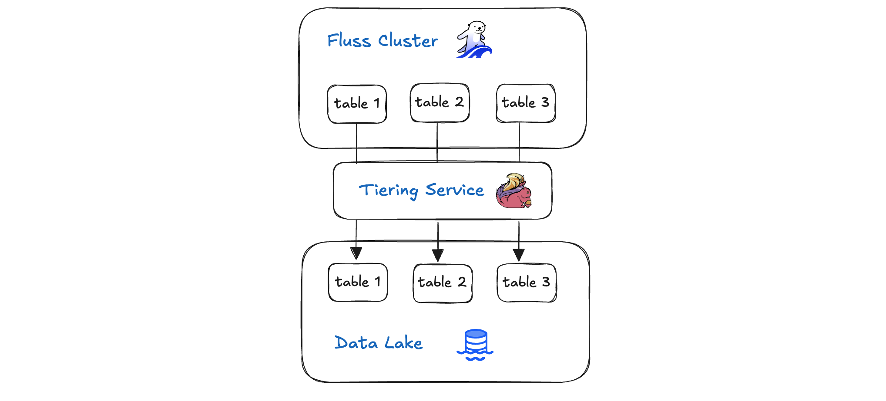
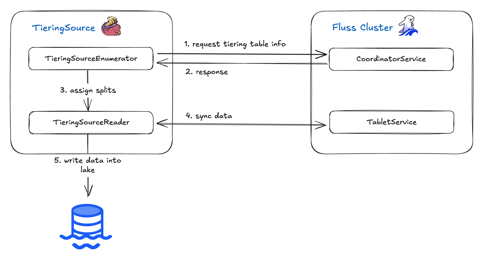
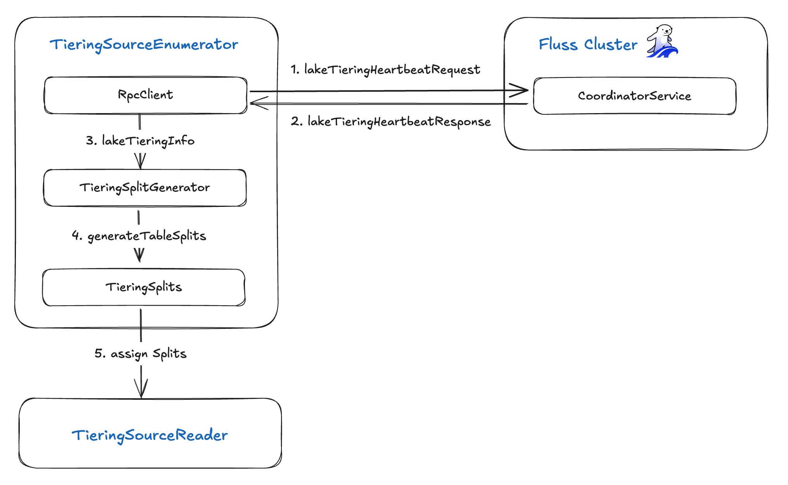
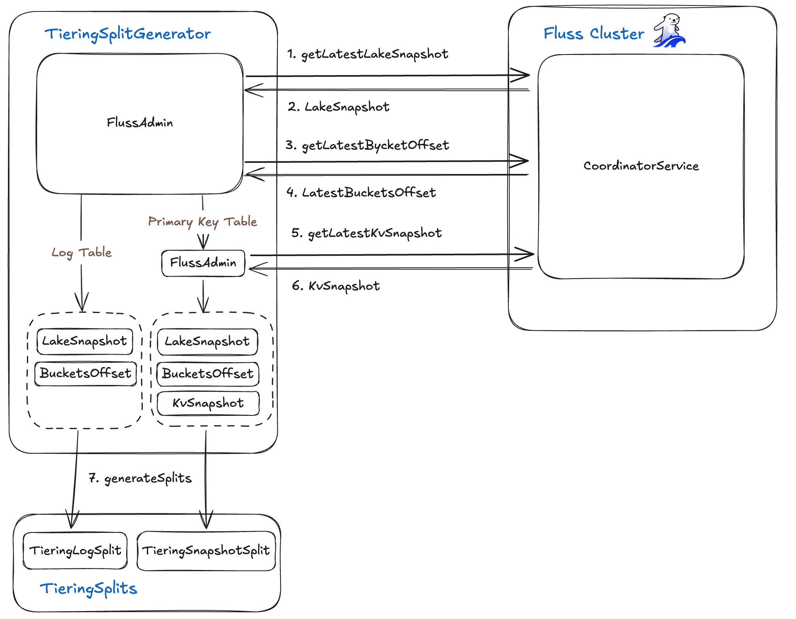

# Tiering Service Deep Dive

## Background



At the core of Fluss’s Lakehouse architecture sits the Tiering Service—a smart, policy-driven data pipeline that seamlessly bridges your real-time Fluss cluster and your cost-efficient lakehouse storage. It continuously ingests fresh events from the fluss cluster, automatically migrating older or less-frequently accessed data into colder storage tiers without interrupting ongoing queries. By balancing hot, warm, and cold storage according to configurable rules, the Tiering Service ensures that recent data remains instantly queryable while historical records are archived economically. In this deep dive, we’ll explore how Fluss’s Tiering Service orchestrates data movement, preserves consistency, and empowers you to scale analytics workloads with both performance and cost in mind.

## Flink Tiering Service

Fluss tiering service is an flink job, which keeps moving data from fluss cluster to data lake. The execution plan is quite straight forward. It has a three operators: a source, a committer and a empty sink writer.

```
 Source: TieringSource -> TieringCommitter -> Sink: Writer
```

- **TieringSource**: Reads records from the Fluss tiering table and writes them to the data lake.
- **TieringCommitter**: Commits each sync batch by advancing offsets in both the lakehouse and the Fluss cluster.
- **No-Op Sink**: A dummy sink that performs no action.

In the sections that follow, we’ll dive into the TieringSource and TieringCommitter to see exactly how they orchestrate seamless data movement between real-time and historical storage.

## TieringSource



The **TieringSource** operator reads records from the Fluss tiering table and writes them into your data lake. Built on Flink’s Source V2 API (FLIP-27), it breaks down into two core components: the **TieringSourceEnumerator** and the **TieringSourceReader**. The high-level workflow is:

1. **Enumerator** queries the CoordinatorService for current tiering table metadata.
2. Once it receives the table information, the Enumerator generates “splits” (data partitions) and assigns them to the Reader.
3. **Reader** fetches the actual data for each split.
4. The Reader then writes those records into the data lake.

In the following sections, we’ll explore how the TieringSourceEnumerator and TieringSourceReader work under the hood to deliver reliable, scalable ingestion from Fluss into your lakehouse.

### TieringSourceEnumerator



The **TieringSourceEnumerator** orchestrates split creation and assignment in five key steps:

1. **Heartbeat Request**: Uses an RPC client to send a `lakeTieringHeartbeatRequest` to the Fluss server.
2. **Heartbeat Response**: Receives a `lakeTieringHeartbeatResponse` containing tiering table metadata and sync statuses for completed, failed, and in-progress tables.
3. **Lake Tiering Info**: Forwards the returned `lakeTieringInfo` to the `TieringSplitGenerator`.
4. **Split Generation**: The `TieringSplitGenerator` produces a set of `TieringSplits`—each representing a data partition to process.
5. **Split Assignment**: Assigns those `TieringSplits` to `TieringSourceReader` instances for downstream ingestion into the data lake.

#### RpcClient

The `RpcClient` inside the `TieringSourceEnumerator` handles all RPC communication with the Fluss CoordinatorService. Its responsibilities include:

- **Sending Heartbeats**: It constructs and sends a `LakeTieringHeartbeatRequest`, which carries three lists of tables—`tiering_tables` (in-progress), `finished_tables`, and `failed_tables`—along with an optional `request_table` flag to request new tiering work.
- **Receiving Responses**: It awaits a `LakeTieringHeartbeatResponse` that contains:
    - `coordinator_epoch`: the current epoch of the coordinator.
    - `tiering_table` (optional): a `PbLakeTieringTableInfo` message (with `table_id`, `table_path`, and `tiering_epoch`) describing the next table to tier.
    - `tiering_table_resp`, `finished_table_resp`, and `failed_table_resp`: lists of heartbeat responses reflecting the status of each table.
- **Forwarding Metadata**: It parses the returned `PbLakeTieringTableInfo` and the sync-status responses, then forwards the assembled `lakeTieringInfo` to the `TieringSplitGenerator` for split creation.

#### TieringSplitGenerator



The **TieringSplitGenerator** calculates the precise data delta between your lakehouse and the Fluss cluster, then emits `TieringSplit` tasks for each segment that needs syncing. It uses a `FlussAdminClient` to fetch three core pieces of metadata:

1. **Lake Snapshot**
    - Invokes the lake metadata API to retrieve a `LakeSnapshot` object, which includes:
        - `snapshotId` (the latest committed snapshot in the data lake)
        - `tableBucketsOffset` (a map from each `TableBucket` to its log offset in the lakehouse)
2. **Current Bucket Offsets**
    - Queries the Fluss server for each bucket’s current log end offset, capturing the high-water mark of incoming streams.
3. **KV Snapshots (for primary-keyed tables)**
    - Retrieves a `KvSnapshots` record containing:
        - `tableId` and optional `partitionId`
        - `snapshotIds` (latest snapshot ID per bucket)
        - `logOffsets` (the log position to resume reading after that snapshot)

With the `LakeSnapshot`, the live bucket offsets, and (when applicable) the `KvSnapshots`, the generator computes which log segments exist in Fluss but aren’t yet committed to the lake. It then produces one `TieringSplit` per segment—each split precisely defines the bucket and offset range to ingest—enabling incremental, efficient synchronization between real-time and historical storage.

#### TieringSplit

The **TieringSplit** abstraction defines exactly which slice of a table bucket needs to be synchronized. It captures three common fields:

- **tablePath**: the full path to the target table.
- **tableBucket**: the specific bucket (shard) within that table.
- **partitionName** (optional): the partition key, if the table is partitioned.

There are two concrete split types:

1. **TieringLogSplit** (for append-only “log” tables)
    - **startingOffset**: the last committed log offset in the lake.
    - **stoppingOffset**: the current end offset in the live Fluss bucket.
    - This split defines a contiguous range of new log records to ingest.
2. **TieringSnapshotSplit** (for primary-keyed tables)
    - **snapshotId**: the identifier of the latest snapshot in Fluss.
    - **logOffsetOfSnapshot**: the log offset at which that snapshot was taken.
    - This split lets the TieringSourceReader replay all CDC (change-data-capture) events since the snapshot, ensuring up-to-date state.

By breaking each table into these well-defined splits, the Tiering Service can incrementally, reliably, and in parallel sync exactly the data that’s missing from your data lake.

### TieringSourceReader


The **TieringSourceReader** pulls assigned splits from the enumerator, uses a `TieringSplitReader` to fetch the corresponding records from the Fluss server, and then writes them into the data lake. Its workflow breaks down as follows:

1. **Split Selection**
    
    The reader picks an assigned `TieringSplit` from its queue.
    
2. **Reader Dispatch**
    
    Depending on the split type, it instantiates either:
    
    - **LogScanner** for `TieringLogSplit` (append-only tables)
    - **BoundedSplitReader** for `TieringSnapshotSplit` (primary-keyed tables)
3. **Data Fetch**
    
    The chosen reader fetches the records defined by the split’s offset or snapshot boundaries from the Fluss server.
    
4. **Lake Writing**
    
    Retrieved records are handed off to the lake writer, which persists them into the data lake.
    

By cleanly separating split assignment, reader selection, data fetching, and lake writing, the TieringSourceReader ensures scalable, parallel ingestion of streaming and snapshot data into your lakehouse.

#### LakeWriter & LakeTieringFactory

The LakeWriter is responsible for persisting Fluss records into your data lake, and it’s instantiated via a pluggable LakeTieringFactory. This interface defines how Fluss interacts with various lake formats (e.g., Paimon, Iceberg):

```java
public interface LakeTieringFactory {

	LakeWriter<WriteResult> createLakeWriter(WriterInitContext writerInitContext);

	SimpleVersionedSerializer<WriteResult> getWriteResultSerializer();

	LakeCommitter<WriteResult, CommitableT> createLakeCommitter(
            CommitterInitContext committerInitContext);

	SimpleVersionedSerializer<CommitableT> getCommitableSerializer();
}
```
- **createLakeWriter(WriterInitContext)**: builds a `LakeWriter` to convert Fluss rows into the target table format.
- **getWriteResultSerializer()**: supplies a serializer for the writer’s output.
- **createLakeCommitter(CommitterInitContext)**: constructs a `LakeCommitter` to finalize and atomically commit data files.
- **getCommitableSerializer()**: provides a serializer for committable tokens.```

By default, Fluss includes a Paimon-backed tiering factory; Iceberg support is coming soon. Once the `TieringSourceReader` writes a batch of records through the `LakeWriter`, it emits the resulting write metadata downstream to the **TieringCommitOperator**, which then commits those changes both in the lakehouse and back to the Fluss cluster.

#### Stateless

The `TieringSourceReader` is designed to be completely stateless—it does not checkpoint or store any `TieringSplit` information itself. Instead, every checkpoint simply returns an empty list, leaving all split-tracking to the `TieringSourceEnumerator`:

```java
@Override
public List<TieringSplit> snapshotState(long checkpointId) {
    // Stateless: no splits are held in reader state
    return Collections.emptyList();
}
```

By delegating split assignment entirely to the Enumerator, the reader remains lightweight and easily scalable, always fetching its next work unit afresh from the coordinator.

## TieringCommitter


The **TieringCommitter** operator wraps up each sync cycle by taking the `WriteResult` outputs from the TieringSourceReader and committing them in two phases—first to the data lake, then back to Fluss—before emitting status events to the Flink coordinator. It leverages two  components:

- **LakeCommitter**: Provided by the pluggable `LakeTieringFactory`, this component atomically commits the written files into the lakehouse and returns the new snapshot ID.
- **FlussTableLakeSnapshotCommitter**: Using that snapshot ID, it updates the Fluss cluster’s tiering table status so that the Fluss server and lakehouse remain in sync.

The end-to-end flow is:

1. **Collect Write Results** from the TieringSourceReader for the current checkpoint.
2. **Lake Commit** via the `LakeCommitter`, which finalizes files and advances the lake snapshot.
3. **Fluss Update** using the `FlussTableLakeSnapshotCommitter`, acknowledging success or failure back to the Fluss CoordinatorService.
4. **Event Emission** of either `FinishedTieringEvent` (on success or completion) or `FailedTieringEvent` (on errors) to the Flink `OperatorCoordinator`.

This TieringCommitter operator ensures exactly-once consistent synchronization between your real-time Fluss cluster and your analytical lakehouse.

## Conclusion

In this deep dive, we dissected every layer of Fluss’s Tiering Service—starting with the TieringSource (Enumerator, RpcClient, and SplitGenerator), moving through split types and the stateless TieringSourceReader, and exploring the pluggable LakeWriter/LakeCommitter integration. We then saw how the TieringCommitter (with its LakeCommitter and FlussTableLakeSnapshotCommitter) ensures atomic, exactly-once commits across both your data lake and Fluss cluster. Together, these components deliver a robust pipeline that reliably syncs real-time streams and historical snapshots, giving you seamless, scalable consistency between live workloads and analytical storage.

