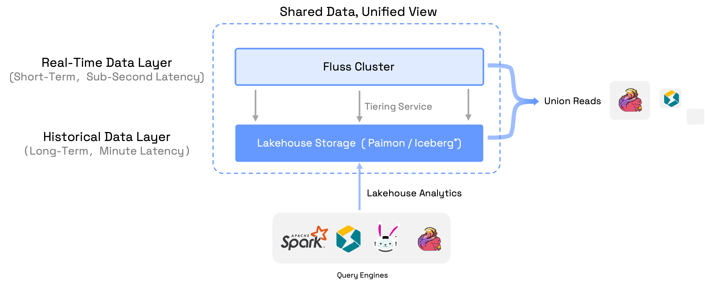
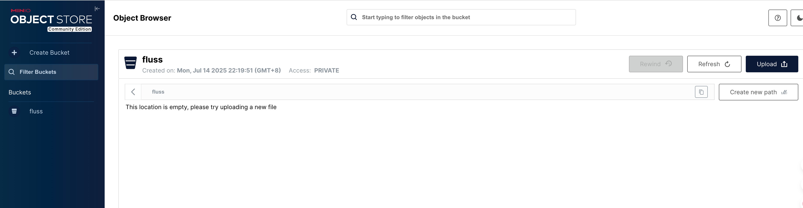
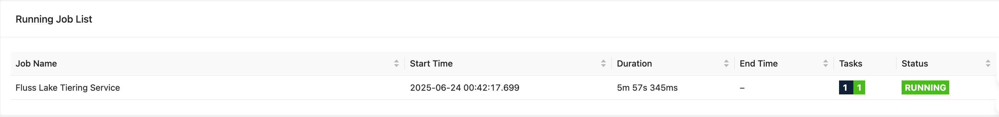
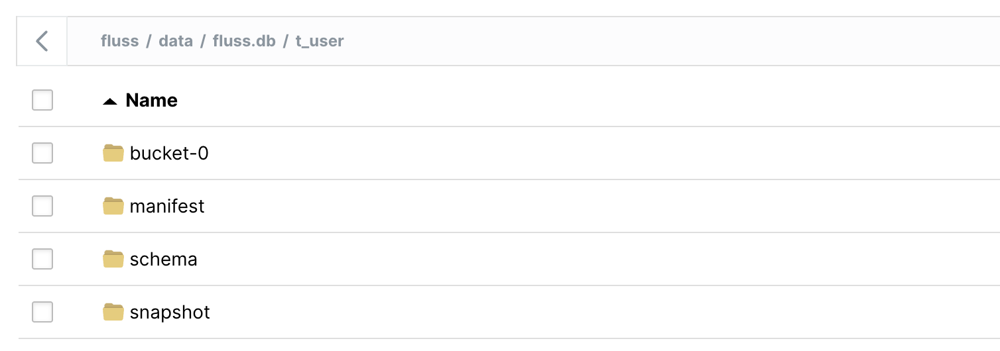

# Hands-on Fluss Lakehouse

Fluss persists historical data in a lakehouse storage layer while keeping real-time data in the Fluss server. A built-in tiering service continuously syncs fresh events into the lakehouse—enabling multiple query engines to run analytics over both hot and cold data. Fluss’s union-read feature then allows Flink jobs to transparently query from both the Fluss cluster and the lakehouse for seamless real-time processing.



In this tutorial, we’ll show you how to build a local Fluss lakehouse environment, perform essential data operations, and get hands-on experience with the end-to-end Fluss lakehouse architecture.

## Integrate the Paimon Lakehouse with S3 Locally

We’ll use **Fluss 0.7** and **Flink 1.20** to run the tiering service on a local cluster, with **Paimon** as the lake format and **S3** as paimon storage. Follow these steps:

### Minio Setup

1. Install Minio object storage locally. 
   
Follow the official .

2. Start minio server 

Run this command with a local path to store minio data.
```
minio server /tmp/minio-data
```

3. Verify in Minio WebUI.

If minio server is successfully running, there will be several endpoints and an account shown:

```
API: http://192.168.2.236:9000  http://127.0.0.1:9000
   RootUser: minioadmin
   RootPass: minioadmin

WebUI: http://192.168.2.236:61832 http://127.0.0.1:61832
   RootUser: minioadmin
   RootPass: minioadmin
```
Open the webUI link and login with the user account.

4. Create a `fluss` bucket through webUI.




### Fluss Cluster Setup

1. Download Fluss

Get the Fluss 0.7 binary release from the .

2. Add dependency

Download the `fluss-fs-s3-0.7.0.jar` from Fluss  and put it into `<FLUSS_HOME>/lib`.

Download the `paimon-s3-1.0.1.jar` from Paimon  and put it into `<FLUSS_HOME>/plugins/paimon`.

3. Configure the Data Lake

Edit `<FLUSS_HOME>/conf/server.yaml` and add:

```java
data.dir: /tmp/fluss-data
remote.data.dir: /tmp/fluss-remote-data

datalake.format: paimon
datalake.paimon.metastore: filesystem
datalake.paimon.warehouse: s3://fluss/data
datalake.paimon.s3.endpoint: http://localhost:9000
datalake.paimon.s3.access-key: minioadmin
datalake.paimon.s3.secret-key: minioadmin
datalake.paimon.s3.path.style.access: true
```

Set Paimon as the datalake format and s3 as the warehouse.

3. Start Fluss

```java
<FLUSS_HOME>/bin/local-cluster.sh start
```

### Flink Cluster Setup

1. Download Flink

Grab the flink 1.20 binary package from the [Flink downloads page](https://flink.apache.org/downloads/).

2. Add the Fluss Connector

Download `fluss-flink-1.20-0.7.0.jar` from the [Fluss site](https://alibaba.github.io/fluss-docs/downloads/) and copy it into:

```java
<FLINK_HOME>/lib
```

3. Add Paimon Dependencies

- Download `paimon-flink-1.20-1.0.1.jar` and `paimon-s3-1.0.1.jar` from the [Paimon project site](https://paimon.apache.org/docs/1.0/project/download/) into `<FLINK_HOME>/lib`.
- Copy the Paimon plugin jars from Fluss into `<FLINK_HOME>/lib` .

```java
<FLUSS_HOME>/plugins/paimon/fluss-lake-paimon-0.7.0.jar
<FLUSS_HOME>/plugins/paimon/flink-shaded-hadoop-2-uber-2.8.3-10.0.jar
```

4. Increase Task Slots

Edit `<FLINK_HOME>/conf/config.yaml`:

```java
// e.g. increase the slots number to 5
numberOfTaskSlots: 5 
```

5. Start Flink

```java
<FLINK_HOME>/bin/start-cluster.sh
```

6. Verify

Open your browser to `http://localhost:8081/` and confirm the cluster is up.

### Launching the Tiering Service

1. Get the Tiering Job Jar

Download the `fluss-flink-tiering-0.7.0.jar` .

2. Submit the Job

```java
<FLINK_HOME>/bin/flink run \
    <path_to_jar>/fluss-flink-tiering-0.7.0.jar \
    --fluss.bootstrap.servers localhost:9123 \
    --datalake.format paimon \
    --datalake.paimon.metastore filesystem \
    --datalake.paimon.warehouse /tmp/fluss-paimon-data
```

3. Confirm Deployment

In the Flink UI, look for the **Fluss Lake Tiering Service** job. Once it’s running, your local tiering pipeline is operational.



## Data Processing

In this section, we’ll use the Flink SQL Client to interact with our Fluss lakehouse and run both batch and streaming queries.

1. Launch the SQL Client

```
<FLINK_HOME>/bin/sql-client.sh
```

2. Create the Catalog and Table

```
CREATE CATALOG fluss_catalog WITH (
    'type' = 'fluss',   
    'bootstrap.servers' = 'localhost:9123'
);

USE CATALOG fluss_catalog;

CREATE TABLE t_user (
    `id` BIGINT,
    `name` string NOT NULL,
    `age` int,
    `birth` DATE,
    PRIMARY KEY (`id`) NOT ENFORCED
)WITH (
    'table.datalake.enabled' = 'true',
    'table.datalake.freshness' = '30s'
);
```

3. Write data

Inserts two records.

```
SET 'execution.runtime-mode' = 'batch';
SET 'sql-client.execution.result-mode' = 'tableau';

INSERT INTO t_user(id,name,age,birth) VALUES
(1,'Alice',18,DATE '2000-06-10'),
(2,'Bob',20,DATE '2001-06-20');
```

4. Union Read

You can run a simple SQL query to get data from this table. By default, Flink will union data from both the Fluss cluster and the lakehouse:

```

Flink SQL> select * from t_user;
+----+-------+-----+------------+
| id |  name | age |      birth |
+----+-------+-----+------------+
|  1 | Alice |  18 | 2000-06-10 |
|  2 |   Bob |  20 | 2001-06-20 |
+----+-------+-----+------------+
```

Users can read data only from the lake table, by appending a `$lake`  after the table name.

```
Flink SQL> select * from t_user$lake;
+----+-------+-----+------------+----------+----------+----------------------------+
| id |  name | age |      birth | __bucket | __offset |                __timestamp |
+----+-------+-----+------------+----------+----------+----------------------------+
|  1 | Alice |  18 | 2000-06-10 |        0 |       -1 | 1970-01-01 07:59:59.999000 |
|  2 |   Bob |  20 | 2001-06-20 |        0 |       -1 | 1970-01-01 07:59:59.999000 |
+----+-------+-----+------------+----------+----------+----------------------------+
```

The two records appear in data lake. The tiering service works for syncing data from Fluss to data lake.

Notice that in the paimon lake table, there are three system columns defined there: `__bucket`, `__offset` and `__timestamp` . The __bucket column shows which bucket this row in. The __offset and __timestamp columns are used for streaming mode data processing.

5. Streaming Inserts

Let’s switch to streaming mode and insert two new records.

```
Flink SQL> SET 'execution.runtime-mode' = 'streaming';

Flink SQL> INSERT INTO t_user(id,name,age,birth) VALUES
(3,'Catlin',25,DATE '2002-06-10'),
(4,'Dylan',28,DATE '2003-06-20');
```

Query the lake:

```

Flink SQL> select * from t_user$lake;
+----+-------+-----+------------+----------+----------+----------------------------+
| id |  name | age |      birth | __bucket | __offset |                __timestamp |
+----+-------+-----+------------+----------+----------+----------------------------+
|  1 | Alice |  18 | 2000-06-10 |        0 |       -1 | 1970-01-01 07:59:59.999000 |
|  2 |   Bob |  20 | 2001-06-20 |        0 |       -1 | 1970-01-01 07:59:59.999000 |
+----+-------+-----+------------+----------+----------+----------------------------+


Flink SQL> select * from t_user$lake;
+----+--------+-----+------------+----------+----------+----------------------------+
| id |   name | age |      birth | __bucket | __offset |                __timestamp |
+----+--------+-----+------------+----------+----------+----------------------------+
|  1 |  Alice |  18 | 2000-06-10 |        0 |       -1 | 1970-01-01 07:59:59.999000 |
|  2 |    Bob |  20 | 2001-06-20 |        0 |       -1 | 1970-01-01 07:59:59.999000 |
|  3 | Catlin |  25 | 2002-06-10 |        0 |        2 | 2025-06-24 23:16:46.740000 |
|  4 |  Dylan |  28 | 2003-06-20 |        0 |        3 | 2025-06-24 23:16:46.740000 |
+----+--------+-----+------------+----------+----------+----------------------------+

```

In the first time, the two new records have not been synced into lake table. After waiting for a while they appear in the second time query.

The __offset and __timestamp columns for these two records are not the default values now. It shows the offset and timestamp when the records entered into the table.

6. Inspect the Paimon Files

Open the Minio webUI, you will see there exists paimon files in the bucket.



In your local filesystem, you can verify the Parquet files and manifest under `/tmp/minio-data` .

```
/tmp/minio-data ❯ tree .
.
└── fluss
    └── data
        ├── default.db__XLDIR__
        │   └── xl.meta
        └── fluss.db
            └── t_user
                ├── bucket-0
                │   ├── changelog-ad07a5a0-10c8-48a9-93c5-11d43e35c9d9-0.parquet
                │   │   └── xl.meta
                │   └── data-ad07a5a0-10c8-48a9-93c5-11d43e35c9d9-1.parquet
                │       └── xl.meta
                ├── manifest
                │   ├── manifest-6bb801ab-9a80-4df1-927f-063b73764cf8-0
                │   │   └── xl.meta
                │   ├── manifest-6bb801ab-9a80-4df1-927f-063b73764cf8-1
                │   │   └── xl.meta
                │   ├── manifest-list-e8b9cde3-5b94-456e-a702-cedd498e1c5f-0
                │   │   └── xl.meta
                │   ├── manifest-list-e8b9cde3-5b94-456e-a702-cedd498e1c5f-1
                │   │   └── xl.meta
                │   └── manifest-list-e8b9cde3-5b94-456e-a702-cedd498e1c5f-2
                │       └── xl.meta
                ├── schema
                │   └── schema-0
                │       └── xl.meta
                └── snapshot
                    ├── LATEST
                    │   └── xl.meta
                    └── snapshot-1
                        └── xl.meta

20 directories, 11 files
```

1. View Snapshots

Users can also check the snapshots from the system table, by appending `$lake$snapshots` after thefluss table name.

```
Flink SQL> select * from t_user$lake$snapshots;
+-------------+-----------+----------------------+-------------------------+-------------+----------+
| snapshot_id | schema_id |          commit_user |             commit_time | commit_kind | ...      |
+-------------+-----------+----------------------+-------------------------+-------------+----------+
|           1 |         0 | __fluss_lake_tiering | 2025-06-24 00:42:25.615 |      APPEND | ...      |
|           2 |         0 | __fluss_lake_tiering | 2025-06-24 23:17:45.341 |      APPEND | ...      |
+-------------+-----------+----------------------+-------------------------+-------------+----------+
2 rows in set (0.33 seconds)
```

## Summary


In this guide, we gave a concise overview of the Fluss lakehouse architecture, walked through a step-by-step local setup of both Fluss and Flink clusters, and showcased practical data-processing examples using real-time and historical data. Those steps give you practical experience with Fluss’s lakehouse architecture in a local environment.