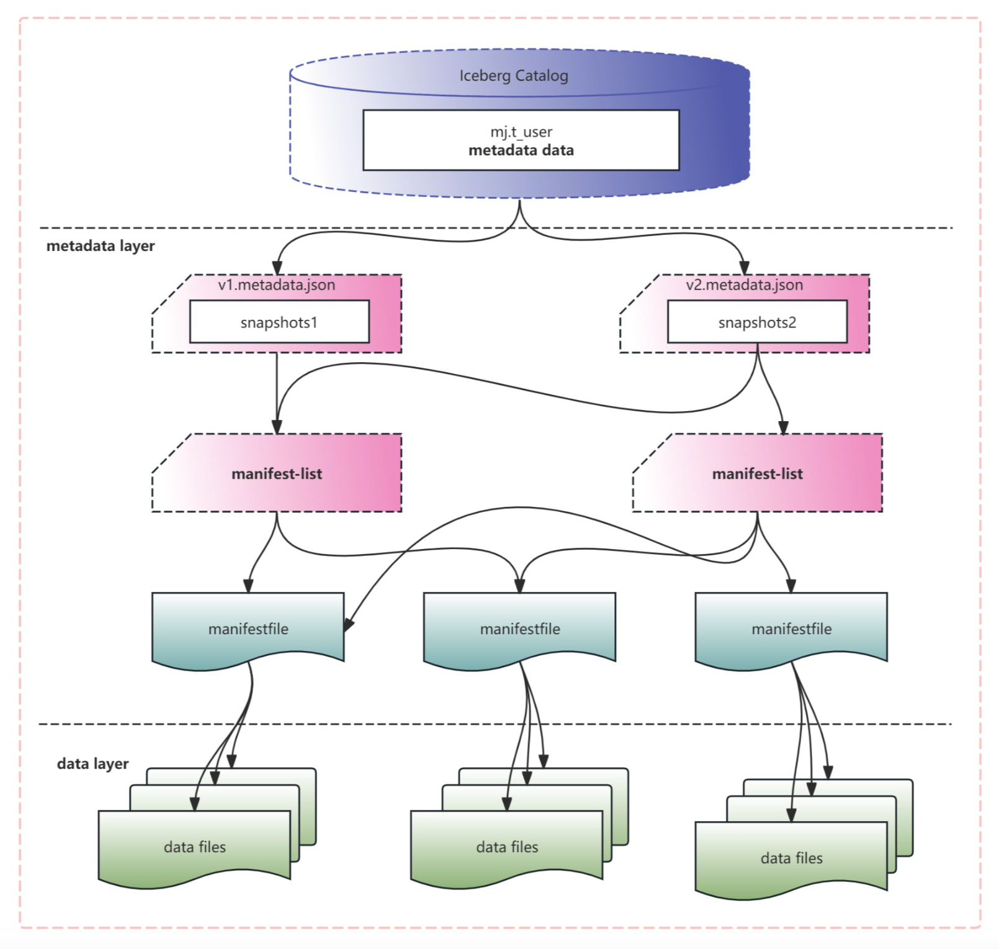
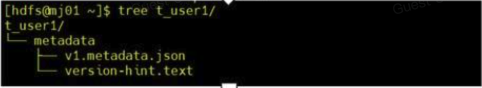
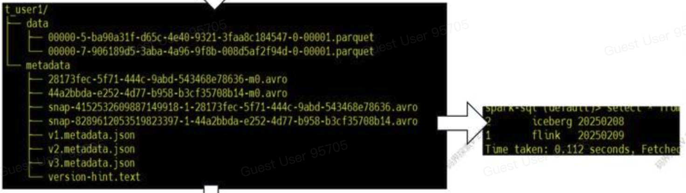
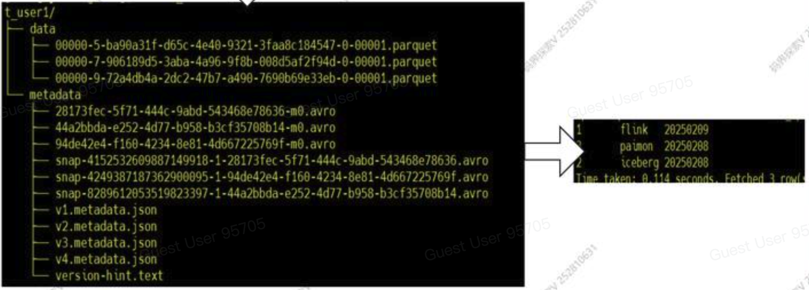
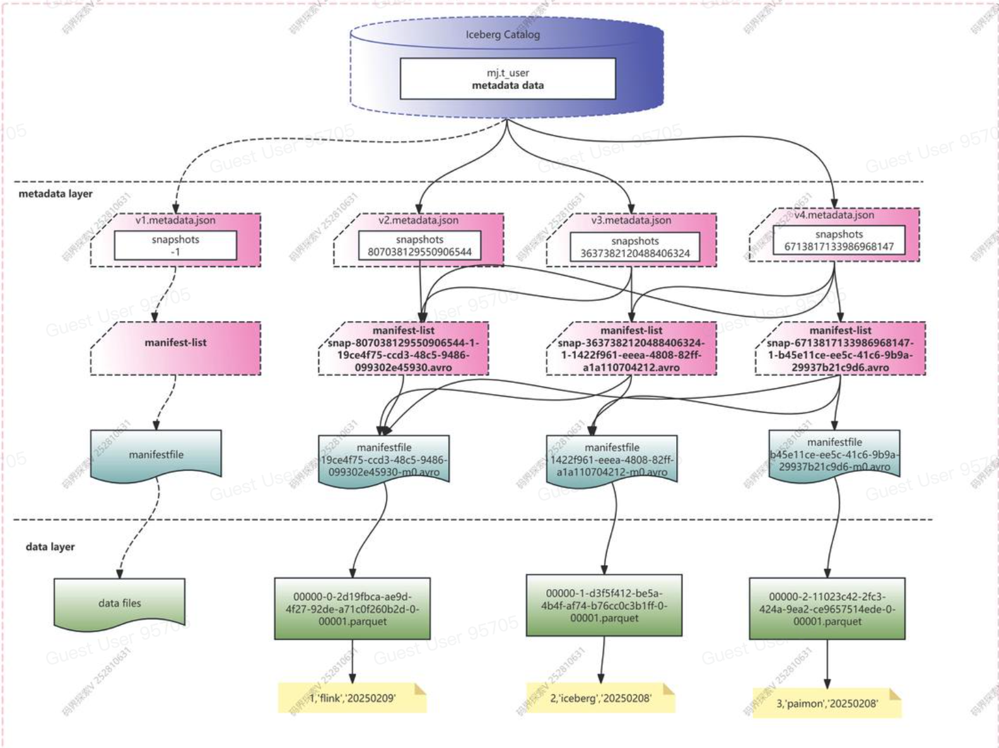
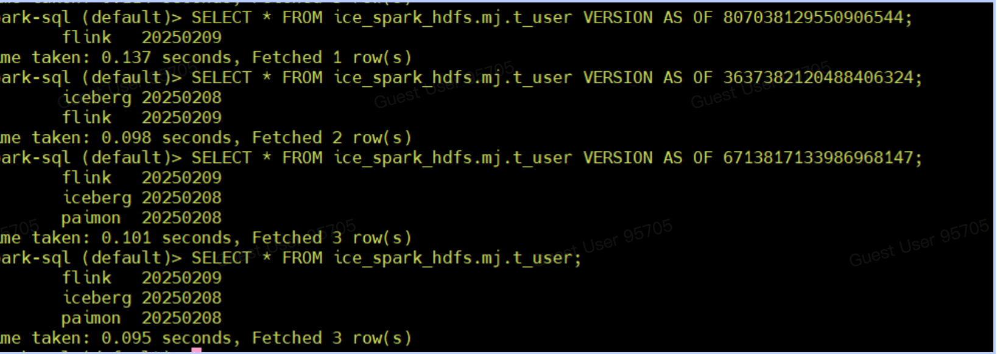

# Iceberg文件布局

## Snapshots
paimon、hudi、iceberg等数据湖组件中都有snapshot(快照)、version(版本)的概念。不管是快照还是版本表示的是某一时刻对应表数据的一个完整的数据以及状态（元数据对应的完整数据）。同时快照、版本也是数据湖能够支持湖仓一体、流批一体的核心设计。

## 文件布局

### 整体预览
文件及布局如图所示


### 详细案例剖析

1. 创建iceberg表
```
CREATE TABLE ice_spark_hdfs.mj.t_user1 (
    id bigint,
    name string,
    dt string
)
USING iceberg
```
其文件结构如图所示，只有metadata文件夹，内涵v1.metadata.json.


2. 插入第一条数据
```
INSERT INTO ice_spark_hdfs.mj.t_user1 VALUES(1, 'flink', '20250209');
```
此时的表文件结构里会多出: 
+ 版本的metadata文件 `metadata/v2.metadata.json`
+ manifest-list文件 `metadata/snapshot-xxx.avro`
+ manifest文件 `metadata/xxx.avro`
+ data数据文件 `data/xxx.parquet`, 

这个snapshot只包含一条数据 (1, 'flink', '20250209')

3. 插入第二条数据
```
INSERT INTO ice_spark_hdfs.mj.t_user1 VALUES(1, 'icebert', '20250208');
```
表文件结构里又会多出一组新的snapshot文件 (metadata.json, manifest-list, manifest, data)。

这个snapshot包含两条数据 (1, 'flink', '20250209')，(1, 'icebert', '20250208')。



4. 插入第三条数据
```
INSERT INTO ice_spark_hdfs.mj.t_user1 VALUES(1, 'paimon', '20250208');
```
同理，表文件结构里又会多出一组snapshot文件。这个snaphot就包含三条数据。


最终的文件结构和内容如图所示


+ 在metadata.json文件里，指向了一个或多个manifest-list文件。比如v2.metadata.json里指向了第一个manifest-list文件，v3.metadata.json文件里指向了第一个和第二个manifest-list文件.
+ 一个manifest-list文件里指向了一个或多个manifest file文件。
+ 一个manifest file文件对应一个data的parquet文件。

### 查看snapshot数据

```
SELECT * FROM ice_spark_hdfs.mj.t_user VERSION AS OF 807038129550906544;
SELECT * FROM ice_spark_hdfs.mj.t_user VERSION AS OF 3637382120488406324;
SELECT * FROM ice_spark_hdfs.mj.t_user VERSION AS OF 6713817133986968147;
```



### 查看avro格式的数据
通过avro-tools-1.10.1.jar可以将avro转成json格式.[下载地址](https://archive.apache.org/dist/avro/avro-1.10.1/java/)
```
java -jar avro-tools-1.10.1.jar tojson --pretty /opt/test/layout1/manifest/manifest-list-c935e5b9-5701-4aa9-951a-61ceef8ffd23-0
```

