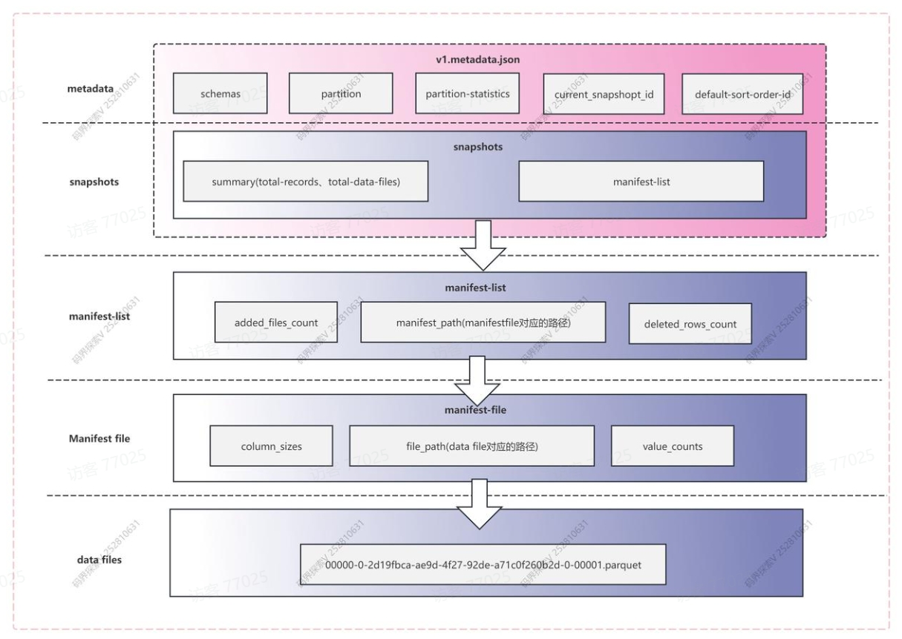
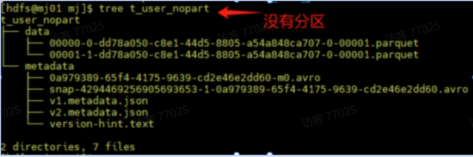
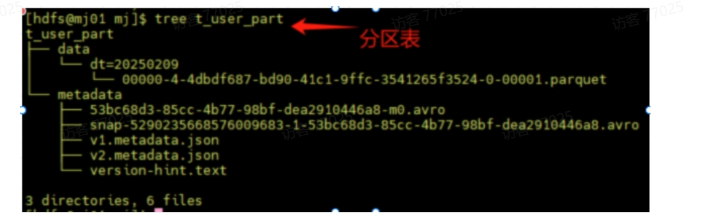
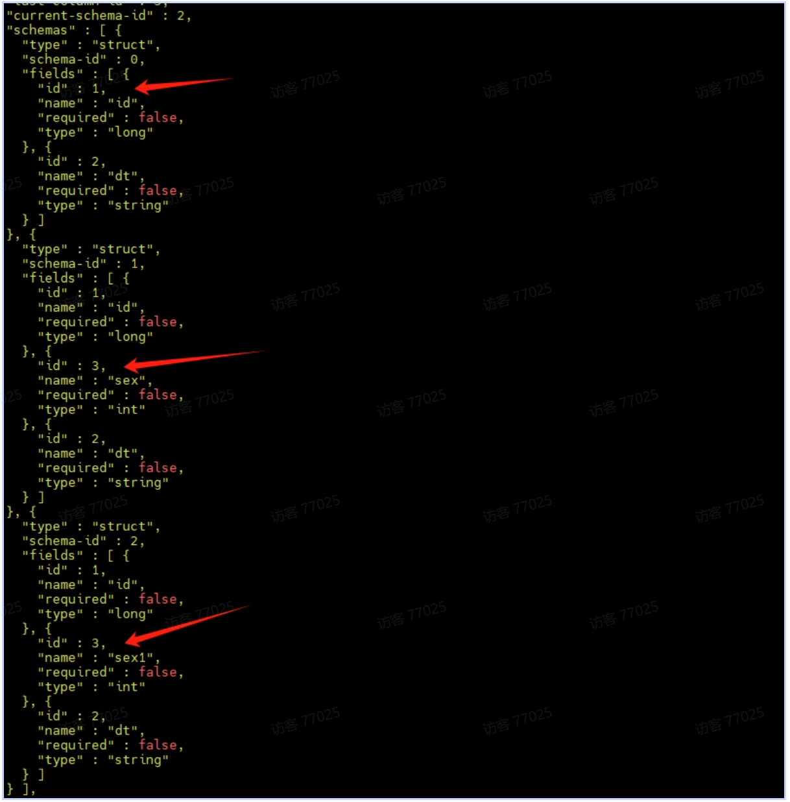
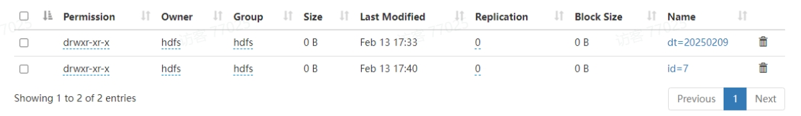

# Iceberg 核心特性

## 存储结构



### 1. metadata
iceberg写入的时候会产生一个v.metadata.json文件，用来存放这个表结构相关的元数据

### 2. snapshot 快照
快照代表一张表在某个时刻的状态。每个快照包含该时刻所对应的所有menifest-list,每个manifest-list包含一个或多个manifest-flie,每个manifest-file包含一个或多个data数据，也可以理解为Manifest list文件代表一个快照（snap-开头）。

### 3. manifest list 清单列表
manifest list主要存储了存储的是Manifest file列表，每行数据存储了Manifest file的路径、data files分区范围，增加了几个数文件、删除了几个数据文件等信息，用来在查询时提供过滤，加快速度。

例如：snap-6713817133986968147-1-b45e11ce-ee5c-41c6-9b9a-29937b21c9d6.avro

### 4. data file
data就是真正存储我们表数据的，iceberg支持的表格式有parquet、avro、orc三种格式。

## Catalogs

Iceberg提供了一个 Catalog 接口，该接口要求实现一系列功能，主要是列出现有表、创建表、删除表、检查表是否存在以及重命名表等功能。

### Hive Metastore
```
spark.sql.catalog.hive_prod = org.apache.iceberg.spark.SparkCatalog
spark.sql.catalog.hive_prod.type = hive
spark.sql.catalog.hive_prod.uri = thrift://metastore-host:port
```
### REST
```
spark.sql.catalog.rest_prod = org.apache.iceberg.spark.SparkCatalog
spark.sql.catalog.rest_prod.type = rest
spark.sql.catalog.rest_prod.uri = http://localhost:8080
```
### Hadoop
```
spark.sql.catalog.hadoop_prod = org.apache.iceberg.spark.SparkCatalog
spark.sql.catalog.hadoop_prod.type = hadoop
spark.sql.catalog.hadoop_prod.warehouse = hdfs://nn:8020/warehouse/path
```

无论是哪种形式的Catalog，其背后就是存储在数据库（mysql）、hdfs、s3等介质，使其具备数据湖表元数据的管理能力。

## format-version

### v1：基础分析表
- 定位：面向不可变文件的静态分析表（如数仓场景）。
- 支持文件格式：Parquet、Avro、ORC。
- 特性：
  - 数据文件不可修改，仅支持追加写入。
  - 元数据通过快照（Snapshot）管理，实现时间旅行（Time Travel）和版本回滚。
- 兼容性：升级到版本 2 后，所有版本 1 的数据和元文件仍有效（新版读取时会自动补全缺失字段）。

### v2：行级删除
- 核心改进：支持对不可变文件的细粒度修改。
- 关键特性：
  - 删除文件（Delete Files）：通过独立的删除文件标记需删除的行（如通过 DELETE 语句删除某行），无需重写原数据文件。
  - 更新严格性：对写入操作要求更严格（如字段类型强制校验），确保数据一致性。
- 适用场景：需要局部更新或删除记录的 OLAP 场景（如 GDPR 数据删除需求）。

### v3（开发中）
- 新增能力：
  - 数据类型扩展：
    - 纳秒级时间戳（timestamp(tz)）。
    - 支持 unknown 类型（表示未知或未定义类型）。
  - 列默认值：为新增列定义默认值，简化 Schema 演化。
  - 高级分区与排序：支持多参数分区函数（如 bucket(user_id, 128)）。
  - 行级血缘追踪：记录行的来源（如数据血缘治理）。
  - 二进制删除向量：优化删除标记的存储效率（替代版本 2 的删除文件）。

```
通过 format.version 参数可指定表的格式版本（如建表时指定 'format-version'='2'），需根据业务需求权衡功能与兼容性。
```

## Schemas

v1.metadata.json对应的json文件中会有与之对应的schems数据的字段（id、name、requered、type）。
```
  "schemas" : [ {
    "type" : "struct",
    "schema-id" : 0,
    "fields" : [ {
      "id" : 1,
      "name" : "id",
      "required" : false,
      "type" : "long"
    }, {
      "id" : 2,
      "name" : "name",
      "required" : false,
      "type" : "string"
    }, {
      "id" : 3,
      "name" : "dt",
      "required" : false,
      "type" : "string"
    } ]
  } ],
```

## Partitioning 分区

### 分区概念
分区：核心是将数据按照特定规则（如相同日期、类别的记录）物理存储在一起（文件夹 dt=20250213），减少查询时扫描的数据量，提升性能。是通过数据存储优化来提升查询性能的一种技术.
总结：减少查询的数据量，提高性能。

### 分区的作用
- 加速查询：通过将数据按查询条件的关键字段（如日期、地区）分区，查询时仅扫描相关分区，避免全表扫描。
- 降低I/O开销：减少磁盘读取量，提升处理效率。

### 非分区表：全文件扫描

- 存储方式：所有数据文件混杂在一个目录中，没有逻辑分组。
- 查询过程：
- -- SELECT * FROM t_user_nopart WHERE dt = '20231001';
  - 执行引擎需要扫描所有数据文件，逐行检查dt字段是否符合条件。
  - 即使目标数据仅占1%，仍需读取全部数据，I/O开销极大。

### 分区表：精准定位分区


  - 存储方式：数据按分区键（如dt）的值组织成独立目录，每个目录对应一个分区值。
  - 查询过程：
  - -- SELECT * FROM t_user_nopart WHERE dt = '20251209';
    - 执行引擎先查询元数据，直接定位到目录dt=2023-10-01/。
    - 仅扫描该目录下的文件，跳过其他所有分区数据。
    - 假设数据按天均匀分布，I/O开销降低至原来的1/N（N为总天数）。

## Hive 分区
```
drop table user_table;
CREATE TABLE user_table (
    id INT,
    name STRING,
    ts TIMESTAMP
) PARTITIONED BY (dt String) STORED AS PARQUET;
 insert into user_table  partition(dt='20250213') select 1,'flink',current_timestamp();
  insert into user_table  select 1,'flink',current_timestamp();
  select * from user_table where dt = '20250213' ;
```
### Hive 分区的局限性
显式分区维护
- 用户需手动管理分区列
- 查询依赖分区列
- 查询耦合物理布局：
查询逻辑必须显式依赖分区列，若分区策略变更（如从按天改为按月），需重写所有历史查询。
- 运维成本高：
分区列爆炸性增长（如按秒分区）会导致元数据膨胀，小文件问题加剧。

## Iceberg隐藏分区
Apache Iceberg 的 隐藏分区 是一种革新性的设计，通过 逻辑与物理分离 解决了传统分区（如 Hive 分区）的痛点，分区列维护成本高、分区策略无法灵活变更等问题。

```
set spark.sql.catalog.ice_spark_hdfs = org.apache.iceberg.spark.SparkCatalog;
set spark.sql.catalog.ice_spark_hdfs.type = hadoop;
set spark.sql.catalog.ice_spark_hdfs.warehouse = hdfs://mj01:8020/lakehouse/ice_spark_hdfs;
-- 创建表时定义隐藏分区（按天分区）
CREATE TABLE ice_spark_hdfs.mj.t_user_part_hidden (
     id bigint,
     name String,
     ts timestamp,
    dt string
) USING iceberg
PARTITIONED BY (days(ts), bucket(3, id));  
INSERT INTO ice_spark_hdfs.mj.t_user_part_hidden  values
(1,'flink',current_timestamp(),'20250209'),
(2,'flink',current_timestamp(),'20250210'),
(1,'flink',current_timestamp(),'20250209'),
(2,'flink',current_timestamp(),'20250210'),
(3,'flink',current_timestamp(),'20250209');
```

### 隐藏分区的核心机制

#### 1. 自动分区值的转换

- 功能：通过预定义的 分区转换函数（如 days(), hours(), bucket()），Iceberg 自动将字段值转换为分区值。
```
PARTITIONED BY (days(ts ))  -- 按天分区
PARTITIONED BY (bucket(10, user_id))  -- 按 user_id 分10个桶
PARTITIONED BY (truncate(10, url))    -- 截取url前10字符分区
```
- 优势：用户无需手动维护 ts 等冗余字段，避免数据不一致。

#### 2. 查询透明性
- 查询透明性：用户只需按原始字段过滤，Iceberg 自动定位到对应物理文件。
 用户直接查询 ts ，无需知道分区逻辑

```
SELECT * FROM ice_spark_hdfs.mj.t_user_part_hidden WHERE ts BETWEEN '2023-10-01 00:00:00' AND '2025-10-01 23:59:59';
```

#### 3. 分区策略动态演化
- 问题：传统分区表一旦分区策略不合理（如按“月”分区导致大文件），需全量数据重写。
- Iceberg 解决方案：
通过 ALTER TABLE 修改分区策略，后续新数据按新策略写入，旧数据保持原状，无需迁移。

```

ALTER TABLE ice_spark_hdfs.mj.t_user_part_hidden REPLACE PARTITION FIELD ts_day WITH months(ts) as month;
INSERT INTO ice_spark_hdfs.mj.t_user_part_hidden  values
(4,'flink',current_timestamp(),'20250209');

ALTER TABLE ice_spark_hdfs.mj.t_user_part_hidden DROP PARTITION FIELD bucket(3, id);
ALTER TABLE ice_spark_hdfs.mj.t_user_part_hidden REPLACE PARTITION FIELD  month WITH months(ts) as month1;

INSERT INTO ice_spark_hdfs.mj.t_user_part_hidden  values
(7,'flink',current_timestamp(),'20250209');
```

### 隐藏分区分区转换函数
Iceberg 支持多种内置转换函数，将字段值映射到分区值：

|函数|说明|示例|
|---|---|---|
|identity	|直接使用字段值（传统分区方式）	|PARTITIONED BY (identity(level))|
|year, month, day	|按时间粒度分区	|PARTITIONED BY (days(event_time))|
|hour	|按小时分区	|PARTITIONED BY (hour(event_time))
|bucket	|哈希分桶（类似分桶表）	|PARTITIONED BY (bucket(100, user_id))|
|truncate	|截断字符串或数字（如按前缀分区）|	PARTITIONED BY (truncate(10, url))|

### 隐藏分区与传统分区的性能对比

|维度	|传统分区（Hive）	|Iceberg 隐藏分区|
|---|---|---|
|分区维护	|需手动维护分区列	|全自动，无额外字段|
|查询优化	|依赖用户显式指定分区键	|自动应用分区过滤，透明加速|
|分区演化	|需重写全表数据	|动态修改策略，无需迁移旧数据|
小文件问题	|分区过多易产生小文件	|结合元数据优化，减少小文件影响|

## Evolution 演化
Iceberg 的 表进化 机制

在不重写数据或迁移表的情况下，动态调整表结构（Schema）、分区策略（Partitioning）和排序规则（Sort Order）。降低了运维复杂度，同时保证数据一致性和查询兼容性。

```
spark-sql --hiveconf hive.cli.print.header=true
set spark.sql.catalog.ice_spark_hdfs = org.apache.iceberg.spark.SparkCatalog;
set spark.sql.catalog.ice_spark_hdfs.type = hadoop;
set spark.sql.catalog.ice_spark_hdfs.warehouse = hdfs://mj01:8020/lakehouse/ice_spark_hdfs;
use ice_spark_hdfs;
create database if not exists ice_spark_hdfs.mj;
drop table if exists ice_spark_hdfs.mj.t_user;
CREATE TABLE ice_spark_hdfs.mj.t_user (
    id bigint,
    dt string)
USING iceberg 
PARTITIONED BY (dt)
TBLPROPERTIES ('format-version'='2');
INSERT INTO ice_spark_hdfs.mj.t_user values
(4,'20250209'),
(5,'20250209'),
(6,'20250209');
```
### Hive局限性引出问题
假如Hive中，如果把一个按天分区的表，改成按小时分区，如何实现？
- 创建一张小时分区的表（hive不能直接修改原表）。
- 数据Insert到新的小时分区表。
- Rename的命令把新表的名字改为原表。
- 使用按照天分区的原表的上的脚本修改成按照小时分区的sql脚本（dt、hour）。

### Schema Evolution
核心能力：动态修改表结构（如增删改列、调整嵌套字段顺序），无需重写数据文件。

#### 1. 支持的变更类型
|操作	|说明	|示例|
|---|---|---|
|Add	|添加新列或嵌套字段	|新增 user_geo 列记录地理位置
|Drop	|删除现有列或嵌套字段	|弃用旧字段 legacy_id
|Rename	|重命名列或嵌套字段	|将 cust_id 更名为 customer_id
|Update	|扩展字段类型（如 INT → BIGINT）|将 price 字段从 FLOAT 改为 DOUBLE

#### 2.实现原理
- 唯一列标识符（Column ID）：
Iceberg 为每个列分配唯一 ID，而非依赖列名或位置。重命名或调整顺序时，ID 保持不变，确保数据正确性。
- 元数据层管理：
Schema 变更仅修改元数据（如 metadata.json），数据文件无需重写。读取时通过 ID 映射新旧列名。

模式演化：其底层原理就是对元数据进行修改，查询数据的时候时候基于元数据找到对应的数据。请注意，映射键不支持添加或删除会更改相等性的结构字段。

#### 3.示例
```
-- 添加column
ALTER TABLE ice_spark_hdfs.mj.t_user   ADD COLUMN age int;
--指定列后面更加column
ALTER TABLE ice_spark_hdfs.mj.t_user ADD COLUMN sex int AFTER id;
--修改列名
ALTER TABLE ice_spark_hdfs.mj.t_user RENAME COLUMN sex TO sex1;
--修改列类型
ALTER TABLE ice_spark_hdfs.mj.t_user ALTER COLUMN sex1 TYPE bigint;
--添加注释
ALTER TABLE ice_spark_hdfs.mj.t_user ALTER COLUMN sex1 COMMENT 'table sex';
--删除列
ALTER TABLE ice_spark_hdfs.mj.t_user DROP COLUMN sex1;
```
更改metadata.json里的schema结构，column是根据id来识别。


### Partition Evolution
核心能力：动态调整分区策略，新旧分区布局共存，查询自动适配。

```
--修改分区·
ALTER TABLE ice_spark_hdfs.mj.t_user REPLACE PARTITION FIELD dt WITH id;
INSERT INTO ice_spark_hdfs.mj.t_user values(7,'20250209',1);
```


老分区的路径依然存在，新数据存在新的分区中

传统系统（如 Hive）的局限性
- 分区策略绑定表定义，变更需创建新表并迁移数据。
- 查询必须显示指定分区列，调整策略需重写所有查询。

Iceberg 实现机制
- 多版本分区策略：
新数据按新策略分区，旧数据保留原分区布局，元数据记录所有历史分区规则。
- 自动分区剪枝：
查询时根据过滤条件自动选择对应分区布局，无需用户干预。

与传统系统的对比总结

|维度	|Hive	|Iceberg|
|---|---|---|
|Schema 变更	|部分支持，需重写数据或迁移表	|完全支持，元数据级操作，无需重写数据
|分区策略调整|	需创建新表，查询需重写	|动态演进，新旧分区共存，查询自动适配
|排序规则调整|	不支持	|动态调整，新旧排序共存
运维成本|	高（需数据迁移与查询适配）	|低（纯元数据操作）

## 分支(Branching)和标签(Tagging)
Iceberg  分支（Branch）和标签（Tag）功能 提供了灵活的快照管理和版本控制能力。支持多版本并行开发满足历史数据审计和合规性管理等应用场景。

|概念|	定义|	生命周期管理|
|---|---|---|
|分支（Branch）|	指向快照的可变引用，用于创建独立的开发或测试（如 audit-branch）。|	可设置保留策略：保留最近 N 个快照，或保留指定时长的快照（如 7 天）。
|标签（Tag）|	指向快照的不可变引用，用于标记关键历史节点（如 EOY-2023 表示年终快照）。|	默认永久保留，可设置过期时间（如 180 天）。
|快照（Snapshot）|	表在某一时刻的完整状态，包含数据文件列表、Schema、分区信息等元数据。|	通过 expire_snapshots 清理过期快照，释放存储空间。

应用场景
- 历史数据审计与合规性管理
    通过标签（Tag）标记关键历史快照（如月末、年末数据），并设置保留策略，满足审计或合规要求。

```
eg:合规要求数据隐私（用户敏感信息加密）则可以通过审计发现敏感信息是否加密。
iceberg实现：每月或每季度创建Tag，审计部门周期性检查（如季度审计、月度审计）来满足合规要求。
```
- 数据验证与测试
     使用分支（Branch）隔离测试环境，验证数据变更或新功能，避免影响主表稳定性。
- 版本管理和回滚
     标签用于标记稳定版本（如发布版本），分支支持版本回滚或数据修复。

```
数据审计：是对数据的系统性检查和评估，旨在验证数据的准确性、完整性、一致性和安全性，并评估数据处理流程是否符合既定标准或法规。
合规：指组织在数据处理活动中遵守相关法律法规、行业标准及内部政策的要求，避免法律风险和经济损失。
```

1.场景描述：

通过标签（Tag）标记关键历史快照（如月末、年末数据），并设置保留策略，满足审计或合规要求（如 GDPR）。例如：
- 每周快照保留：标记每周数据并保留 7 天。
- 年度快照永久保留：标记年末快照作为长期审计依据。
```
//默认最新快照构建Tag
ALTER TABLE ice_spark_hdfs.mj.t_user_part_hidden CREATE TAG  `year-1` RETAIN 7 DAYS; 

//指定快照创建Tag
ALTER TABLE ice_spark_hdfs.mj.t_user_part_hidden CREATE TAG  `year-2` AS OF VERSION 5868249554383675426 RETAIN 7 DAYS;

 //修改Tag保留时间
ALTER TABLE ice_spark_hdfs.mj.t_user_part_hidden REPLACE TAG `year-1` RETAIN 30 DAYS;
//查询指定标签
SELECT * FROM ice_spark_hdfs.mj.t_user_part_hidden VERSION AS OF 'year-1';
//删除Tag
ALTER TABLE ice_spark_hdfs.mj.t_user_part_hidden DROP TAG `year-2`;
```

- 优势：
标签独立于主分支生命周期，确保关键快照不被自动清理，同时通过时间旅行查询回溯历史状态。

2.场景描述：

使用分支（Branch）隔离测试环境，验证数据变更或新功能，避免影响主表稳定性。例如：
- 审计分支：在独立分支写入数据，验证通过后合并到主分支。
- 实验性开发：开发团队在分支上测试 Schema 变更或数据更新。

```
//创建分支
ALTER TABLE ice_spark_hdfs.mj.t_user_part_hidden CREATE BRANCH `br1`;
ALTER TABLE ice_spark_hdfs.mj.t_user_part_hidden CREATE BRANCH `br2`;
//查询分支
SELECT * FROM ice_spark_hdfs.mj.t_user_part_hidden VERSION AS OF 'br1';
//删除分支
ALTER TABLE ice_spark_hdfs.mj.t_user_part_hidden DROP BRANCH `br2`;

//修改分支合并到主分支
ALTER TABLE ice_spark_hdfs.mj.t_user_part_hidden SET TBLPROPERTIES ('write.wap.enabled'='true');  

// 修改分支
SET spark.wap.branch = br1;
update ice_spark_hdfs.mj.t_user_part_hidden set name = 'qqq';
INSERT INTO ice_spark_hdfs.mj.t_user_part_hidden  values
(4,'123',current_timestamp(),'20250209');

//查询分支，数据已被改动，name = 'qqq'
select * from ice_spark_hdfs.mj.t_user_part_hidden;

// 切换到主分支，查询数据，数据没有改动
SET spark.wap.branch = main;
select * from ice_spark_hdfs.mj.t_user_part_hidden;

// fastforward主分支，再查询主分支，数据已经改动
CALL ice_spark_hdfs.system.fast_forward('mj.t_user_part_hidden ', 'main', 'br1');
```

## Time Travel 时间旅行
Iceberg 的 时间旅行 功能允许用户查询表在 特定时间点 或 特定版本 的历史数据快照，无需手动备份或迁移数据。该功能在数据审计、错误数据修复、历史分析等场景中至关重要。

1. 时间旅行的核心能力
   
- 按时间戳查询：指定具体时间（如 '2023-10-01 10:00:00'），查询该时刻的数据状态。
- 按快照ID查询：通过唯一快照 ID（如 10963874102873）定位数据版本。
- 按分支/标签查询：使用分支（Branch）或标签（Tag）名称访问特定数据分支或标记版本。
 
2. 时间旅行语法详解
```
-- time travel to October 26, 1986 at 01:21:00
SELECT * FROM  ice_spark_hdfs.mj.t_user_part_hidden TIMESTAMP AS OF '2025-02-15 00:39:01.33';

-- time travel to snapshot with id 10963874102873L
SELECT * FROM ice_spark_hdfs.mj.t_user_part_hidden VERSION AS OF 5868249554383675426 ;
-- 按分支或标签查询（字符串）
SELECT * FROM ice_spark_hdfs.mj.t_user_part_hidden VERSION AS OF 'br1';
SELECT * FROM ice_spark_hdfs.mj.t_user_part_hidden VERSION AS OF 'year-1';
```

3. 元数据查询

```
// 查询表快照
SELECT * FROM ice_spark_hdfs.mj.t_user_part_hidden.snapshots;
 
// 查询数据文件信息
SELECT * FROM ice_spark_hdfs.mj.t_user_part_hidden.files;
 
// 查询表历史
SELECT * FROM ice_spark_hdfs.mj.t_user_part_hidden.history;
 
// 查询 manifest
SELECT * FROM ice_spark_hdfs.mj.t_user_part_hidden.manifests;
```

### 案例
```
hadoop fs -rmr hdfs://mj01:8020/lakehouse/ice_spark_hdfs
spark-sql --hiveconf hive.cli.print.header=true
set spark.sql.catalog.ice_spark_hdfs = org.apache.iceberg.spark.SparkCatalog;
set spark.sql.catalog.ice_spark_hdfs.type = hadoop;
set spark.sql.catalog.ice_spark_hdfs.warehouse = hdfs://mj01:8020/lakehouse/ice_spark_hdfs;
use ice_spark_hdfs;
create database if not exists ice_spark_hdfs.mj;
drop table if exists ice_spark_hdfs.mj.t_user;
CREATE TABLE ice_spark_hdfs.mj.t_user (
    id bigint,
    dt string)
USING iceberg 
PARTITIONED BY (dt)
TBLPROPERTIES ('format-version'='2');
INSERT INTO ice_spark_hdfs.mj.t_user values
(4,'20250209'),
(5,'20250209'),
(6,'20250209');
======================================================
hadoop fs -rmr hdfs://mj01:8020/lakehouse/ice_spark_hdfs
spark-sql --hiveconf hive.cli.print.header=true
set spark.sql.catalog.ice_spark_hdfs = org.apache.iceberg.spark.SparkCatalog;
set spark.sql.catalog.ice_spark_hdfs.type = hadoop;
set spark.sql.catalog.ice_spark_hdfs.warehouse = hdfs://mj01:8020/lakehouse/ice_spark_hdfs;
CREATE TABLE ice_spark_hdfs.mj.t_user_part_hidden (
     id bigint,
     name String,
     ts timestamp,
    dt string
) USING iceberg
PARTITIONED BY (days(ts), bucket(3, id));  
INSERT INTO ice_spark_hdfs.mj.t_user_part_hidden  values
(1,'flink',current_timestamp(),'20250209'),
(2,'flink',current_timestamp(),'20250210'),
(1,'flink',current_timestamp(),'20250209'),
(2,'flink',current_timestamp(),'20250210'),
(3,'flink',current_timestamp(),'20250209');


ALTER TABLE ice_spark_hdfs.mj.t_user_part_hidden CREATE TAG  `year-1` AS OF VERSION 747233321920288435;
ALTER TABLE ice_spark_hdfs.mj.t_user_part_hidden CREATE TAG  `year-2` ; 
ALTER TABLE ice_spark_hdfs.mj.t_user_part_hidden CREATE TAG  `year-3` RETAIN 60 DAYS; 
ALTER TABLEice_spark_hdfs.mj.t_user_part_hidden REPLACE TAG `year-1`
AS OF VERSION 747233321920288435 RETAIN 60 DAYS;
INSERT INTO ice_spark_hdfs.mj.t_user_part_hidden  values
(4,'flink',current_timestamp(),'20250209');


SELECT * FROM ice_spark_hdfs.mj.t_user_part_hidden VERSION AS OF 'year-1';
ALTER TABLE ice_spark_hdfs.mj.t_user_part_hidden DROP TAG `year-1`;
ALTER TABLE ice_spark_hdfs.mj.t_user_part_hidden CREATE BRANCH `br1`;
ALTER TABLE ice_spark_hdfs.mj.t_user_part_hidden CREATE BRANCH `br2`;
SELECT * FROM ice_spark_hdfs.mj.t_user_part_hidden VERSION AS OF 'br1';
SELECT * FROM ice_spark_hdfs.mj.t_user_part_hidden VERSION AS OF 'br2';
update ice_spark_hdfs.mj.t_user_part_hidden set name='222';

ALTER TABLE ice_spark_hdfs.mj.t_user_part_hidden DROP BRANCH `branch-1`;
CALL ice_spark_hdfs.system.fast_forward('mj.t_user_part_hidden ', 'main', 'branch-2');

ALTER TABLE ice_spark_hdfs.mj.t_user_part_hidden SET TBLPROPERTIES ('write.wap.enabled'='true');  

update ice_spark_hdfs.mj.t_user_part_hidden set name = 'qqq';
SET spark.wap.branch = br1;
INSERT INTO ice_spark_hdfs.mj.t_user_part_hidden  values
(4,'123',current_timestamp(),'20250209');
select * from `ice_spark_hdfs.mj.t_user_part_hidden`;
SET spark.wap.branch = main;
CALL ice_spark_hdfs.system.fast_forward('mj.t_user_part_hidden ', 'main', 'br1');
```