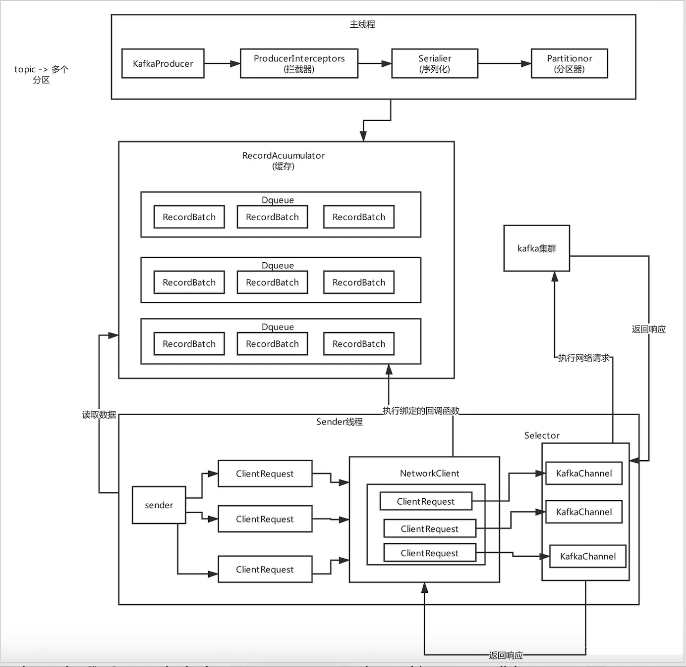
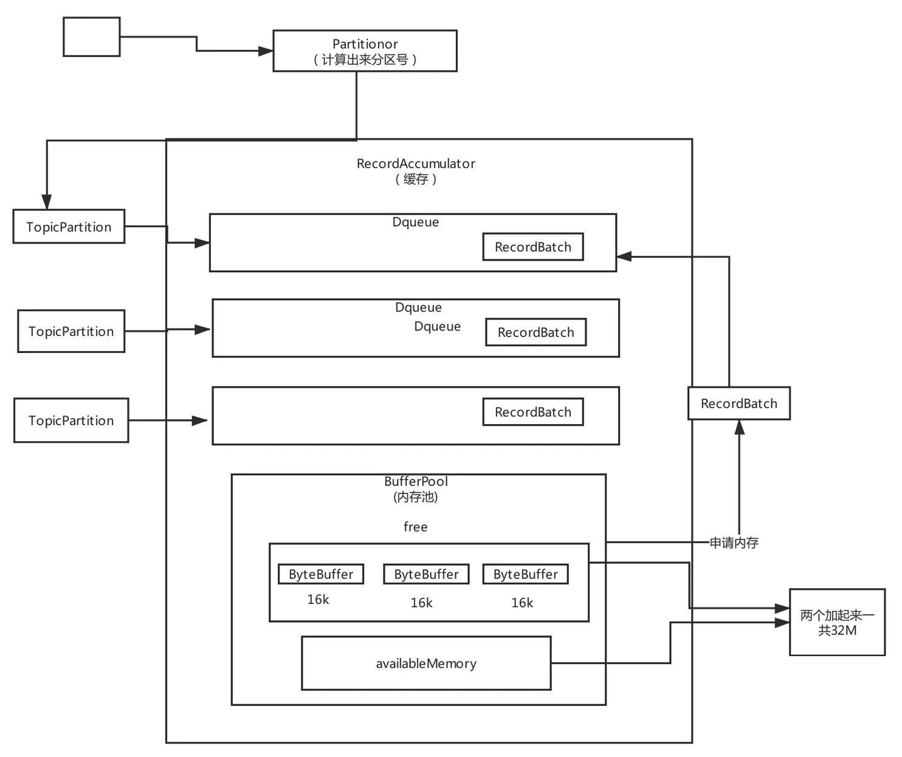

# KafkaProducer源码 - 核心流程 

### <Badge type="tip" text="Kafka" /> <Badge type="tip" text="3.9.0" />

> 此篇文章参考自 hsfxuebao 博客 [kafka源码系列](https://juejin.cn/post/7008882455868342285)。原文使用的Kafka版本是0.10.2。本文将代码内容更新到了3.9.0，增加了自己的解读，部份内容也做了修改和补充。

## Producer发送流程

### 整体流程图



### send方法

producer发送数据都是调用 `send()` 方法。

```java
@Override
public Future<RecordMetadata> send(ProducerRecord<K, V> record) {
    return send(record, null);
}

@Override
public Future<RecordMetadata> send(ProducerRecord<K, V> record, Callback callback) {
    // 使用ProducerInterceptor对消息进行拦截或修改
    ProducerRecord<K, V> interceptedRecord = this.interceptors.onSend(record);
    return doSend(interceptedRecord, callback);
}
```

数据发送的最终实现还是调用了 Producer 的 `doSend()` 接口。

### doSend方法

```java
    private Future<RecordMetadata> doSend(ProducerRecord<K, V> record, Callback callback) {
        // Append callback takes care of the following:
        //  - call interceptors and user callback on completion
        //  - remember partition that is calculated in RecordAccumulator.append
        // 为record绑定callback和interceptor函数
        AppendCallbacks appendCallbacks = new AppendCallbacks(callback, this.interceptors, record);

        try {
            throwIfProducerClosed();
            // first make sure the metadata for the topic is available
            /**
		         *  同步等待拉取元数据。
		         *  maxBlockTimeMs 最多能等待多久。
		         */
            long nowMs = time.milliseconds();
            ClusterAndWaitTime clusterAndWaitTime;
            try {
                clusterAndWaitTime = waitOnMetadata(record.topic(), record.partition(), nowMs, maxBlockTimeMs);
            } catch (KafkaException e) {
                if (metadata.isClosed())
                    throw new KafkaException("Producer closed while send in progress", e);
                throw e;
            }
            nowMs += clusterAndWaitTime.waitedOnMetadataMs;
            long remainingWaitMs = Math.max(0, maxBlockTimeMs - clusterAndWaitTime.waitedOnMetadataMs);
            Cluster cluster = clusterAndWaitTime.cluster;
            
            /**
		         *  对消息的key和value进行序列化。
		         */
            byte[] serializedKey;
            try {
                serializedKey = keySerializer.serialize(record.topic(), record.headers(), record.key());
            } catch (ClassCastException cce) {
                throw new SerializationException("Can't convert key of class " + record.key().getClass().getName() +
                        " to class " + producerConfig.getClass(ProducerConfig.KEY_SERIALIZER_CLASS_CONFIG).getName() +
                        " specified in key.serializer", cce);
            }
            byte[] serializedValue;
            try {
                serializedValue = valueSerializer.serialize(record.topic(), record.headers(), record.value());
            } catch (ClassCastException cce) {
                throw new SerializationException("Can't convert value of class " + record.value().getClass().getName() +
                        " to class " + producerConfig.getClass(ProducerConfig.VALUE_SERIALIZER_CLASS_CONFIG).getName() +
                        " specified in value.serializer", cce);
            }

            /**
		         *  根据partitioner选择消息应该发送的分区。
		         *  计算完之后有可能为 RecordMetadata.UNKNOWN_PARTITION，意味着RecordAccumulator会用内置的逻辑来决定分区。
		         *  （可能会考虑 broker load，the amount of data produced to each partition, etc）
		         *
		         *  因为前面我们已经获取到了元数据
		         *  这儿我们就可以根据元数据的信息
		         *  计算一下，我们应该要把这个数据发送到哪个分区上面。
		         */
            int partition = partition(record, serializedKey, serializedValue, cluster);

            setReadOnly(record.headers());
            Header[] headers = record.headers().toArray();

						/**
				      * 计算消息记录的总大小
				      */
            int serializedSize = AbstractRecords.estimateSizeInBytesUpperBound(apiVersions.maxUsableProduceMagic(),
                    compression.type(), serializedKey, serializedValue, headers);
            
            /**
		         *  确认一下消息的大小是否超过了最大值。
		         *  KafkaProdcuer初始化的时候，指定了一个参数，代表的是Producer这儿最大能发送的是一条消息能有多大
		         *  默认最大是1M，我们一般都会去修改它。
		         */
            ensureValidRecordSize(serializedSize);
            long timestamp = record.timestamp() == null ? nowMs : record.timestamp();

            // A custom partitioner may take advantage on the onNewBatch callback.
            boolean abortOnNewBatch = partitioner != null;

            // Append the record to the accumulator.  Note, that the actual partition may be
            // calculated there and can be accessed via appendCallbacks.topicPartition.
            /**
		         *  把消息放入accumulator
		         *  然后accumulator把消息封装成为一个批次一个批次的去发送。
		         *  有可能在这一步计算好实际的pratition
		         */
            RecordAccumulator.RecordAppendResult result = accumulator.append(record.topic(), partition, timestamp, serializedKey,
                    serializedValue, headers, appendCallbacks, remainingWaitMs, abortOnNewBatch, nowMs, cluster);
            assert appendCallbacks.getPartition() != RecordMetadata.UNKNOWN_PARTITION;

						/**
						 * partitioner可以实现onNewBatch的方法，当一个新的batch被创建的时候会call
						 * 可以为新的batch重新计算分区
						 */
            if (result.abortForNewBatch) {
                int prevPartition = partition;
                onNewBatch(record.topic(), cluster, prevPartition);
                partition = partition(record, serializedKey, serializedValue, cluster);
                if (log.isTraceEnabled()) {
                    log.trace("Retrying append due to new batch creation for topic {} partition {}. The old partition was {}", record.topic(), partition, prevPartition);
                }
                result = accumulator.append(record.topic(), partition, timestamp, serializedKey,
                    serializedValue, headers, appendCallbacks, remainingWaitMs, false, nowMs, cluster);
            }

            // Add the partition to the transaction (if in progress) after it has been successfully
            // appended to the accumulator. We cannot do it before because the partition may be
            // unknown or the initially selected partition may be changed when the batch is closed
            // (as indicated by `abortForNewBatch`). Note that the `Sender` will refuse to dequeue
            // batches from the accumulator until they have been added to the transaction.
            // 添加partition到事务
            if (transactionManager != null) {
                transactionManager.maybeAddPartition(appendCallbacks.topicPartition());
            }

            if (result.batchIsFull || result.newBatchCreated) {
                log.trace("Waking up the sender since topic {} partition {} is either full or getting a new batch", record.topic(), appendCallbacks.getPartition());
                /**
                 batch已满或者新batch建立，唤醒sender线程发送数据
                 */
                this.sender.wakeup();
            }
            return result.future;
            // handling exceptions and record the errors;
            // for API exceptions return them in the future,
            // for other exceptions throw directly
        } catch (ApiException e) {
            log.debug("Exception occurred during message send:", e);
            // callback错误回调
            if (callback != null) {
                TopicPartition tp = appendCallbacks.topicPartition();
                RecordMetadata nullMetadata = new RecordMetadata(tp, -1, -1, RecordBatch.NO_TIMESTAMP, -1, -1);
                callback.onCompletion(nullMetadata, e);
            }
            this.errors.record();
            // interceptor错误回调
            this.interceptors.onSendError(record, appendCallbacks.topicPartition(), e);
            if (transactionManager != null) {
		            // transaction错误回调
                transactionManager.maybeTransitionToErrorState(e);
            }
            return new FutureFailure(e);
        } catch (InterruptedException e) {
            this.errors.record();
            this.interceptors.onSendError(record, appendCallbacks.topicPartition(), e);
            throw new InterruptException(e);
        } catch (KafkaException e) {
            this.errors.record();
            this.interceptors.onSendError(record, appendCallbacks.topicPartition(), e);
            throw e;
        } catch (Exception e) {
            // we notify interceptor about all exceptions, since onSend is called before anything else in this method
            this.interceptors.onSendError(record, appendCallbacks.topicPartition(), e);
            throw e;
        }
    }

```

`doSend()` 大致流程分为如下的几个步骤：

1. 为record绑定callback和interceptor
2. 确认数据要发送到的 topic 的 metadata 是可用的（如果该 partition 的 leader 存在则是可用的，如果开启权限时，client 有相应的权限），如果没有 topic 的 metadata 信息，就需要获取相应的 metadata；
3. 序列化 record 的 key 和 value；
4. 获取该 record 要发送到的 partition（可以指定，也可以根据算法计算）；
5. 确认一下消息的大小是否超过最大值；
6. 向 accumulator 中追加 record 数据，数据会先进行缓存。过程中计算要发送的partition；
7. 如果追加完数据后，对应的 RecordBatch 已经达到了 batch.size 的大小（或者batch 的剩余空间不足以添加下一条 Record），则唤醒 `sender` 线程发送数据。

数据发送主要分为上面的七个步骤，下面对着几部分进行消息分析。

## 发送过程详解

### 同步阻塞获取metadata信息

如果你要往一个topic里发送消息，必须是得有这个topic的元数据的，你必须要知道这个topic有哪些分区，然后根据Partitioner组件去选择一个分区，然后知道这个分区对应的leader所在的broker，才能跟那个broker建立连接，发送消息

调用同步阻塞的方法，去等待先得获取到那个topic对应的元数据，如果此时客户端还没缓存那个topic的元数据，那么一定会发送网络请求到broker去拉取那个topic的元数据过来，但是下一次就可以直接根据缓存好的元数据来发送了。

### 对消息的key和value序列化

发送消息的key和value可以是各种各样的类型，比如说String、Double、Boolean，或者是自定义的对象，但是如果要发送消息到broker，必须对这个key和value进行序列化，把那些类型的数据转换成byte[]字节数组的形式。kafka内部提供很多Serializer, 都实现了Serializer接口。

如果这些序列化不能满足我们的需求，可以自定义序列化和反序列化。

### 获取分区 partition 值

partition方法会计算partition值，分为四种情况

```java
private int partition(ProducerRecord<K, V> record, byte[] serializedKey, byte[] serializedValue, Cluster cluster) {
    if (record.partition() != null)
        return record.partition();

    if (partitioner != null) {
        int customPartition = partitioner.partition(
            record.topic(), record.key(), serializedKey, record.value(), serializedValue, cluster);
        if (customPartition < 0) {
            throw new IllegalArgumentException(String.format(
                "The partitioner generated an invalid partition number: %d. Partition number should always be non-negative.", customPartition));
        }
        return customPartition;
    }

    if (serializedKey != null && !partitionerIgnoreKeys) {
        // hash the keyBytes to choose a partition
        return BuiltInPartitioner.partitionForKey(serializedKey, cluster.partitionsForTopic(record.topic()).size());
    } else {
        return RecordMetadata.UNKNOWN_PARTITION;
    }
}
```

1. record里指明 partition 的情况下，直接将指明的值直接作为 partiton 值；
2. 如果有配置了自定义的partitioner，则使用自定义partitioner的计算结果。
3. 如果有key并且partitionerIgnoreKeys为false，则使用内置的partitioner根据hash key计算partition值。
4. 如果上述条件都不满足，则返回RecordMetadata.UNKNOWN_PARTITION。表示任何partition都可以使用。后续可能会根据RecordAccumulator里的内置算法计算出一个partition。

默认的BuiltInPartitoner使用key来计算partition。对key使用 `murmur2` hash算法，murmur2是一种高效率低碰撞的Hash算法。最后对总partitions数取余。

```java
/*
 * Default hashing function to choose a partition from the serialized key bytes
 */
public static int partitionForKey(final byte[] serializedKey, final int numPartitions) {
    return Utils.toPositive(Utils.murmur2(serializedKey)) % numPartitions;
}
```

### 校验消息大小是否超过最大值

比较消息与 `maxRequestSize` 和 `totalMemorySize` 的大小。

```java
private void ensureValidRecordSize(int size) {
    if (size > maxRequestSize)
        throw new RecordTooLargeException("The message is " + size +
                " bytes when serialized which is larger than " + maxRequestSize + ", which is the value of the " +
                ProducerConfig.MAX_REQUEST_SIZE_CONFIG + " configuration.");
    if (size > totalMemorySize)
        throw new RecordTooLargeException("The message is " + size +
                " bytes when serialized which is larger than the total memory buffer you have configured with the " +
                ProducerConfig.BUFFER_MEMORY_CONFIG +
                " configuration.");
}
```

### 向Accumulator写数据

```java
public RecordAppendResult append(String topic,
                                 int partition,
                                 long timestamp,
                                 byte[] key,
                                 byte[] value,
                                 Header[] headers,
                                 AppendCallbacks callbacks,
                                 long maxTimeToBlock,
                                 boolean abortOnNewBatch,
                                 long nowMs,
                                 Cluster cluster) throws InterruptedException {
    // topicInfoMap维护了topic的元信息
    TopicInfo topicInfo = topicInfoMap.computeIfAbsent(topic, k -> new TopicInfo(createBuiltInPartitioner(logContext, k, batchSize)));

    // We keep track of the number of appending thread to make sure we do not miss batches in
    // abortIncompleteBatches().
    // 统计正在向RecordAccumulator中追加数据的线程数
    appendsInProgress.incrementAndGet();
    ByteBuffer buffer = null;
    if (headers == null) headers = Record.EMPTY_HEADERS;
    try {
        // Loop to retry in case we encounter partitioner's race conditions.
        // 循环重试来避免partitioner的race conditions
        while (true) {
            // If the message doesn't have any partition affinity, so we pick a partition based on the broker
            // availability and performance.  Note, that here we peek current partition before we hold the
            // deque lock, so we'll need to make sure that it's not changed while we were waiting for the
            // deque lock.
            // 如果message消息没有指定任何partition，就根据availability和performance选一个partition。
            // 如果指定了partition就使用它
            final BuiltInPartitioner.StickyPartitionInfo partitionInfo;
            final int effectivePartition;
            if (partition == RecordMetadata.UNKNOWN_PARTITION) {
                partitionInfo = topicInfo.builtInPartitioner.peekCurrentPartitionInfo(cluster);
                effectivePartition = partitionInfo.partition();
            } else {
                partitionInfo = null;
                effectivePartition = partition;
            }

            // 将最终的partition分区告诉callback函数
            setPartition(callbacks, effectivePartition);

            // check if we have an in-progress batch
	          /**  
	           * 先根据分区找到应该插入到哪个队列里面。
             * 如果有已经存在的队列，那么我们就使用存在队列
             * 如果队列不存在，那么我们新创建一个队列
             */
            Deque<ProducerBatch> dq = topicInfo.batches.computeIfAbsent(effectivePartition, k -> new ArrayDeque<>());
            synchronized (dq) {
                // After taking the lock, validate that the partition hasn't changed and retry.
                // 检查partition是否有变化，如果有就重试retry
                if (partitionChanged(topic, topicInfo, partitionInfo, dq, nowMs, cluster))
                    continue;

								/**
                 *  尝试往队列里面的批次里添加数据
                 * 
                 *  一开始添加数据肯定是失败的，我们目前只是有了队列
                 *  数据是需要存储在批次对象里面（这个批次对象是需要分配内存的）
                 *  我们目前还没有分配内存，所以如果按场景驱动的方式，
                 *  代码第一次运行到这儿其实是不成功的。
                 */
                RecordAppendResult appendResult = tryAppend(timestamp, key, value, headers, callbacks, dq, nowMs);
                if (appendResult != null) {
                    // If queue has incomplete batches we disable switch (see comments in updatePartitionInfo).
                    // 如果append成功，将append result更新至partitionInfo，并返回
                    boolean enableSwitch = allBatchesFull(dq);
                    topicInfo.builtInPartitioner.updatePartitionInfo(partitionInfo, appendResult.appendedBytes, cluster, enableSwitch);
                    return appendResult;
                }
            }

            // we don't have an in-progress record batch try to allocate a new batch
            if (abortOnNewBatch) {
                // Return a result that will cause another call to append.
                return new RecordAppendResult(null, false, false, true, 0);
            }

						// 分配内存
            if (buffer == null) {
                byte maxUsableMagic = apiVersions.maxUsableProduceMagic();
                /**
                 计算一个batch的大小
                 在消息的大小和批次的大小之间取一个最大值，用这个值作为当前这个批次的大小。
                 当一条消息的大小超过一个batch的大小时，那么这个batch就只有这一条消息了
                */
                int size = Math.max(this.batchSize, AbstractRecords.estimateSizeInBytesUpperBound(maxUsableMagic, compression.type(), key, value, headers));
                log.trace("Allocating a new {} byte message buffer for topic {} partition {} with remaining timeout {}ms", size, topic, effectivePartition, maxTimeToBlock);
                // This call may block if we exhausted buffer space.
                // 根据批次的大小去分配内存
                buffer = free.allocate(size, maxTimeToBlock);
                // Update the current time in case the buffer allocation blocked above.
                // NOTE: getting time may be expensive, so calling it under a lock
                // should be avoided.
                nowMs = time.milliseconds();
            }

            synchronized (dq) {
                // After taking the lock, validate that the partition hasn't changed and retry.
                if (partitionChanged(topic, topicInfo, partitionInfo, dq, nowMs, cluster))
                    continue;
								/**
                 *  再次尝试往队列里面的批次里添加数据
                 *  这次是用的appendNewBatch方法，内部会先调用tryAppend方法
                 *  如果失败，则创建一个新的batch放在dq末尾
                 */
                RecordAppendResult appendResult = appendNewBatch(topic, effectivePartition, dq, timestamp, key, value, headers, callbacks, buffer, nowMs);
                // Set buffer to null, so that deallocate doesn't return it back to free pool, since it's used in the batch.
                if (appendResult.newBatchCreated)
                    buffer = null;
                // If queue has incomplete batches we disable switch (see comments in updatePartitionInfo).
                boolean enableSwitch = allBatchesFull(dq);
                topicInfo.builtInPartitioner.updatePartitionInfo(partitionInfo, appendResult.appendedBytes, cluster, enableSwitch);
                return appendResult;
            }
        }
    } finally {
        free.deallocate(buffer);
        appendsInProgress.decrementAndGet();
    }
}
```

TopicInfo里面的batches是一个线程安全的 `CopyOnWriteMap` 维护了每个partition的batch队列。

```java
/**
 * Per topic info.
 */
private static class TopicInfo {
    public final ConcurrentMap<Integer /*partition*/, Deque<ProducerBatch>> batches = new CopyOnWriteMap<>();
    public final BuiltInPartitioner builtInPartitioner;

    public TopicInfo(BuiltInPartitioner builtInPartitioner) {
        this.builtInPartitioner = builtInPartitioner;
    }
}
```

accumulator写数据使用了内存池 `BufferPool` 的设计，能够循环使用内存，减少GC次数。流程图为



### 唤醒Sender线程

sender线程才是真正发送数据的线程。当我们在RecordAccumulator里面把数据以分批的形式存在对应partition的deque队列里之后，sender线程会处理这些batch数据并真正的发送出去。

## 小结

从Producer 的 send 方法可以学到非常多的东西：

- Producer初始化没有去拉取集群的元数据，而是在后面根据你发送消息时候的需要，要给哪个topic发送消息，再去拉取那个topic对应的元数据，这就是懒加载的设计思想，按需加载思想
- 一个高并发、高吞吐、高性能的消息系统的客户端的设计，他的核心流程是如何来搭建和设计的，可扩展，通过拦截器的模式预留一些扩展点给其他人来扩展，在消息发送之前或者发送之后，都可以进行自定义的扩展
- 设计一个通用框架的时候，必须得有一个序列化的过程，因为key和value可能是各种各样的类型，但是必须要保证把key和value都转换成通用的byte[]字节数组的格式，才可以来进行跟broker的通信
- 基于一个独立封装的组件来进行分区的选择和路由，可以用默认的，也可以用自定义的分区器，留下给用户自己扩展的空间
- 对消息的大小，是否超出请求的最大大小，是否会填满 内存缓冲导致内存溢出，对一些核心的请求数据必然要进行严格的检查
- 异步发送请求，通过先进入内存缓冲，同时设置一个callback回调函数的思路，在发送完成之后来回调你的函数通知你消息发送的结果，异步运行的后台线程配合起来使用，基于异步线程来发送消息