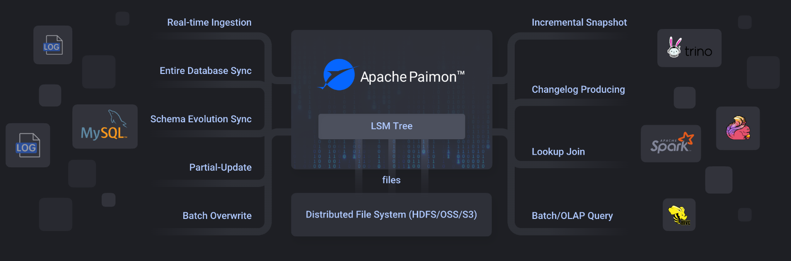

# Paimon简介

Flink 社区希望能够将 Flink 的 Streaming 实时计算能力和 Lakehouse 新架构优势进一步结合，推出新一代的 Streaming Lakehouse 技术，促进数据在数据湖上真正实时流动起来，并为用户提供实时离线一体化的开发体验。Flink 社区内部孵化了 Flink Table Store （简称 FTS ）子项目，一个真正面向 Streaming 以及 Realtime的数据湖存储项目。2023年3月12日，FTS进入 Apache 软件基金会 (ASF) 的孵化器，改名为 Apache Paimon (incubating)。
Apache Paimon是一个流数据湖平台，具有高速数据摄取、变更日志跟踪和高效的实时分析的能力。

## Paimon特性



paimon、hudi、iceberg都是在hdfs、对象存储（S3、OSS、OBS）上的表格式（以表形式布局数据），基于flink等引擎可以对表格式进行管理。

- 读/写：可以读取kafka、pulsar、mysql(binlog)等数据增量存储到HDFS、对象。
- 生态： 除了Apache Flink之外，Paimon还支持Apache Hive、Apache Spark、Trino、Apache Doris、starrocks等其他计算引擎的读取。
- 统一存储: 内部Paimon 将列式文件存储在文件系统/对象存储上，并使用 LSM 树结构来支持大量数据更新和高性能查询。

Paimon 提供表抽象。它的使用方式与传统数据库没有什么区别：
- 在批处理执行模式下，它就像一个Hive表，支持Batch SQL的各种操作。查询它以查看最新的快照。
- 在流执行模式下，它的作用就像一个消息队列。查询它的行为就像从历史数据永不过期的消息队列中查询流更改日志。

Paimon核心特性:

1. 统一批处理和流处理：离线、实时共用一份数据，支持生成变更日志、支持流式更新、支持流读、批读。
2. 各种合并引擎：根据需求更新记录部分更新、聚合等。
3. 丰富的表类型：主键表、Append 表。
4. 模式演化：支持完整表结构的变化


## SQL操作

```
SET 'execution.runtime-mode' = 'streaming';
SET 'table.exec.sink.upsert-materialize'='NONE';
SET 'execution.checkpointing.interval'='10 s';

CREATE CATALOG paimon WITH (
    'type' = 'paimon',
    'warehouse' = 'hdfs://mj01:8020/lakehouse'
    );
USE CATALOG paimon;
create database if not exists merge_test;
CREATE TABLE if not exists paimon.merge_test.deduplicate_test1(
 `id` Int,
  `name` String,
  `salary` Int,
   PRIMARY KEY (id) NOT ENFORCED
) ;

insert into paimon.merge_test.deduplicate_test1 values(1,'flink',1000);
insert into paimon.merge_test.deduplicate_test1 values(1,'flink',2000);
insert into paimon.merge_test.deduplicate_test1 values(1,'flink',500);

```