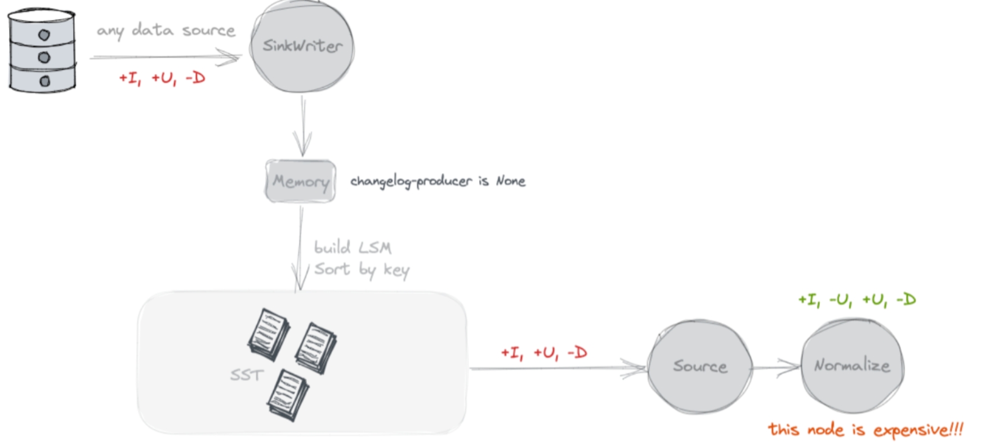
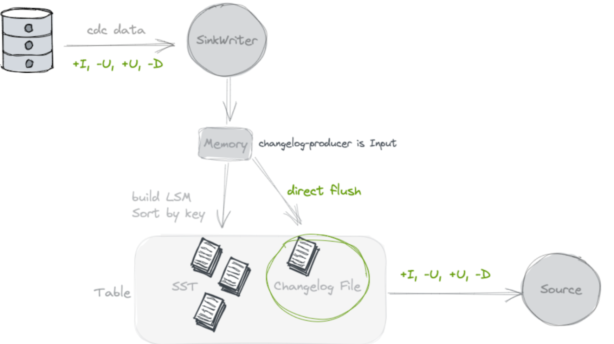
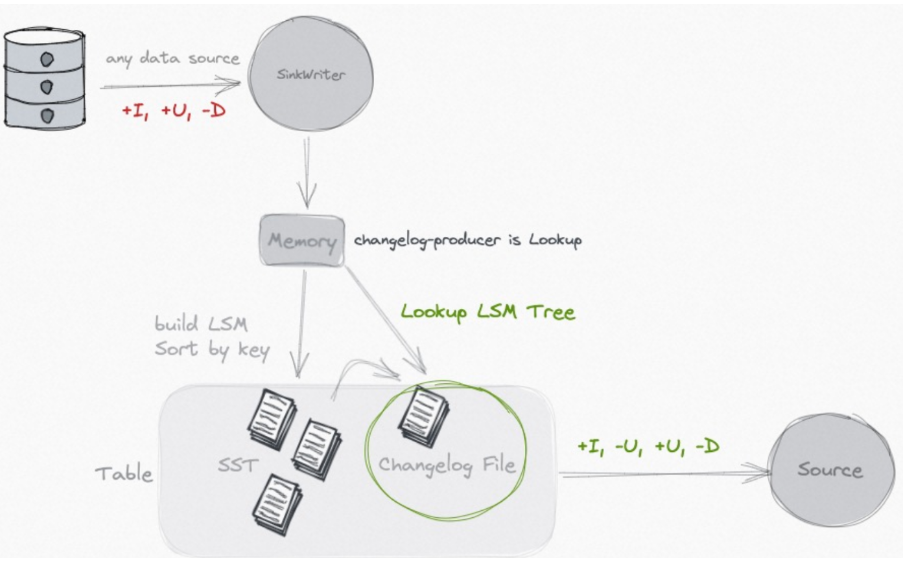
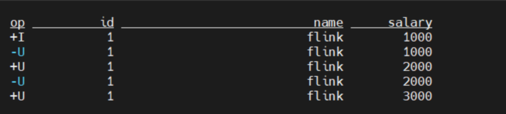
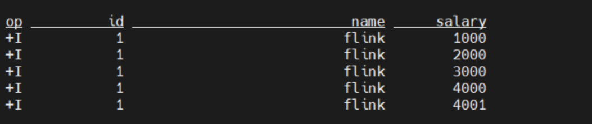
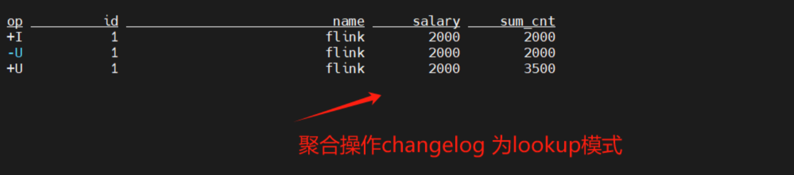
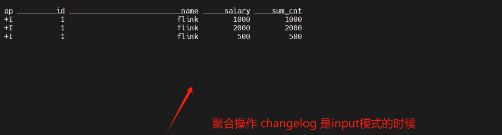

# Changelog Producer

Chaneglog producer 的主要目的是为了在 Paimon 表上产生流读的 changelog, 如果只是批读的表是可以不用设置 Chaneglog producer 的.

比如数据库如 MySQL 来说, 当执行的语句涉及数据的修改例如插入、更新、删除时，MySQL 会将这些数据变动记录在 binlog 中。相当于额外记录一份操作日志,  Paimon 中用Changelog来表示对应参数是 changelog producer，有四种模式none、input、lookup、compaction。

## 为什么要有changelog producer？

Paimon表需要将数据的增、删、改操作保存为的变更数据（changelog），有了变更数据下游才能进行流消费。通过在WITH参数中设置changelog-producer，Paimon将会以不同的方式产生变更数据。


## None

不查找旧值, 不额外写Chaneglog



默认就是 none, 这种模式下在 Paimon 不会额外存储数据。Source 读取的时候, 就是将 snapshot 的 delta list 文件读取出来, 就是本次 Snapshot 的增量 Changelog 了。Paimon主键表将不会产出完整的变更数据。
在 None 模式中,虽然在 Paimon 侧没有占用额外的存储, 但是在下游的流任务的状态中, 其实是有一份全量表的额外存储的开销的
使用场景：Paimon表通过批作业进行消费。

## Input

不查找旧值, 额外写Chaneglog.

Paimon主键表会直接将输入的消息作为变更数据传递给下游消费者。输入数据流本身是完整的变更数据时（例如数据库的Binlog）使用。input机制不涉及额外的计算，因此其效率最高。



使用场景：关系型数据库binlog日志的采集

## Lookup

查找旧值, 额外存储changelog

Paimon主键表在Flink作业每次创建检查点（checkpoint）时触发小文件合并（compaction），并利用小文件合并的结果产生完整的变更数据。在 compaction 的过程中, 会去向高层查找本次新增 key 的旧值, 如果没有查找到, 那么本次的就是新增 key, 如果有查找到, 那么就生成完整的 UB 和 UA 消息.



使用场景：表在写入过程中有计算逻辑（partial-update/aggregation 合并引擎）使用该模式，用来通过查找旧值来生成正确的Changelog。与full-compaction机制相比，lookup机制的时效性更好。

## Full-compact 

查找旧值, 额外存储 Chaneglog

Paimon主键表会在每一次执行小文件全量合并（full compaction）时，产生完整的changelog变更数据。

这种模式下一般通过设置 full-compaction.delta-commits 定期进行 full compact, 因为 full compact 其实代价是比较高的. 所以这种模式整体的开销也是比较大。

full compaction 时间 = full-compaction.delta-commits次数乘以checkpoint时间。e.g. 3 * 60 s = 3分钟

注意：由于小文件全量合并会消耗较多计算资源，因此频率不宜过高，建议每30分钟至1小时强制执行一次。

### Lookup VS full compaction

无论输入数据流是否为完整的变更数据，都可以使用lookup、full-compaction。

lookup：与full-compaction相比较，lookup机制的时效性更好，但总体来看耗费的资源更多。如果数据时效性要求很高（分钟级）的情况下使用。

full-compaction：与lookup机制相比，full-compaction机制的时效性较差，小文件合并流程，不产生额外计算，因此总体来看耗费的资源更少。数据时效性（小时级）的情况下使用。由于小文件全量合并会消耗较多计算资源，因此频率不宜过高，建议每30分钟至1小时强制执行一次。

'full-compaction.delta-commits' = '{num}'：Paimon在每{num}个Flink作业的检查点执行小文件全量合并。

## 案例

### None 案例

没有changelog文件的保存，但是流状态查询依然能够查询到。
 
```
SET 'execution.runtime-mode' = 'streaming';
SET 'table.exec.sink.upsert-materialize'='NONE';
--设置检查点的间隔为1分钟
SET 'execution.checkpointing.interval'='10 s';
set parallelism.default=1;
SET 'sql-client.execution.result-mode' = 'changelog';
CREATE CATALOG paimon WITH (
    'type' = 'paimon',
    'warehouse' = 'hdfs://bigdata01:8020/lakehouse'
    );
USE CATALOG paimon;
create database if not exists test;
CREATE TABLE if not exists paimon.test.none_init(
 `id` Int,
 `name` String,
 `salary` Int,
 PRIMARY KEY (id) NOT ENFORCED
) with  (
'merge-engine' = 'deduplicate',
'changelog-producer'='none'
);


insert into paimon.test.none_init values(1,'flink',1000);
insert into paimon.test.none_init values(1,'flink',2000);
insert into paimon.test.none_init values(1,'flink',3000);

 SELECT * FROM paimon.test.none_init /*+ OPTIONS('scan.snapshot-id' = '1') */
```

结果



### Input 案例

```
SET 'execution.runtime-mode' = 'streaming';
SET 'table.exec.sink.upsert-materialize'='NONE';
--设置检查点的间隔为1分钟
SET 'execution.checkpointing.interval'='10 s';
set parallelism.default=1;
SET 'sql-client.execution.result-mode' = 'changelog';
CREATE CATALOG paimon WITH (
    'type' = 'paimon',
    'warehouse' = 'hdfs://bigdata01:8020/lakehouse'
    );
USE CATALOG paimon;
create database if not exists test;
CREATE TABLE if not exists paimon.test.input_init(
 `id` Int,
 `name` String,
 `salary` Int,
 PRIMARY KEY (id) NOT ENFORCED
) with  (
'merge-engine' = 'deduplicate',
'changelog-producer'='input'
);


insert into paimon.test.input_init values(1,'flink',1000);
insert into paimon.test.input_init values(1,'flink',2000);
insert into paimon.test.input_init values(1,'flink',3000);
insert into paimon.test.input_init values(1,'flink',4000);
insert into paimon.test.input_init values(1,'flink',4001);


 SELECT * FROM paimon.test.input_init /*+ OPTIONS('scan.snapshot-id' = '1') */
```

文件路径下除了data文件外，会生成changelog文件。 会另外保存一份changelog的数据。

结果



只保存变更，不做计算。图中输入时只有insert数据，因此变更只有 +I。

### Lookup 案例1

```
SET 'execution.runtime-mode' = 'streaming';
SET 'table.exec.sink.upsert-materialize'='NONE';
--设置检查点的间隔为1分钟
SET 'execution.checkpointing.interval'='120 s';
set parallelism.default=1;
SET 'sql-client.execution.result-mode' = 'changelog';
CREATE CATALOG paimon WITH (
    'type' = 'paimon',
    'warehouse' = 'hdfs://bigdata01:8020/lakehouse'
    );
USE CATALOG paimon;
create database if not exists test;
CREATE TABLE if not exists paimon.test.lookup_input (
 `id` Int,
  `name` String,
  `salary` Int,
  `sum_cnt` Int,
   PRIMARY KEY (id) NOT ENFORCED
)  with  (
  'merge-engine' = 'aggregation',
  'fields.salary.aggregate-function' = 'max',
  'fields.sum_cnt.aggregate-function' = 'sum',
   'changelog-producer' = 'input'
);

CREATE TABLE if not exists paimon.test.lookup_lookup (
 `id` Int,
  `name` String,
  `salary` Int,
  `sum_cnt` Int,
   PRIMARY KEY (id) NOT ENFORCED
)  with  (
  'merge-engine' = 'aggregation',
  'fields.salary.aggregate-function' = 'max',
  'fields.sum_cnt.aggregate-function' = 'sum',
   'changelog-producer' = 'lookup'
);

insert into paimon.test.lookup_input  values(1,'flink',1000,1000);
insert into paimon.test.lookup_input values(1,'flink',2000,2000);
insert into paimon.test.lookup_input values(1,'flink',500,500);

insert into paimon.test.lookup_lookup values(1,'flink',1000,1000);
insert into paimon.test.lookup_lookup values(1,'flink',2000,2000);
insert into paimon.test.lookup_lookup values(1,'flink',500,500);

// 结果：1,'flink',2000,3500

 SELECT * FROM paimon.test.lookup_input /*+ OPTIONS('scan.snapshot-id' = '1') */
 
 SELECT * FROM paimon.test.lookup_lookup  /*+ OPTIONS('scan.snapshot-id' = '1') */
```
案例分别向input模式的表和lookup模式的表插入3条数据吗，比较了input模式和lookup模式的差异，


lookup模式下，变更数据过来之后，会查找旧值，compact之后生成新的数据文件。


input模式下，只有最初的变更。

### Lookup 案例2

这个案例中checkpoint间隔时间更长，为1分钟。产生changelog。与后面的Compactin案例做比较。

```
SET 'execution.runtime-mode' = 'streaming';
SET 'table.exec.sink.upsert-materialize'='NONE';
--设置检查点的间隔为1分钟
SET 'execution.checkpointing.interval'='60 s';
set parallelism.default=1;
SET 'sql-client.execution.result-mode' = 'changelog';

CREATE TABLE if not exists lookup_input (
  `id` Int PRIMARY KEY NOT ENFORCED,
  `name` String,
  `age` Int
) with (
'connector' = 'datagen',
'fields.id.kind' = 'random',
'fields.id.min' = '1',
'fields.id.max' = '100',
'fields.name.length' = '10',
'fields.age.min' = '18',
'fields.age.max' = '60',
'rows-per-second' = '3'
);
CREATE CATALOG paimon WITH (
    'type' = 'paimon',
    'warehouse' = 'hdfs://bigdata01:8020/lakehouse'
    );

USE CATALOG paimon;
create database if not exists test;
CREATE TABLE if not exists paimon.test.lookup_lookup (
`id` Int,
  `name` String,
  `age` Int,
   PRIMARY KEY (id) NOT ENFORCED
)  with  (
  'merge-engine' = 'aggregation',
  'fields.age.aggregate-function' = 'sum',
   'changelog-producer' = 'lookup'
);


insert into paimon.test.lookup_lookup 
select * from default_catalog.default_database.lookup_input ;
```

### Compaction 案例

在这个例子中，checkpoint间隔是1分钟，delta-cOPommits设置为3次。最后也就是每隔3分钟会触发一次full compaction. 产生changelog.

```
SET 'execution.runtime-mode' = 'streaming';
SET 'table.exec.sink.upsert-materialize'='NONE';~~~~
--设置检查点的间隔为1分钟
SET 'execution.checkpointing.interval'='60 s';
set parallelism.default=1;
SET 'sql-client.execution.result-mode' = 'changelog';

CREATE TABLE if not exists compaction_input (
  `id` Int PRIMARY KEY NOT ENFORCED,
  `name` String,
  `age` Int
) with (
'connector' = 'datagen',
'fields.id.kind' = 'random',
'fields.id.min' = '1',
'fields.id.max' = '100',
'fields.name.length' = '10',
'fields.age.min' = '18',
'fields.age.max' = '60',
'rows-per-second' = '3'
);
CREATE CATALOG paimon WITH (
    'type' = 'paimon',
    'warehouse' = 'hdfs://bigdata01:8020/lakehouse'
    );

USE CATALOG paimon;
create database if not exists test;
CREATE TABLE if not exists paimon.test.compaction (
`id` Int,
  `name` String,
  `age` Int,
   PRIMARY KEY (id) NOT ENFORCED
)  with  (
  'merge-engine' = 'aggregation',
  'fields.age.aggregate-function' = 'sum',
   'changelog-producer' = 'full-compaction',
    'full-compaction.delta-commits'='3'
);


insert into paimon.test.compaction 
select * from default_catalog.default_database.compaction_input ;
```