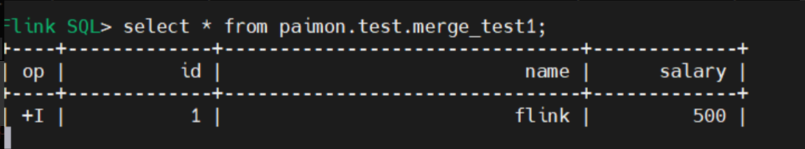
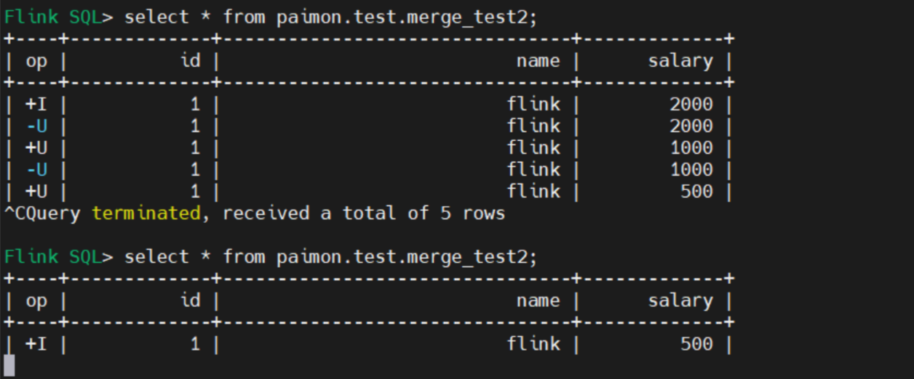
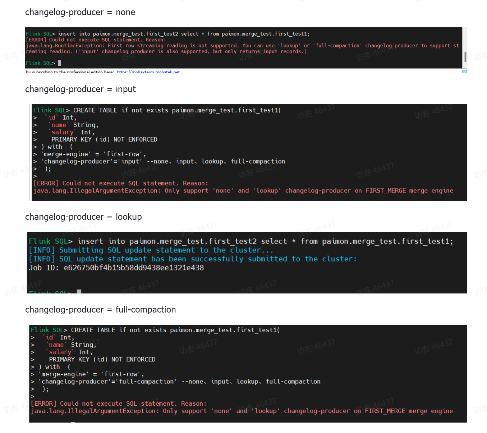
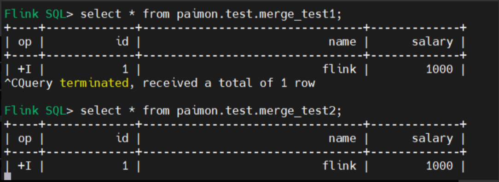
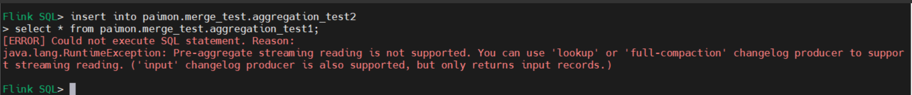
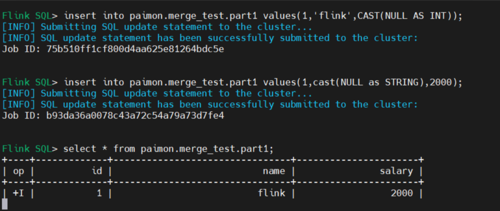

# Merge Engine

相同主键的多条数据，Paimon会根据merge-engine参数对数据进行合并

## Deduplicate 

```
'merge-engine' = 'deduplicate' -- deduplicate 是默认值，可以不设置
```

对于多条相同主键的数据，主键表仅会保留最新一条数据。如果最新数据是delete操作，所有对应主键的数据都会被丢弃。

### Deduplicate 案例

```
SET 'execution.runtime-mode' = 'streaming';
SET 'table.exec.sink.upsert-materialize'='NONE';
SET 'execution.checkpointing.interval'='10 s';
set parallelism.default=1;
SET 'sql-client.execution.result-mode' = 'tableau';
CREATE CATALOG paimon WITH (
    'type' = 'paimon',
    'warehouse' = 'hdfs://mj01:8020/lakehouse'
    );
USE CATALOG paimon;
create database if not exists merge_test;
CREATE TABLE if not exists paimon.merge_test.deduplicate_test1(
 `id` Int,
  `name` String,
  `salary` Int,
   PRIMARY KEY (id) NOT ENFORCED
) with  (
'merge-engine' = 'deduplicate'
);

CREATE TABLE if not exists paimon.merge_test.deduplicate_test2(
 `id` Int,
  `name` String,
  `salary` Int,
   PRIMARY KEY (id) NOT ENFORCED
);

insert into paimon.merge_test.deduplicate_test2 select * from paimon.merge_test.deduplicate_test1;

insert into paimon.merge_test.deduplicate_test1 values(1,'flink',1000);
insert into paimon.merge_test.deduplicate_test1 values(1,'flink',2000);
insert into paimon.merge_test.deduplicate_test1 values(1,'flink',500);
```

结果只有最新的一条数据





## First-row

```
'merge-engine' = 'first-row' 
```

Paimon只会保留相同主键数据中的第一条。与deduplicate合并机制相比，first-row只会产生insert类型的变更数据。

重点注意：
- 下游如果需要流式消费first-row的产生的数据，上游表changelog-producer参数必须设置为 lookup。
- first-row无法处理delete与update_before消息。您可以设置'first-row.ignore-delete' = 'true'以忽略这两类消息。
- first-row不支持changelog-producer input、full-compaction模式

为什么frist-row不支持input、full-compaction模式？
- full-compaction：每一次执行小文件全量合并（full compaction）时，产生完整的变更数据。
- input：直接将输入的消息作为变更数据传递给下游消费者(作为changelog)
input、full-compaction严格意义上与first-row相违背。所以first-row支持none、lookup

### First-row 案例

```
SET 'execution.runtime-mode' = 'streaming';
SET 'table.exec.sink.upsert-materialize'='NONE';
SET 'execution.checkpointing.interval'='10 s';
set parallelism.default=1;
SET 'sql-client.execution.result-mode' = 'tableau';
CREATE CATALOG paimon WITH (
    'type' = 'paimon',
    'warehouse' = 'hdfs://bigdata01:8020/lakehouse'
    );
USE CATALOG paimon;
create database if not exists merge_test;


CREATE TABLE if not exists paimon.merge_test.first_test2(
 `id` Int,
  `name` String,
  `salary` Int,
   PRIMARY KEY (id) NOT ENFORCED
);

CREATE TABLE if not exists paimon.merge_test.first_test1(
 `id` Int,
  `name` String,
  `salary` Int,
   PRIMARY KEY (id) NOT ENFORCED
) with  (
'merge-engine' = 'first-row',
'changelog-producer'='lookup' --none、input、lookup、full-compaction
 );
 

 
insert into paimon.merge_test.first_test2 select * from paimon.merge_test.first_test1;

insert into paimon.merge_test.first_test1 values(1,'flink',1000);
insert into paimon.merge_test.first_test1 values(1,'flink',2000);


SELECT * FROM paimon.merge_test.first_test1 /*+ OPTIONS('scan.snapshot-id' = '1') */
```

当merge-engine为first-row的时候，不是所有的changelog producer类型都支持。只有none和lookup类型支持，其他都报错。



但在流读模式下，none不产生changelog，因此也只能将changelog producer设置为lookup.

结果只有第一条数据

```

```

## Aggregate

具有相同主键的多条数据，主键表将会根据指定的聚合函数进行聚合。对于不属于主键的每一列，都需要通过fields.{field-name}.aggregate-function指定一个聚合函数，否则该列将默认使用last_non_null_value聚合函数。

支持的聚合函数与对应的数据类型如下：
- sum（求和）：支持DECIMAL、TINYINT、SMALLINT、INTEGER、BIGINT、FLOAT和DOUBLE。
- product（求乘积）：支持DECIMAL、TINYINT、SMALLINT、INTEGER、BIGINT、FLOAT和DOUBLE。
- count（统计非null值总数）：支持INTEGER和BIGINT。
- max（最大值）和min（最小值）：CHAR、VARCHAR、DECIMAL、TINYINT、SMALLINT、INTEGER、BIGINT、FLOAT、DOUBLE、DATE、TIME、TIMESTAMP和TIMESTAMP_LTZ。
- first_value（返回第一次输入的值）和last_value（返回最新输入的值）：支持所有数据类型，包括null。
- first_not_null_value（返回第一次输入的非null值）和last_non_null_value（返回最新输入的非 null 值）：支持所有数据类型。
- listagg（将输入的字符串依次用英文逗号连接）：支持STRING。
- bool_and和bool_or：支持BOOLEAN。


如果下游需要流式消费aggregation的结果，需要将changelog-producer参数设为input、lookup或full-compaction。

### Aggregate 案例

```
SET 'execution.runtime-mode' = 'streaming';
SET 'table.exec.sink.upsert-materialize'='NONE';
SET 'execution.checkpointing.interval'='10 s';
set parallelism.default=1;
SET 'sql-client.execution.result-mode' = 'tableau';
CREATE CATALOG paimon WITH (
    'type' = 'paimon',
    'warehouse' = 'hdfs://bigdata01:8020/lakehouse'
    );
USE CATALOG paimon;
create database if not exists merge_test;


CREATE TABLE if not exists paimon.merge_test.aggregation_test2(
 `id` Int,
  `name` String,
  `salary` Int,
  `sum_cnt` Int,
   PRIMARY KEY (id) NOT ENFORCED
);

CREATE TABLE if not exists paimon.merge_test.aggregation_test1(
 `id` Int,
  `name` String,
  `salary` Int,
  `sum_cnt` Int,
   PRIMARY KEY (id) NOT ENFORCED
)  with  (
  'merge-engine' = 'aggregation',
  'fields.salary.aggregate-function' = 'max',
  'fields.sum_cnt.aggregate-function' = 'sum',
   'changelog-producer' = 'lookup'
);


insert into paimon.merge_test.aggregation_test2 
select * from paimon.merge_test.aggregation_test1;

insert into paimon.merge_test.aggregation_test1 values(2,'flink',1000,1000);
insert into paimon.merge_test.aggregation_test1 values(2,'flink',2000,500);
insert into paimon.merge_test.aggregation_test1  values(3,'flink',500,500);

SELECT * FROM paimon.merge_test.aggregation_test1 /*+ OPTIONS('scan.snapshot-id' = '1') */
```

aggregation不支持none类型的changelog producer，其他类型都支持。


结果是 salary取最大值2000， sum_cnt求和值2000

## Partial-update

```
'merge-engine' = 'partial-update'
```
设置'merge-engine' = 'partial-update'后，您可以通过多条消息对数据进行逐步更新，并最终得到完整的数据。即具有相同主键的新数据将会覆盖原来的数据，但值为null的列不会进行覆盖。

### Sequence Group 序列组

序列字段可能无法解决具有多个流更新的 partial-update 表的无序问题，在多流更新期间，sequence-field 可能会被另一个流的最新数据覆盖。通过设置Sequence Group为不同列分别指定合并顺序

重点注意：
- 如果下游需要流式消费partial-update的结果，changelog-producer参数设为input、lookup或full-compaction。
- partial-update 无法处理 delete 与 update_before 消息。需要设置'partial-update.ignore-delete' = 'true' 以忽略这两类消息。

部分更新效率部分场景下取代left join等链表（shuffle）
 select id，a,null from streaming1 union all select id,null,b from streaming2

### Partial-update 案例1

```
SET 'execution.runtime-mode' = 'streaming';
SET 'table.exec.sink.upsert-materialize'='NONE';
--设置检查点的间隔为1分钟
SET 'execution.checkpointing.interval'='10 s';
set parallelism.default=1;
SET 'sql-client.execution.result-mode' = 'tableau';
CREATE CATALOG paimon WITH (
    'type' = 'paimon',
    'warehouse' = 'hdfs://bigdata01:8020/lakehouse'
    );
USE CATALOG paimon;
create database if not exists merge_test;
CREATE TABLE if not exists paimon.merge_test.part1(
 `id` Int,
  `name` String,
  `salary` BIGINT,
   PRIMARY KEY (id) NOT ENFORCED
) with  (
'merge-engine' = 'partial-update',
   'changelog-producer' = 'lookup'
);

insert into paimon.merge_test.part1 values(1,'flink',CAST(NULL AS INT));
insert into paimon.merge_test.part1 values(1,cast(NULL as STRING),2000);

CREATE TABLE if not exists paimon.merge_test.part1(
 `id` Int,
  `name1` String,
   `name2` String,
    `name3` String,
  `salary1` BIGINT,
   `salary2` BIGINT,
  `salary3` BIGINT,
   PRIMARY KEY (id,name1,salary1) NOT ENFORCED
) with  (
'merge-engine' = 'partial-update',
   'changelog-producer' = 'lookup'
);

```
分别插入两次同一主键数据的不同field，最终两次的更新都会到同一条数据上。



### Partial-update 案例2 （sequence group）

```
SET 'execution.runtime-mode' = 'streaming';
SET 'table.exec.sink.upsert-materialize'='NONE';
--设置检查点的间隔为1分钟
SET 'execution.checkpointing.interval'='10 s';
set parallelism.default=1;
SET 'sql-client.execution.result-mode' = 'tableau';
CREATE CATALOG paimon WITH (
    'type' = 'paimon',
    'warehouse' = 'hdfs://bigdata01:8020/lakehouse'
    );
USE CATALOG paimon;
create database if not exists merge_test;
CREATE TABLE if not exists paimon.merge_test.part2(
 `id` Int,
  `name` String,
   `sg_1` Int,
  `salary` BIGINT,
   `sg_2` Int,
   PRIMARY KEY (id) NOT ENFORCED
) with  (
'merge-engine' = 'partial-update',
'changelog-producer' = 'input',
'fields.sg_1.sequence-group' = 'name',
'fields.sg_2.sequence-group' = 'salary'
);

insert into paimon.merge_test.part2 values(1,'flink',1,1,1);
--    output: +I | 1 | flink | 1 | 1 | 1 
insert into paimon.merge_test.part2 values(1,'flink1',0,1,cast(NULL as Int));
--    output: +I | 1 | flink | 1 | 1 | 1 
insert into paimon.merge_test.part2 values(1,'flink2',1,2000,1);
--    output: +I | 1 | flink2 | 1 | 2000 | 1 
insert into paimon.merge_test.part2 values(1,'flink3',0,3000,0);
--    output: +I | 1 | flink2 | 1 | 2000 | 1 
insert into paimon.merge_test.part2 values(1,'flink3',2,3000,2);
--    output: +I | 1 | flink3 | 1 | 3000 | 1 
```

如果多个流同时更新一个field，无法保证顺序，partial-update时会产生问题，就是无法判读以哪个为准。

sequence group就是为了保持顺序，如果新的数据的sequence group的值比当前数据的值小，就不会更新数据。

上面的例子，sg_1这一栏被设置为name这一栏的sequence group。第一条数据(name, sg_1)为(flink, 1).

第二条新的数据(name, sg_1)为(flink1, 0), 由于seqneuce group的值0比当前值1小，因此不触发更新。name值依然为flink.

第三条新的数据(name, sg_2)为(flink2, 1), sequence group 为1，不小于当前值，可以触发更新。更新后的数据name变为flink2.

对于设置为salay的sequence group sg_2也是同理更新数据。


