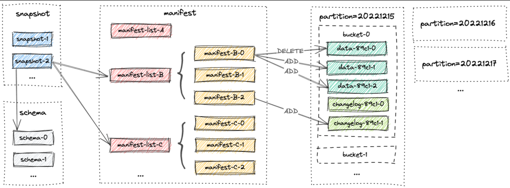
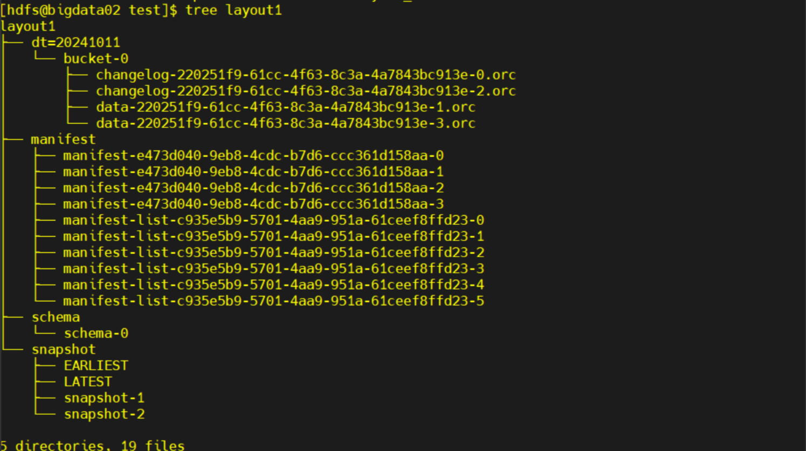
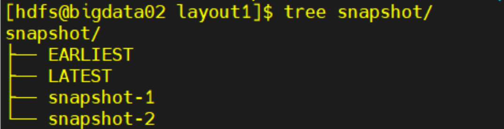
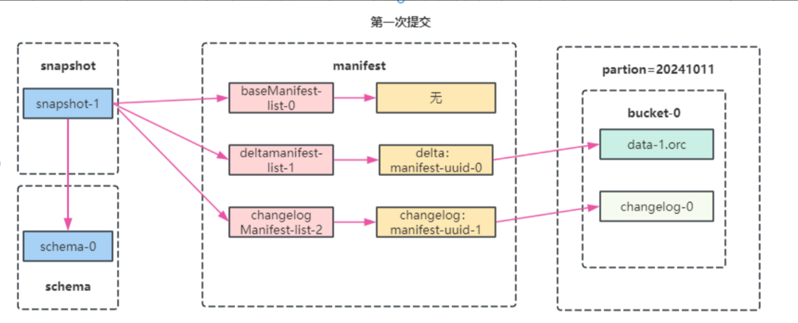
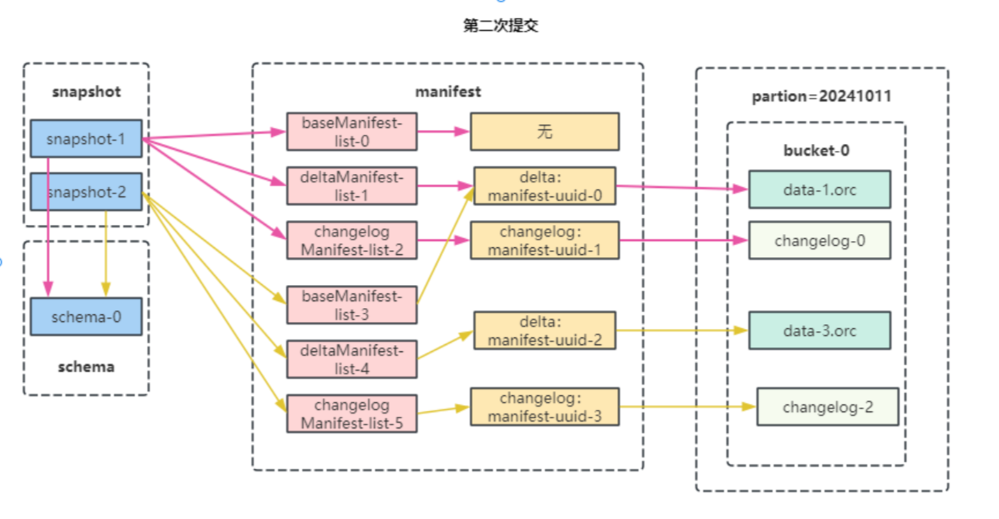

# 文件布局

Paimon文件布局


文件的结构如下所示


## 示例代码

使用下面这段代码创建一张paimon表并输入数据，用来展示文件的结构。
保持其运行两分钟，产生2个checkpoint后停止。

```
SET 'execution.runtime-mode' = 'streaming';
SET 'table.exec.sink.upsert-materialize'='NONE';
SET 'execution.checkpointing.interval'='60 s';
set parallelism.default=1;
SET 'sql-client.execution.result-mode' = 'tableau';

CREATE TABLE if not exists input_source (
  `id` Int PRIMARY KEY NOT ENFORCED,
  `name` String,
  `age` Int
) with (
'connector' = 'datagen',
'fields.id.kind' = 'random',
'fields.id.min' = '1',
'fields.id.max' = '100',
'fields.name.length' = '10',
'fields.age.min' = '18',
'fields.age.max' = '60',
'rows-per-second' = '1'
);

CREATE CATALOG paimon WITH (
    'type' = 'paimon',
    'warehouse' = 'hdfs://bigdata01:8020/lakehouse'
    );
USE CATALOG paimon;
create database if not exists layout;
CREATE TABLE if not exists paimon.layout.layout1(
 `id` Int,
  `name` String,
  `age` Int,
   `dt` String,
   PRIMARY KEY (id,dt) NOT ENFORCED
) PARTITIONED BY (dt) with  (
'bucket' = '1',
'changelog-producer'='input'
);

insert into paimon.layout.layout1  
select id,name,age,'20241011' from default_catalog.default_database.input_source ;

insert into paimon.layout.layout1 values(1,'flink',10);
insert into paimon.layout.layout1 values(1,'spark',15);
insert into paimon.layout.layout1 values(1,'hadoop',20);
```

## Schema

schema存放的就是我们的表结构,字段、分区键、主键、options。就是编写的创表语句用json格式展现出来。

schema文件内容：
```
{
  "version" : 2,
  "id" : 0,
  "fields" : [ {
    "id" : 0,
    "name" : "id",
    "type" : "INT NOT NULL"
  }, {
    "id" : 1,
    "name" : "name",
    "type" : "STRING"
  }, {
    "id" : 2,
    "name" : "age",
    "type" : "INT"
  }, {
    "id" : 3,
    "name" : "dt",
    "type" : "STRING NOT NULL"
  } ],
  "highestFieldId" : 3,
  "partitionKeys" : [ "dt" ],
  "primaryKeys" : [ "id", "dt" ],
  "options" : {
    "bucket" : "1",
    "changelog-producer" : "input"
  },
  "comment" : "",
  "timeMillis" : 1728655009691
}
```

如果运行了修改表的SQL，schema文件内容也会相应的变化。

```
// 增加一列
ALTER TABLE paimon.layout.layout1 ADD (add_c string);
```
新的schema文件内容为
```
{
  "version" : 2,
  "id" : 1,
  "fields" : [ {
    "id" : 0,
    "name" : "id",
    "type" : "INT NOT NULL"
  }, {
    "id" : 1,
    "name" : "name",
    "type" : "STRING"
  }, {
    "id" : 2,
    "name" : "age",
    "type" : "INT"
  }, {
    "id" : 3,
    "name" : "dt",
    "type" : "STRING NOT NULL"
  }, {
    "id" : 4,
    "name" : "add_c",
    "type" : "STRING"
  } ],
  "highestFieldId" : 4,
  "partitionKeys" : [ "dt" ],
  "primaryKeys" : [ "id", "dt" ],
  "options" : {
    "bucket" : "1",
    "changelog-producer" : "input"
  },
  "comment" : "",
  "timeMillis" : 1728655892324
}
```

## Snapshot

Flink 每一次checkpoint会触发快照，所有快照文件都存储在snapshot目录中。快照文件是一个 JSON 文件。

快照文件内容包含：
1. 当前快照对应的schema的版本
2. 快照变化类型APPEND、COMPACT、OVERWRITE、ANALYZE  
3. 包含此快照的所有更改的清单列表（manifest list）
4. 数据总条数

### snapshot文件夹整体目录

snapshot文件夹目录，包含4个文件。EARLIST，LATEST，snapshot-1，snapshot-2


### EARLIST文件

EARLIST文件里存储了最早的一个snapshot id，这个案例中最早的snapshot id为1.

文件内容：
```
1
```

### LATEST文件

LATEST文件里存储了最近的snapshot id，这个案例中最近的snapshot id为2.

文件内容:
```
2
```

### snapshot-1 文件

文件内容有id，schemaId，baseManifestList，deltaManifestList，changelogManifestList，commitKind等等必要信息。

以及一下数据的统计，totalRecordCount，deltaRecordCount，changelogRecordCount。

```
{
  "version" : 3,
  "id" : 1,
  "schemaId" : 0,
  "baseManifestList" : "manifest-list-c935e5b9-5701-4aa9-951a-61ceef8ffd23-0",
  "deltaManifestList" : "manifest-list-c935e5b9-5701-4aa9-951a-61ceef8ffd23-1",
  "changelogManifestList" : "manifest-list-c935e5b9-5701-4aa9-951a-61ceef8ffd23-2",
  "commitUser" : "3bd48472-3f17-4753-a663-fc7e3b58015a",
  "commitIdentifier" : 1,
  "commitKind" : "APPEND",
  "timeMillis" : 1728655078994,
  "logOffsets" : { },
  "totalRecordCount" : 39,
  "deltaRecordCount" : 39,
  "changelogRecordCount" : 50,
  "watermark" : -9223372036854775808
}
```

- baseManifestList：记录与以前快照相比的所有更改的清单列表第一次没有。总结：记录本次开始之前的最后一次快照的manifest-list
- deltaManifestList：记录此快照中发生的所有最新数据。总结：记录本次数据更新后的最新状态
- changelogManifestList：记录此快照中产生的所有变更日志。总结：记录此次快照数据生命周期的变更manifest-list，可能存在重复组件 
- totalRecordCount：此快照中发生的所有更改的记录计数。总结：数据总条数。
- deltaRecordCount：此快照中发生的所有新更改的记录计数。总结：此次提交数据的条数。
- changelogRecordCount：此快照中生成的所有更改日志的记录计数。总结：changelog文件中的数据总条数。

manifest list 清单列表（文件级别的元数据等相关信息）

manifest file 清单文件：真正存储数据、变更日志相关的信息

#### Manifest
##### baseManifestList

/opt/test/layout1/manifest/manifest-list-c935e5b9-5701-4aa9-951a-61ceef8ffd23-0
```
// 没有数据， 第一次snapshot没有上一次的manifest list
```

##### deltaManifestList
/opt/test/layout1/manifest/manifest-list-c935e5b9-5701-4aa9-951a-61ceef8ffd23-1
```
{
  "org.apache.paimon.avro.generated.record" : {
    "_VERSION" : 2,
    "_FILE_NAME" : "manifest-e473d040-9eb8-4cdc-b7d6-ccc361d158aa-0",
    "_FILE_SIZE" : 1881,
    "_NUM_ADDED_FILES" : 1,
    "_NUM_DELETED_FILES" : 0,
    "_PARTITION_STATS" : {
      "org.apache.paimon.avro.generated.record__PARTITION_STATS" : {
        "_MIN_VALUES" : "\u0000\u0000\u0000\u0001\u0000\u0000\u0000\u0000\u0000\u0000\u0000\u0000\b\u0000\u0000\u0000\u0010\u0000\u0000\u000020241011",
        "_MAX_VALUES" : "\u0000\u0000\u0000\u0001\u0000\u0000\u0000\u0000\u0000\u0000\u0000\u0000\b\u0000\u0000\u0000\u0010\u0000\u0000\u000020241011",
        "_NULL_COUNTS" : {
          "array" : [ {
            "long" : 0
          } ]
        }
      }
    },
    "_SCHEMA_ID" : 0
  }
}
```
##### delta manifest 文件

在deltaManifestList文件中，指向了一个manifest文件: manifest-e473d040-9eb8-4cdc-b7d6-ccc361d158aa-0

```
// delta manifest文件：manifest-e473d040-9eb8-4cdc-b7d6-ccc361d158aa-0
{
  "org.apache.paimon.avro.generated.record" : {
    "_VERSION" : 2,
    "_KIND" : 0,
    "_PARTITION" : "\u0000\u0000\u0000\u0001\u0000\u0000\u0000\u0000\u0000\u0000\u0000\u0000\b\u0000\u0000\u0000\u0010\u0000\u0000\u000020241011",
    "_BUCKET" : 0,
    "_TOTAL_BUCKETS" : 1,
    "_FILE" : {
      "org.apache.paimon.avro.generated.record__FILE" : {
        "_FILE_NAME" : "data-220251f9-61cc-4f63-8c3a-4a7843bc913e-1.orc",
        "_FILE_SIZE" : 1379,
        "_ROW_COUNT" : 39,
        "_MIN_KEY" : "\u0000\u0000\u0000\u0001\u0000\u0000\u0000\u0000\u0000\u0000\u0000\u0000\u0001\u0000\u0000\u0000\u0000\u0000\u0000\u0000",
        "_MAX_KEY" : "\u0000\u0000\u0000\u0001\u0000\u0000\u0000\u0000\u0000\u0000\u0000\u0000b\u0000\u0000\u0000\u0000\u0000\u0000\u0000",
        "_KEY_STATS" : {
          "org.apache.paimon.avro.generated.record__FILE__KEY_STATS" : {
            "_MIN_VALUES" : "\u0000\u0000\u0000\u0001\u0000\u0000\u0000\u0000\u0000\u0000\u0000\u0000\u0001\u0000\u0000\u0000\u0000\u0000\u0000\u0000",
            "_MAX_VALUES" : "\u0000\u0000\u0000\u0001\u0000\u0000\u0000\u0000\u0000\u0000\u0000\u0000b\u0000\u0000\u0000\u0000\u0000\u0000\u0000",
            "_NULL_COUNTS" : {
              "array" : [ {
                "long" : 0
              } ]
            }
          }
        },
        "_VALUE_STATS" : {
          "org.apache.paimon.avro.generated.record__FILE__VALUE_STATS" : {
            "_MIN_VALUES" : "\u0000\u0000\u0000\u0004\u0000\u0000\u0000\u0000\u0000\u0000\u0000\u0000\u0001\u0000\u0000\u0000\u0000\u0000\u0000\u0000\n\u0000\u0000\u0000(\u0000\u0000\u0000\u0012\u0000\u0000\u0000\u0000\u0000\u0000\u0000\b\u0000\u0000\u00008\u0000\u0000\u000003bc650922\u0000\u0000\u0000\u0000\u0000\u000020241011",
            "_MAX_VALUES" : "\u0000\u0000\u0000\u0004\u0000\u0000\u0000\u0000\u0000\u0000\u0000\u0000b\u0000\u0000\u0000\u0000\u0000\u0000\u0000\n\u0000\u0000\u0000(\u0000\u0000\u00009\u0000\u0000\u0000\u0000\u0000\u0000\u0000\b\u0000\u0000\u00008\u0000\u0000\u0000fc4574f1fb\u0000\u0000\u0000\u0000\u0000\u000020241011",
            "_NULL_COUNTS" : {
              "array" : [ {
                "long" : 0
              }, {
                "long" : 0
              }, {
                "long" : 0
              }, {
                "long" : 0
              } ]
            }
          }
        },
        "_MIN_SEQUENCE_NUMBER" : 1,
        "_MAX_SEQUENCE_NUMBER" : 49,
        "_SCHEMA_ID" : 0,
        "_LEVEL" : 0,
        "_EXTRA_FILES" : [ ],
        "_CREATION_TIME" : {
          "long" : 1728683878510
        },
        "_DELETE_ROW_COUNT" : {
          "long" : 0
        },
        "_EMBEDDED_FILE_INDEX" : null
      }
    }
  }
}
```

##### delta data file数据文件
在清单文件中，指向了一个数据文件data file：data-220251f9-61cc-4f63-8c3a-4a7843bc913e-1.orc. 表示这次delta中的所有数据都存在这个文件中。

#### Changelog 文件
##### changelogManifestList

/opt/test/layout1/manifest/manifest-list-c935e5b9-5701-4aa9-951a-61ceef8ffd23-2

```
// changelog manifest list文件
{
  "org.apache.paimon.avro.generated.record" : {
    "_VERSION" : 2,
    "_FILE_NAME" : "manifest-e473d040-9eb8-4cdc-b7d6-ccc361d158aa-1",
    "_FILE_SIZE" : 1886,
    "_NUM_ADDED_FILES" : 1,
    "_NUM_DELETED_FILES" : 0,
    "_PARTITION_STATS" : {
      "org.apache.paimon.avro.generated.record__PARTITION_STATS" : {
        "_MIN_VALUES" : "\u0000\u0000\u0000\u0001\u0000\u0000\u0000\u0000\u0000\u0000\u0000\u0000\b\u0000\u0000\u0000\u0010\u0000\u0000\u000020241011",
        "_MAX_VALUES" : "\u0000\u0000\u0000\u0001\u0000\u0000\u0000\u0000\u0000\u0000\u0000\u0000\b\u0000\u0000\u0000\u0010\u0000\u0000\u000020241011",
        "_NULL_COUNTS" : {
          "array" : [ {
            "long" : 0
          } ]
        }
      }
    },
    "_SCHEMA_ID" : 0
  }
}

```

##### changelong manifest文件

在上面的manifest list文件中，指向了一个manifest文件 manifest-e473d040-9eb8-4cdc-b7d6-ccc361d158aa-1

```
// changelog manifest 文件
{
  "org.apache.paimon.avro.generated.record" : {
    "_VERSION" : 2,
    "_KIND" : 0,
    "_PARTITION" : "\u0000\u0000\u0000\u0001\u0000\u0000\u0000\u0000\u0000\u0000\u0000\u0000\b\u0000\u0000\u0000\u0010\u0000\u0000\u000020241011",
    "_BUCKET" : 0,
    "_TOTAL_BUCKETS" : 1,
    "_FILE" : {
      "org.apache.paimon.avro.generated.record__FILE" : {
        "_FILE_NAME" : "changelog-220251f9-61cc-4f63-8c3a-4a7843bc913e-0.orc",
        "_FILE_SIZE" : 1531,
        "_ROW_COUNT" : 50,
        "_MIN_KEY" : "\u0000\u0000\u0000\u0001\u0000\u0000\u0000\u0000\u0000\u0000\u0000\u0000\u0001\u0000\u0000\u0000\u0000\u0000\u0000\u0000",
        "_MAX_KEY" : "\u0000\u0000\u0000\u0001\u0000\u0000\u0000\u0000\u0000\u0000\u0000\u0000b\u0000\u0000\u0000\u0000\u0000\u0000\u0000",
        "_KEY_STATS" : {
          "org.apache.paimon.avro.generated.record__FILE__KEY_STATS" : {
            "_MIN_VALUES" : "\u0000\u0000\u0000\u0001\u0000\u0000\u0000\u0000\u0000\u0000\u0000\u0000\u0001\u0000\u0000\u0000\u0000\u0000\u0000\u0000",
            "_MAX_VALUES" : "\u0000\u0000\u0000\u0001\u0000\u0000\u0000\u0000\u0000\u0000\u0000\u0000b\u0000\u0000\u0000\u0000\u0000\u0000\u0000",
            "_NULL_COUNTS" : {
              "array" : [ {
                "long" : 0
              } ]
            }
          }
        },
        "_VALUE_STATS" : {
          "org.apache.paimon.avro.generated.record__FILE__VALUE_STATS" : {
            "_MIN_VALUES" : "\u0000\u0000\u0000\u0004\u0000\u0000\u0000\u0000\u0000\u0000\u0000\u0000\u0001\u0000\u0000\u0000\u0000\u0000\u0000\u0000\n\u0000\u0000\u0000(\u0000\u0000\u0000\u0012\u0000\u0000\u0000\u0000\u0000\u0000\u0000\b\u0000\u0000\u00008\u0000\u0000\u000003bc650922\u0000\u0000\u0000\u0000\u0000\u000020241011",
            "_MAX_VALUES" : "\u0000\u0000\u0000\u0004\u0000\u0000\u0000\u0000\u0000\u0000\u0000\u0000b\u0000\u0000\u0000\u0000\u0000\u0000\u0000\n\u0000\u0000\u0000(\u0000\u0000\u00009\u0000\u0000\u0000\u0000\u0000\u0000\u0000\b\u0000\u0000\u00008\u0000\u0000\u0000fc4574f1fb\u0000\u0000\u0000\u0000\u0000\u000020241011",
            "_NULL_COUNTS" : {
              "array" : [ {
                "long" : 0
              }, {
                "long" : 0
              }, {
                "long" : 0
              }, {
                "long" : 0
              } ]
            }
          }
        },
        "_MIN_SEQUENCE_NUMBER" : 0,
        "_MAX_SEQUENCE_NUMBER" : 49,
        "_SCHEMA_ID" : 0,
        "_LEVEL" : 0,
        "_EXTRA_FILES" : [ ],
        "_CREATION_TIME" : {
          "long" : 1728683878472
        },
        "_DELETE_ROW_COUNT" : {
          "long" : 0
        },
        "_EMBEDDED_FILE_INDEX" : null
      }
    }
  }
}

```

##### changelog data文件

在上面的manifest文件中，指向了一个data文件 changelog-220251f9-61cc-4f63-8c3a-4a7843bc913e-0.orc。表示这次changelog的所有数据都存储在这个data文件中。

### snapshot-2 文件

snapshot-2文件内容与snapshot-1类似，记录了snapshot-2相关的manifest list与changelog list

```
{
  "version" : 3,
  "id" : 2,
  "schemaId" : 0,
  "baseManifestList" : "manifest-list-c935e5b9-5701-4aa9-951a-61ceef8ffd23-3",
  "deltaManifestList" : "manifest-list-c935e5b9-5701-4aa9-951a-61ceef8ffd23-4",
  "changelogManifestList" : "manifest-list-c935e5b9-5701-4aa9-951a-61ceef8ffd23-5",
  "commitUser" : "3bd48472-3f17-4753-a663-fc7e3b58015a",
  "commitIdentifier" : 2,
  "commitKind" : "APPEND",
  "timeMillis" : 1728655138334,
  "logOffsets" : { },
  "totalRecordCount" : 86,
  "deltaRecordCount" : 47,
  "changelogRecordCount" : 60,
  "watermark" : -9223372036854775808
}
```

其中 baseManifestList， deltaManifestList和deltaManifestList文件内容与snapshot-1类似，指向了manifest文件。manifest文件中指向真正的data文件。

## 总结

我们创建了paimon表，运行了一段时间输入数据。产生了两个checkpoint，提交了两次产生两个snapshot

### 第一次提交



1. 最初创建表时候只有一个schema
2. 第一次触发checkpoint的时候会生成snapshot目录的快照文件snapshot-1
3. snapshot-1中包含schema版本、baseManifestList、deltaManifestList、changelogManifestLis以及对应的数据条数（文件级别的）
4. 第一次baseManifestList为空
5. deltaManifestList文件对应的是此次快照中的文件清单manifest-0
6. changelogManifestList对应的是此次快照中changelog对应的文件清单manifest-1
7. manifest-0内部存放此次snapshot中最新数据对应的数据文件data-1.orc
8. manifest-1内部存放此次snapshot中数据changelog对应的数据文件changelog-0.orc



1. 最初创建表时候只有一个schema
2. 第一次触发checkpoint的时候会生成snapshot目录的快照文件snapshot-1
3. snapshot-2中包含schema版本、baseManifestList、deltaManifestList、changelogManifestLis以及对应的数据条数（文件级别的）
4. 第一次baseManifestList为snapshot-1中的delta-manifest-0的文件清单（最终对应的就是上一次快照最终数据对应的data-1.orc文件）manifest-0
5. deltaManifestList文件对应的是此次快照中的文件清单manifest-2
6. changelogManifestList对应的是此次快照中changelog对应的文件清单manifest-3
7. manifest-0内部存放此次snapshot中最新数据对应的数据文件data-3.orc
8. manifest-1内部存放此次snapshot中数据changelog对应的数据文件changelog-2.orc